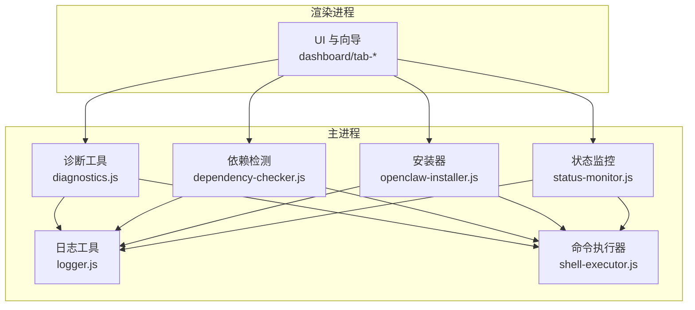
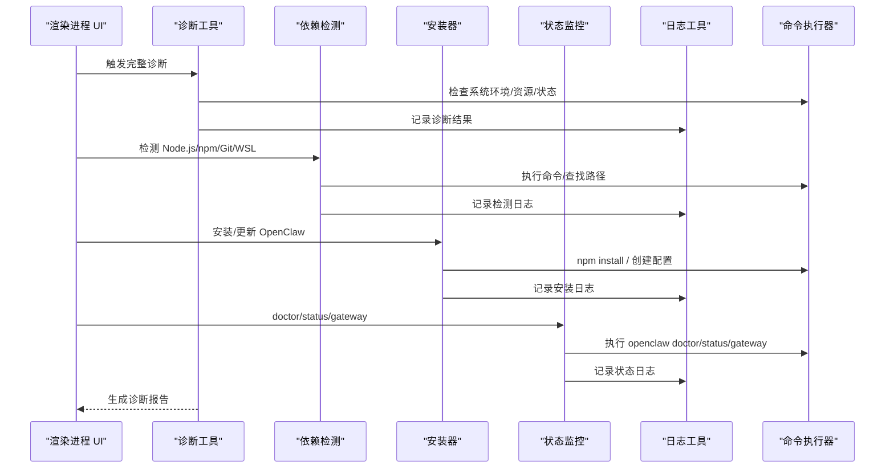
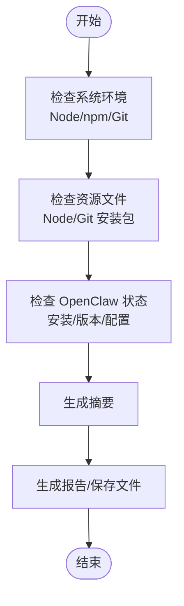
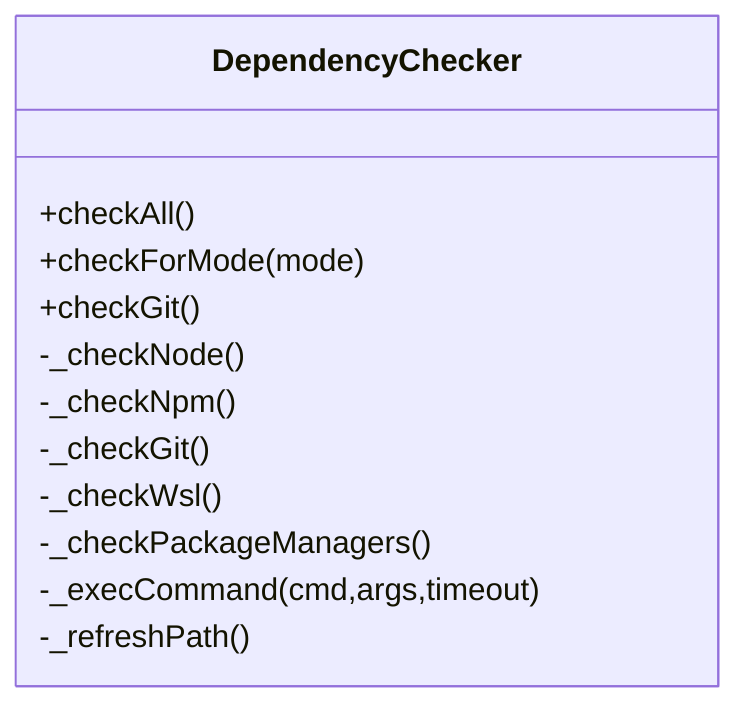
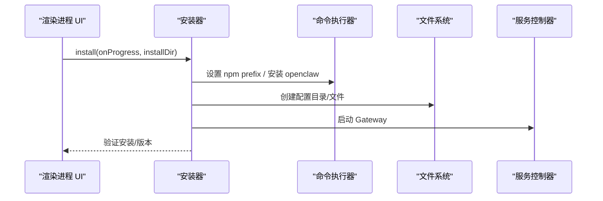
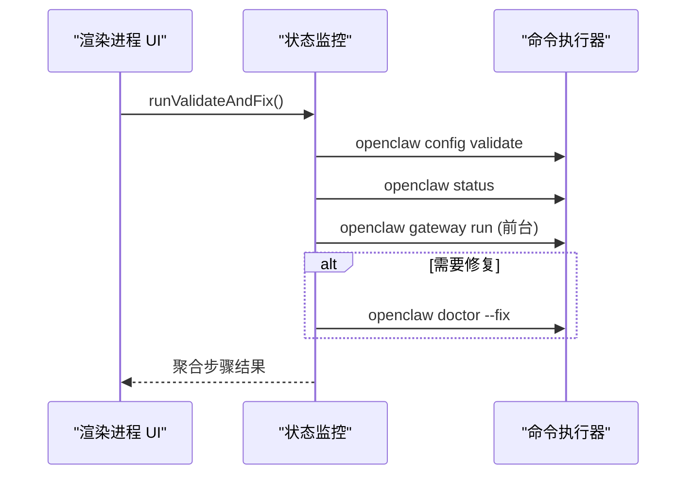
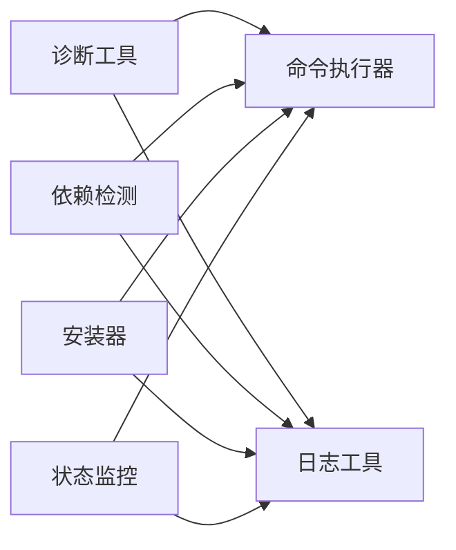

# 故障排除

<cite>
**本文引用的文件**
- [README.md](file://README.md)
- [docs/TROUBLESHOOTING.md](file://docs/TROUBLESHOOTING.md)
- [docs/INSTALLATION_FIX_GUIDE.md](file://docs/INSTALLATION_FIX_GUIDE.md)
- [docs/DEPENDENCY_INSTALL_FIXES.md](file://docs/DEPENDENCY_INSTALL_FIXES.md)
- [docs/FIX_SUMMARY.md](file://docs/FIX_SUMMARY.md)
- [scripts/install-openclaw.sh](file://scripts/install-openclaw.sh)
- [scripts/apply-fix.sh](file://scripts/apply-fix.sh)
- [src/main/utils/diagnostics.js](file://src/main/utils/diagnostics.js)
- [src/main/utils/logger.js](file://src/main/utils/logger.js)
- [src/main/utils/shell-executor.js](file://src/main/utils/shell-executor.js)
- [src/main/services/dependency-checker.js](file://src/main/services/dependency-checker.js)
- [src/main/services/openclaw-installer.js](file://src/main/services/openclaw-installer.js)
- [src/main/services/status-monitor.js](file://src/main/services/status-monitor.js)
</cite>

## 目录
1. [简介](#简介)
2. [项目结构](#项目结构)
3. [核心组件](#核心组件)
4. [架构总览](#架构总览)
5. [详细组件分析](#详细组件分析)
6. [依赖关系分析](#依赖关系分析)
7. [性能考虑](#性能考虑)
8. [故障排除指南](#故障排除指南)
9. [结论](#结论)
10. [附录](#附录)

## 简介
本指南面向使用 OpenClaw 安装管理器的用户与开发者，系统性梳理安装、运行、配置与性能相关问题的诊断与修复方法。内容覆盖：
- 常见问题与解决方案（安装、运行、配置、性能）
- 诊断工具使用（系统状态监控、日志分析、错误追踪）
- 系统化排查流程（从症状到根因再到修复）
- 网络连接、权限、依赖冲突与兼容性处理
- 预防性维护与性能优化建议
- 社区支持与获取帮助的途径

## 项目结构
该项目采用 Electron 主进程 + 渲染进程架构，核心功能由主进程的服务层实现，渲染进程负责 UI 与用户交互。故障排除涉及以下关键模块：
- 诊断工具：系统环境、资源文件、OpenClaw 状态
- 依赖检测：Node.js、npm、Git、WSL、包管理器
- 安装器：OpenClaw 安装、更新、配置文件生成
- 状态监控：OpenClaw doctor/status/gateway 运行状态
- 日志与命令执行：统一的日志记录与跨平台命令执行封装

图表来源
- [src/main/utils/diagnostics.js:14-44](file://src/main/utils/diagnostics.js#L14-L44)
- [src/main/services/dependency-checker.js:133-191](file://src/main/services/dependency-checker.js#L133-L191)
- [src/main/services/openclaw-installer.js:10-115](file://src/main/services/openclaw-installer.js#L10-L115)
- [src/main/services/status-monitor.js:9-64](file://src/main/services/status-monitor.js#L9-L64)
- [src/main/utils/logger.js:1-75](file://src/main/utils/logger.js#L1-L75)
- [src/main/utils/shell-executor.js:62-197](file://src/main/utils/shell-executor.js#L62-L197)

章节来源
- [README.md: 36-90:36-90](file://README.md#L36-L90)

## 核心组件
- 诊断工具：运行完整诊断、生成报告、保存诊断文件
- 依赖检测：检测 Node.js/npm/Git/WSL，自动安装缺失依赖
- 安装器：全局安装 OpenClaw、创建配置目录与必要文件、启动 Gateway
- 状态监控：doctor/status/gateway 运行状态检查与增强诊断
- 日志工具：统一日志写入、时间戳、消息清洗
- 命令执行器：跨平台命令执行、WSL 包装、编码处理、超时控制

章节来源
- [src/main/utils/diagnostics.js: 14-L44:14-44](file://src/main/utils/diagnostics.js#L14-L44)
- [src/main/services/dependency-checker.js: 133-L191:133-191](file://src/main/services/dependency-checker.js#L133-L191)
- [src/main/services/openclaw-installer.js: 10-L115:10-115](file://src/main/services/openclaw-installer.js#L10-L115)
- [src/main/services/status-monitor.js: 9-L64:9-64](file://src/main/services/status-monitor.js#L9-L64)
- [src/main/utils/logger.js: 1-L75:1-75](file://src/main/utils/logger.js#L1-L75)
- [src/main/utils/shell-executor.js: 62-L197:62-197](file://src/main/utils/shell-executor.js#L62-L197)

## 架构总览
下图展示故障排查关键流程：从 UI 触发诊断，到依赖检测、安装器执行、状态监控与日志记录，最终生成诊断报告。

图表来源
- [src/main/utils/diagnostics.js: 14-L44:14-44](file://src/main/utils/diagnostics.js#L14-L44)
- [src/main/services/dependency-checker.js: 149-L191:149-191](file://src/main/services/dependency-checker.js#L149-L191)
- [src/main/services/openclaw-installer.js: 117-L438:117-438](file://src/main/services/openclaw-installer.js#L117-L438)
- [src/main/services/status-monitor.js: 48-L130:48-130](file://src/main/services/status-monitor.js#L48-L130)
- [src/main/utils/logger.js: 45-L72:45-72](file://src/main/utils/logger.js#L45-L72)
- [src/main/utils/shell-executor.js: 136-L197:136-197](file://src/main/utils/shell-executor.js#L136-L197)

## 详细组件分析

### 诊断工具（Diagnostics）
- 功能：运行系统环境检查、资源文件检查、OpenClaw 状态检查，汇总生成诊断报告
- 关键点：统一时间戳、摘要生成、报告保存
- 适用场景：安装后无法检测、资源缺失、版本异常

图表来源
- [src/main/utils/diagnostics.js: 14-L44:14-44](file://src/main/utils/diagnostics.js#L14-L44)
- [src/main/utils/diagnostics.js: 151-L192:151-192](file://src/main/utils/diagnostics.js#L151-L192)

章节来源
- [src/main/utils/diagnostics.js: 14-L44:14-44](file://src/main/utils/diagnostics.js#L14-L44)
- [src/main/utils/diagnostics.js: 151-L192:151-192](file://src/main/utils/diagnostics.js#L151-L192)

### 依赖检测（DependencyChecker）
- 功能：检测 Node.js、npm、Git、WSL、包管理器；自动安装缺失依赖
- 关键点：刷新 PATH、并行检测、多路径探测、注册表查询（Windows）
- 适用场景：PATH 不完整、版本不满足、包管理器缺失

图表来源
- [src/main/services/dependency-checker.js: 133-L191:133-191](file://src/main/services/dependency-checker.js#L133-L191)
- [src/main/services/dependency-checker.js: 244-L382:244-382](file://src/main/services/dependency-checker.js#L244-L382)
- [src/main/services/dependency-checker.js: 390-L524:390-524](file://src/main/services/dependency-checker.js#L390-L524)
- [src/main/services/dependency-checker.js: 529-L664:529-664](file://src/main/services/dependency-checker.js#L529-L664)

章节来源
- [src/main/services/dependency-checker.js: 133-L191:133-191](file://src/main/services/dependency-checker.js#L133-L191)
- [src/main/services/dependency-checker.js: 244-L382:244-382](file://src/main/services/dependency-checker.js#L244-L382)
- [src/main/services/dependency-checker.js: 390-L524:390-524](file://src/main/services/dependency-checker.js#L390-L524)
- [src/main/services/dependency-checker.js: 529-L664:529-664](file://src/main/services/dependency-checker.js#L529-L664)

### 安装器（OpenClawInstaller）
- 功能：安装/更新 OpenClaw、创建配置目录与必要文件、启动 Gateway、验证安装
- 关键点：WSL/原生模式适配、npm prefix 管理、清理旧版本文件、生成缺失 README
- 适用场景：安装失败、版本检测异常、配置文件缺失

图表来源
- [src/main/services/openclaw-installer.js: 117-L438:117-438](file://src/main/services/openclaw-installer.js#L117-L438)
- [src/main/services/openclaw-installer.js: 534-L576:534-576](file://src/main/services/openclaw-installer.js#L534-L576)

章节来源
- [src/main/services/openclaw-installer.js: 117-L438:117-438](file://src/main/services/openclaw-installer.js#L117-L438)
- [src/main/services/openclaw-installer.js: 534-L576:534-576](file://src/main/services/openclaw-installer.js#L534-L576)

### 状态监控（StatusMonitor）
- 功能：doctor/status/gateway 运行状态检查；增强诊断（顺序执行并聚合结果）
- 关键点：WSL/原生模式命令适配、前台运行 gateway 捕获输出、编码处理
- 适用场景：服务未启动、端口冲突、配置错误

图表来源
- [src/main/services/status-monitor.js: 80-L130:80-130](file://src/main/services/status-monitor.js#L80-L130)
- [src/main/services/status-monitor.js: 169-L269:169-269](file://src/main/services/status-monitor.js#L169-L269)

章节来源
- [src/main/services/status-monitor.js: 80-L130:80-130](file://src/main/services/status-monitor.js#L80-L130)
- [src/main/services/status-monitor.js: 169-L269:169-269](file://src/main/services/status-monitor.js#L169-L269)

### 日志工具（Logger）
- 功能：统一写入日志文件，格式化时间戳，清洗消息
- 适用场景：所有组件的错误/警告/信息记录

章节来源
- [src/main/utils/logger.js: 1-L75:1-75](file://src/main/utils/logger.js#L1-L75)

### 命令执行器（ShellExecutor）
- 功能：跨平台命令执行、WSL 包装、编码处理、超时控制、PATH 适配
- 适用场景：安装、检测、诊断、状态检查等所有外部命令调用

章节来源
- [src/main/utils/shell-executor.js: 62-L197:62-197](file://src/main/utils/shell-executor.js#L62-L197)
- [src/main/utils/shell-executor.js: 301-L350:301-350](file://src/main/utils/shell-executor.js#L301-L350)
- [src/main/utils/shell-executor.js: 356-L404:356-404](file://src/main/utils/shell-executor.js#L356-L404)

## 依赖关系分析
- 诊断工具依赖命令执行器与资源定位，输出诊断报告
- 依赖检测依赖命令执行器与资源定位，支持自动安装
- 安装器依赖命令执行器与配置写入，负责安装与配置
- 状态监控依赖命令执行器，执行 doctor/status/gateway
- 日志工具被各组件调用，统一记录

图表来源
- [src/main/utils/diagnostics.js: 14-L44:14-44](file://src/main/utils/diagnostics.js#L14-L44)
- [src/main/services/dependency-checker.js: 133-L191:133-191](file://src/main/services/dependency-checker.js#L133-L191)
- [src/main/services/openclaw-installer.js: 10-L115:10-115](file://src/main/services/openclaw-installer.js#L10-L115)
- [src/main/services/status-monitor.js: 9-L64:9-64](file://src/main/services/status-monitor.js#L9-L64)
- [src/main/utils/logger.js: 45-L72:45-72](file://src/main/utils/logger.js#L45-L72)
- [src/main/utils/shell-executor.js: 136-L197:136-197](file://src/main/utils/shell-executor.js#L136-L197)

## 性能考虑
- 并行检测：依赖检测使用 Promise.all 并行检查 npm、Git、WSL，减少等待时间
- 超时控制：命令执行器统一超时，避免长时间阻塞
- 缓存策略：依赖检测器缓存结果，避免重复检测
- 日志落盘：日志异步写入，降低对主线程影响

章节来源
- [src/main/services/dependency-checker.js: 171-L176:171-176](file://src/main/services/dependency-checker.js#L171-L176)
- [src/main/utils/shell-executor.js: 136-L197:136-197](file://src/main/utils/shell-executor.js#L136-L197)
- [src/main/services/dependency-checker.js: 137-L141:137-141](file://src/main/services/dependency-checker.js#L137-L141)

## 故障排除指南

### 一、安装问题
- 症状：打包后无法检测已安装、资源文件缺失、Git 安装失败、OpenClaw 安装失败
- 排查步骤：
  1) 运行完整诊断，检查系统、资源、OpenClaw 状态
  2) 检查资源文件是否存在（Node.js/Git 安装包）
  3) 手动检查 OpenClaw 配置目录与 openclaw.json
  4) 检查 OpenClaw 可执行文件路径
  5) 使用安装器安装/更新，确保配置文件齐全
- 修复建议：
  - 资源缺失：确认资源文件存在或手动添加
  - Git 安装失败：手动下载安装包或添加到 resources/gitbash/
  - OpenClaw 安装失败：检查网络/镜像源，手动安装或使用安装器

章节来源
- [docs/TROUBLESHOOTING.md: 5-L79:5-79](file://docs/TROUBLESHOOTING.md#L5-L79)
- [docs/TROUBLESHOOTING.md: 137-L196:137-196](file://docs/TROUBLESHOOTING.md#L137-L196)
- [src/main/utils/diagnostics.js: 97-L109:97-109](file://src/main/utils/diagnostics.js#L97-L109)
- [src/main/services/openclaw-installer.js: 117-L438:117-438](file://src/main/services/openclaw-installer.js#L117-L438)

### 二、运行问题
- 症状：命令行提示“不是内部或外部命令”、服务未启动、端口冲突
- 排查步骤：
  1) 检查 PATH：用户 PATH 仅对当前用户生效，建议在应用中“检查 PATH”并“添加到 PATH”
  2) 使用 doctor/status/gateway 增强诊断，捕获启动失败原因
  3) 查看日志文件，定位错误
- 修复建议：
  - PATH 问题：使用应用提供的“添加到 PATH”功能
  - 权限问题：以管理员身份运行应用（系统 PATH）
  - 端口冲突：调整 Gateway 端口或释放占用端口

章节来源
- [README.md: 260-L279:260-279](file://README.md#L260-L279)
- [src/main/services/status-monitor.js: 80-L130:80-130](file://src/main/services/status-monitor.js#L80-L130)
- [src/main/utils/logger.js: 45-L72:45-72](file://src/main/utils/logger.js#L45-L72)

### 三、配置问题
- 症状：配置文件缺失、版本不一致、环境变量未生效
- 排查步骤：
  1) 检查 ~/.openclaw 目录与必要文件是否存在
  2) 验证 openclaw.json 合法性（config validate）
  3) 检查 .env 中 OPENCLAW_NPM_PREFIX 是否正确
- 修复建议：
  - 使用安装器自动创建缺失配置文件
  - 重新生成默认配置，确保 gateway.mode=local
  - 写入 OPENCLAW_NPM_PREFIX 并重启会话

章节来源
- [src/main/services/openclaw-installer.js: 314-L371:314-371](file://src/main/services/openclaw-installer.js#L314-L371)
- [src/main/services/openclaw-installer.js: 364-L370:364-370](file://src/main/services/openclaw-installer.js#L364-L370)
- [src/main/services/openclaw-installer.js: 372-L387:372-387](file://src/main/services/openclaw-installer.js#L372-L387)

### 四、性能问题
- 症状：安装/检测缓慢、诊断卡顿
- 优化建议：
  - 使用并行检测（依赖检测器已实现）
  - 合理设置超时，避免长时间阻塞
  - 清理缓存目录，避免临时文件异常
  - 使用国内镜像源加速安装

章节来源
- [src/main/services/dependency-checker.js: 171-L176:171-176](file://src/main/services/dependency-checker.js#L171-L176)
- [src/main/utils/shell-executor.js: 136-L197:136-197](file://src/main/utils/shell-executor.js#L136-L197)
- [docs/DEPENDENCY_INSTALL_FIXES.md: 18-L31:18-31](file://docs/DEPENDENCY_INSTALL_FIXES.md#L18-L31)

### 五、网络连接问题
- 症状：npm install 失败、镜像源不可用
- 排查步骤：
  1) 切换国内镜像源（npmmirror.com）
  2) 检查代理/防火墙设置
  3) 使用安装器设置镜像源
- 修复建议：
  - 使用安装器一键切换镜像
  - 手动配置 npm registry

章节来源
- [src/main/services/openclaw-installer.js: 600-L618:600-618](file://src/main/services/openclaw-installer.js#L600-L618)
- [scripts/install-openclaw.sh: 106-L116:106-116](file://scripts/install-openclaw.sh#L106-L116)

### 六、权限问题
- 症状：添加 PATH 需要管理员权限、WSL 安装失败
- 排查步骤：
  1) 用户 PATH 仅对当前用户生效，无需管理员权限
  2) 系统 PATH 需要管理员权限
  3) WSL 安装需要 UAC 提权
- 修复建议：
  - 使用应用“添加到 PATH”（用户 PATH）
  - 以管理员身份运行应用（系统 PATH）
  - 使用应用一键安装 WSL

章节来源
- [README.md: 271-L279:271-279](file://README.md#L271-L279)
- [src/main/services/dependency-checker.js: 699-L781:699-781](file://src/main/services/dependency-checker.js#L699-L781)

### 七、依赖冲突与兼容性
- 症状：版本不满足、包管理器缺失、注册表查询失败
- 排查步骤：
  1) 检查 Node.js 版本（>=18，原修复为 v18）
  2) 检查 npm 是否随 Node.js 一起安装
  3) 检查 Git 安装路径与注册表
- 修复建议：
  - 升级 Node.js 至满足版本
  - 使用安装器自动安装缺失依赖
  - 使用注册表查询（Windows）

章节来源
- [docs/INSTALLATION_FIX_GUIDE.md: 100-L220:100-220](file://docs/INSTALLATION_FIX_GUIDE.md#L100-L220)
- [docs/INSTALLATION_FIX_GUIDE.md: 222-L378:222-378](file://docs/INSTALLATION_FIX_GUIDE.md#L222-L378)
- [docs/FIX_SUMMARY.md: 26-L43:26-43](file://docs/FIX_SUMMARY.md#L26-L43)

### 八、系统化排查流程
- 步骤 1：运行完整诊断，保存诊断报告
- 步骤 2：检查 PATH 与环境变量
- 步骤 3：并行检测依赖（Node.js/npm/Git/WSL）
- 步骤 4：doctor/status/gateway 增强诊断
- 步骤 5：查看日志文件，定位错误
- 步骤 6：根据报告与日志执行修复

章节来源
- [docs/TROUBLESHOOTING.md: 80-L107:80-107](file://docs/TROUBLESHOOTING.md#L80-L107)
- [src/main/utils/diagnostics.js: 14-L44:14-44](file://src/main/utils/diagnostics.js#L14-L44)
- [src/main/services/status-monitor.js: 80-L130:80-130](file://src/main/services/status-monitor.js#L80-L130)
- [src/main/utils/logger.js: 45-L72:45-72](file://src/main/utils/logger.js#L45-L72)

### 九、诊断工具使用
- 运行完整诊断：在开发者工具控制台执行诊断 API，查看系统、资源、OpenClaw 状态
- 保存诊断报告：生成并保存诊断报告到用户目录
- 诊断报告示例：包含系统信息、资源文件、OpenClaw 状态与总结

章节来源
- [docs/TROUBLESHOOTING.md: 80-L136:80-136](file://docs/TROUBLESHOOTING.md#L80-L136)
- [src/main/utils/diagnostics.js: 151-L192:151-192](file://src/main/utils/diagnostics.js#L151-L192)

### 十、日志分析与错误追踪
- 日志位置：~/.openclaw/installer-manager.log
- 日志格式：时间戳 + 级别 + 消息
- 错误追踪：结合诊断报告与日志定位具体错误

章节来源
- [src/main/utils/logger.js: 5-L72:5-72](file://src/main/utils/logger.js#L5-L72)

### 十一、社区支持与获取帮助
- 保存诊断报告并提交到 GitHub Issues
- 包含操作系统版本、应用版本、完整诊断报告、复现步骤
- 参考安装脚本与修复脚本获取更多信息

章节来源
- [docs/TROUBLESHOOTING.md: 198-L219:198-219](file://docs/TROUBLESHOOTING.md#L198-L219)
- [scripts/apply-fix.sh: 1-L104:1-104](file://scripts/apply-fix.sh#L1-L104)
- [scripts/install-openclaw.sh: 1-L328:1-328](file://scripts/install-openclaw.sh#L1-L328)

## 结论
本指南提供了从诊断到修复的完整流程，结合依赖检测、安装器、状态监控与日志工具，能够有效定位并解决安装、运行、配置与性能问题。建议在日常使用中定期运行诊断、检查 PATH、使用国内镜像、关注日志，以提升稳定性与可维护性。

## 附录
- 一键安装脚本：支持镜像源切换、WSL 环境安装、默认配置生成
- 依赖检测修复：增强 PATH 环境变量、多路径探测、注册表查询、缓存目录修复
- 修复补丁脚本：演示如何修复依赖检测问题

章节来源
- [scripts/install-openclaw.sh: 1-L328:1-328](file://scripts/install-openclaw.sh#L1-L328)
- [docs/INSTALLATION_FIX_GUIDE.md: 15-L43:15-43](file://docs/INSTALLATION_FIX_GUIDE.md#L15-L43)
- [docs/DEPENDENCY_INSTALL_FIXES.md: 1-L48:1-48](file://docs/DEPENDENCY_INSTALL_FIXES.md#L1-L48)
- [scripts/apply-fix.sh: 1-L104:1-104](file://scripts/apply-fix.sh#L1-L104)