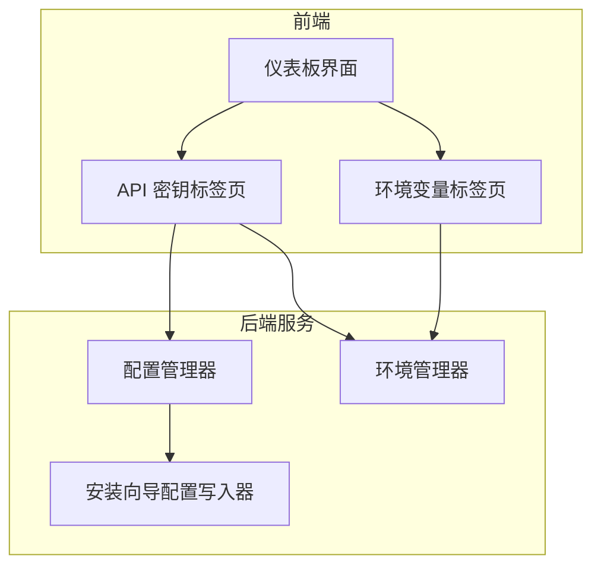
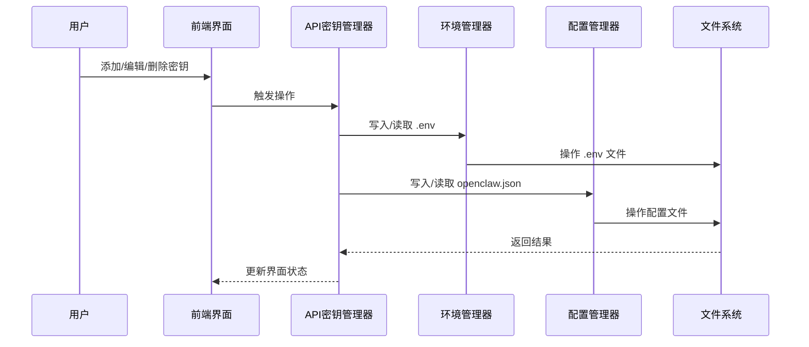
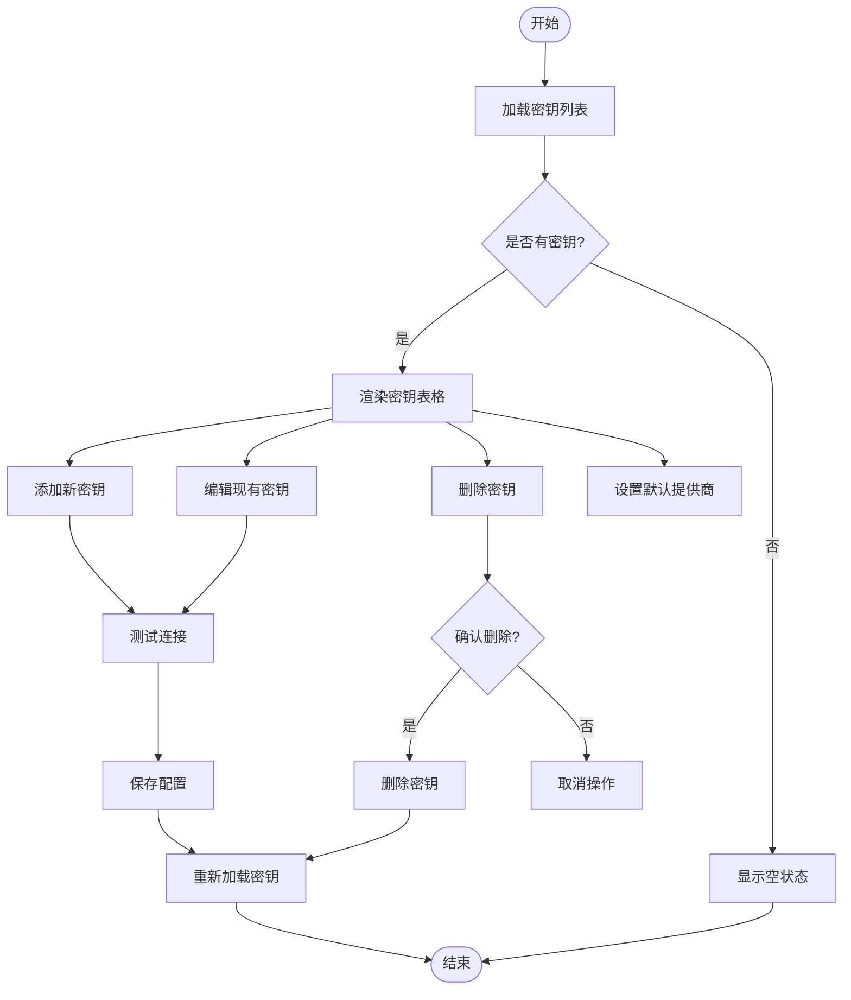
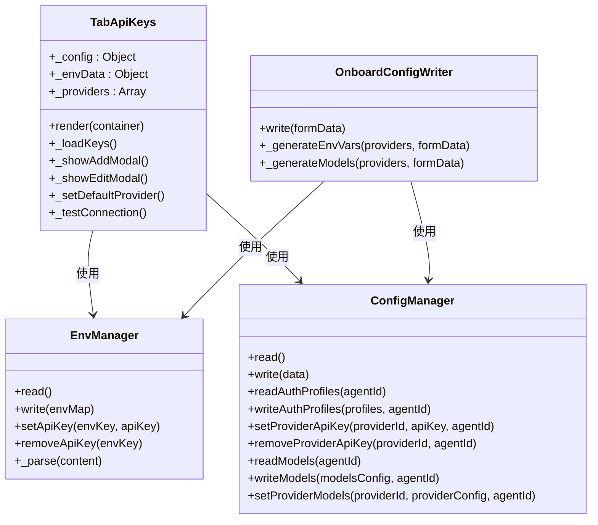

# API 密钥管理

<cite>
**本文档引用的文件**
- [tab-apikeys.js](file://src/renderer/js/dashboard/tab-apikeys.js)
- [env-manager.js](file://src/main/services/env-manager.js)
- [config-manager.js](file://src/main/services/config-manager.js)
- [onboard-config-writer.js](file://src/main/services/onboard-config-writer.js)
- [tab-env.js](file://src/renderer/js/dashboard/tab-env.js)
</cite>

## 目录
1. [简介](#简介)
2. [项目结构](#项目结构)
3. [核心组件](#核心组件)
4. [架构概览](#架构概览)
5. [详细组件分析](#详细组件分析)
6. [依赖关系分析](#依赖关系分析)
7. [性能考虑](#性能考虑)
8. [故障排除指南](#故障排除指南)
9. [结论](#结论)

## 简介
本指南详细介绍 API 密钥管理功能，涵盖添加、编辑、删除和组织各类 AI 服务密钥（OpenAI、Anthropic、Google 等）的完整流程。文档重点说明密钥的安全存储机制、加密保护措施、格式验证与有效性检查、分类管理策略、轮换与更新最佳实践，以及批量导入导出功能的使用方法。

## 项目结构
API 密钥管理功能主要分布在以下模块：
- 前端仪表板：负责用户界面交互与密钥展示
- 后端服务：负责配置读写与密钥安全存储
- 环境管理：负责 .env 文件的读写与备份
- 配置管理：负责 openclaw.json 等配置文件的读写与备份

**图表来源**
- [tab-apikeys.js](file://src/renderer/js/dashboard/tab-apikeys.js)
- [env-manager.js](file://src/main/services/env-manager.js)
- [config-manager.js](file://src/main/services/config-manager.js)
- [onboard-config-writer.js](file://src/main/services/onboard-config-writer.js)

**章节来源**
- [tab-apikeys.js](file://src/renderer/js/dashboard/tab-apikeys.js)
- [env-manager.js](file://src/main/services/env-manager.js)
- [config-manager.js](file://src/main/services/config-manager.js)

## 核心组件
API 密钥管理功能的核心组件包括：

### 1. API 密钥管理器 (TabApiKeys)
负责密钥的增删改查、默认提供商设置、连接测试等功能。

### 2. 环境管理器 (EnvManager)
负责 .env 文件的读写、备份、密钥存储与删除。

### 3. 配置管理器 (ConfigManager)
负责 openclaw.json 等配置文件的读写、备份、提供商配置管理。

### 4. 安装向导配置写入器 (OnboardConfigWriter)
负责首次安装时的配置生成与密钥写入。

**章节来源**
- [tab-apikeys.js](file://src/renderer/js/dashboard/tab-apikeys.js)
- [env-manager.js](file://src/main/services/env-manager.js)
- [config-manager.js](file://src/main/services/config-manager.js)
- [onboard-config-writer.js](file://src/main/services/onboard-config-writer.js)

## 架构概览
系统采用前后端分离架构，前端负责用户交互，后端负责数据持久化和安全存储。

**图表来源**
- [tab-apikeys.js](file://src/renderer/js/dashboard/tab-apikeys.js)
- [env-manager.js](file://src/main/services/env-manager.js)
- [config-manager.js](file://src/main/services/config-manager.js)

## 详细组件分析

### API 密钥管理器 (TabApiKeys)
负责密钥的完整生命周期管理，包括添加、编辑、删除、默认提供商设置等功能。

#### 主要功能特性
- **密钥添加**：支持多种 AI 服务提供商，包括 OpenAI、Anthropic、Google 等
- **密钥编辑**：允许修改现有密钥、Base URL 和模型配置
- **密钥删除**：安全删除指定提供商的密钥
- **默认提供商设置**：设置默认使用的 AI 服务提供商
- **连接测试**：验证密钥的有效性和连接性
- **密钥显示控制**：支持显示/隐藏密钥内容

#### 数据流分析

**图表来源**
- [tab-apikeys.js](file://src/renderer/js/dashboard/tab-apikeys.js)

**章节来源**
- [tab-apikeys.js](file://src/renderer/js/dashboard/tab-apikeys.js)

### 环境管理器 (EnvManager)
负责 .env 文件的安全存储和管理，确保密钥以明文形式存储在受控环境中。

#### 核心功能
- **密钥存储**：将 API 密钥以明文形式存储在 .env 文件中
- **文件备份**：每次写入前自动创建备份文件
- **密钥检索**：从 .env 文件中读取和解析密钥
- **密钥删除**：从 .env 文件中删除指定密钥

#### 安全机制
- **文件备份**：所有写入操作都会创建 .bak 备份文件
- **明文存储**：密钥以明文形式存储，便于程序读取
- **路径隔离**：使用 OPENCLAW_HOME 路径确保文件位置可控

**章节来源**
- [env-manager.js](file://src/main/services/env-manager.js)

### 配置管理器 (ConfigManager)
负责 openclaw.json 等配置文件的管理，存储提供商配置和模型信息。

#### 主要职责
- **配置读写**：管理 openclaw.json 配置文件的读写操作
- **提供商管理**：维护各 AI 服务提供商的配置信息
- **模型配置**：管理支持的模型列表和配置
- **备份机制**：自动创建配置文件备份

#### 配置结构
配置文件采用 JSON 格式，包含以下关键部分：
- `models.providers`：各提供商的配置信息
- `agents.defaults.model.primary`：默认模型配置
- `env.vars`：环境变量配置（历史兼容）

**章节来源**
- [config-manager.js](file://src/main/services/config-manager.js)

### 安装向导配置写入器 (OnboardConfigWriter)
负责首次安装时的配置生成和密钥写入过程。

#### 功能特点
- **多提供商支持**：支持 OpenAI、Anthropic、Google 等主流 AI 服务
- **自动配置**：根据用户输入自动生成配置文件
- **密钥写入**：将 API 密钥安全写入 .env 文件
- **模型配置**：为各提供商配置默认模型

**章节来源**
- [onboard-config-writer.js](file://src/main/services/onboard-config-writer.js)

## 依赖关系分析

**图表来源**
- [tab-apikeys.js](file://src/renderer/js/dashboard/tab-apikeys.js)
- [env-manager.js](file://src/main/services/env-manager.js)
- [config-manager.js](file://src/main/services/config-manager.js)
- [onboard-config-writer.js](file://src/main/services/onboard-config-writer.js)

**章节来源**
- [tab-apikeys.js](file://src/renderer/js/dashboard/tab-apikeys.js)
- [env-manager.js](file://src/main/services/env-manager.js)
- [config-manager.js](file://src/main/services/config-manager.js)
- [onboard-config-writer.js](file://src/main/services/onboard-config-writer.js)

## 性能考虑
- **异步操作**：所有文件读写操作均为异步，避免阻塞用户界面
- **缓存机制**：密钥列表在内存中缓存，减少重复读取
- **增量更新**：环境变量采用增量更新方式，避免不必要的文件写入
- **错误恢复**：配置文件损坏时自动使用备份文件恢复

## 故障排除指南

### 常见问题及解决方案

#### 1. 密钥无法保存
**症状**：添加或编辑密钥后提示保存失败
**原因**：文件权限不足或磁盘空间不足
**解决方法**：
- 检查 OPENCLAW_HOME 目录的写入权限
- 确认磁盘空间充足
- 查看应用日志获取详细错误信息

#### 2. 密钥显示异常
**症状**：密钥显示为星号或乱码
**原因**：密钥格式不正确或编码问题
**解决方法**：
- 确认 API 密钥格式符合要求
- 检查密钥是否包含特殊字符
- 重新添加密钥并保存

#### 3. 连接测试失败
**症状**：测试连接时出现超时或认证错误
**原因**：网络问题、密钥无效或 Base URL 错误
**解决方法**：
- 检查网络连接状态
- 验证 API 密钥的有效性
- 确认 Base URL 格式正确
- 尝试使用不同的模型

#### 4. 配置文件损坏
**症状**：应用启动时提示配置文件错误
**原因**：配置文件被意外修改或损坏
**解决方法**：
- 检查 .bak 备份文件是否存在
- 手动恢复备份文件
- 重新配置相关设置

**章节来源**
- [tab-apikeys.js](file://src/renderer/js/dashboard/tab-apikeys.js)
- [env-manager.js](file://src/main/services/env-manager.js)
- [config-manager.js](file://src/main/services/config-manager.js)

## 结论
API 密钥管理功能提供了完整的密钥生命周期管理能力，包括安全存储、格式验证、连接测试、分类管理等核心功能。系统采用明文存储但具备完善的备份机制，确保数据安全性和可恢复性。通过合理的配置管理和最佳实践，用户可以高效地管理大量 API 密钥，满足不同 AI 服务提供商的需求。

建议在使用过程中：
- 定期备份 .env 和配置文件
- 使用强密码并定期轮换
- 建立密钥分类和命名规范
- 监控密钥使用情况和有效期
- 建立应急响应机制处理密钥泄露事件