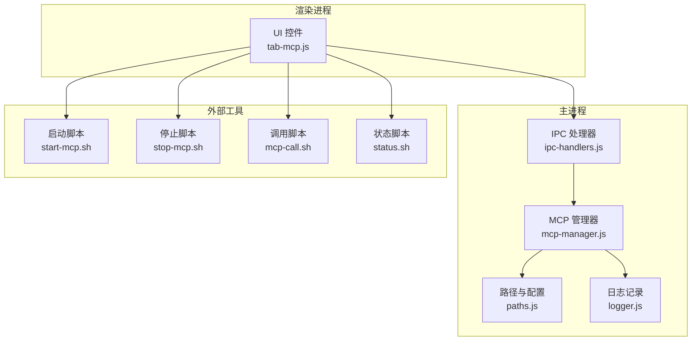
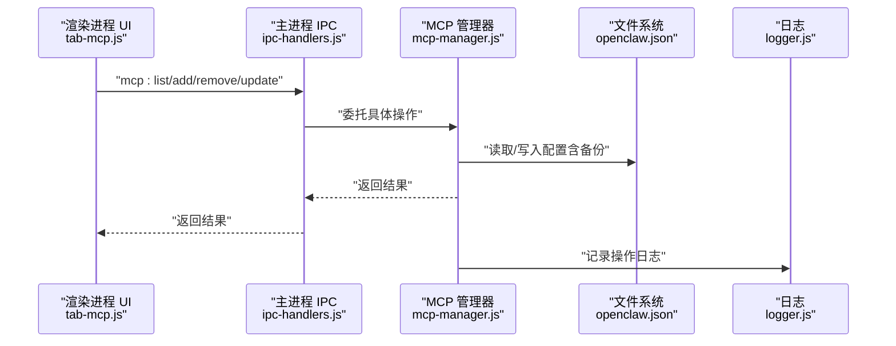
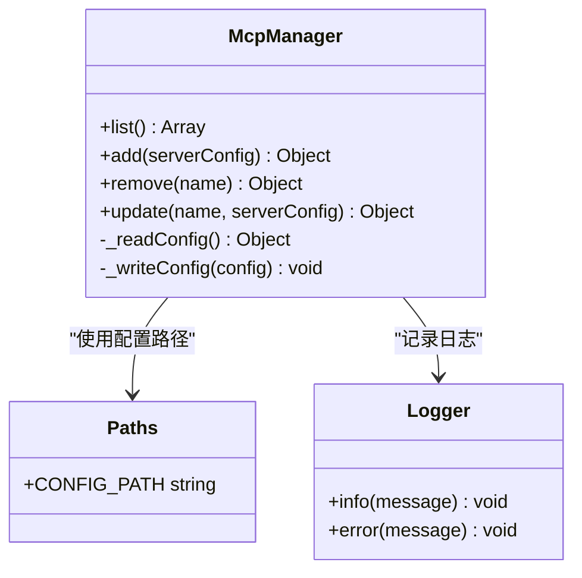
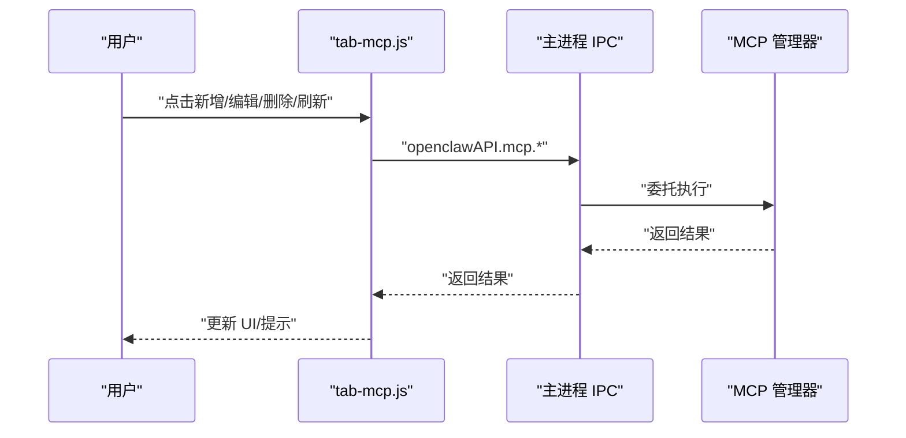
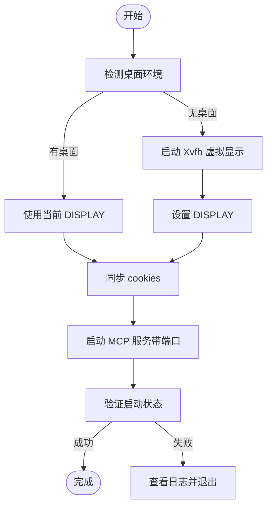
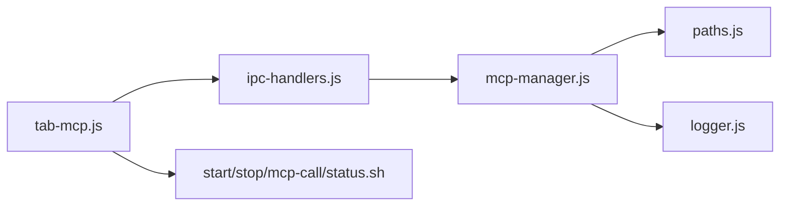
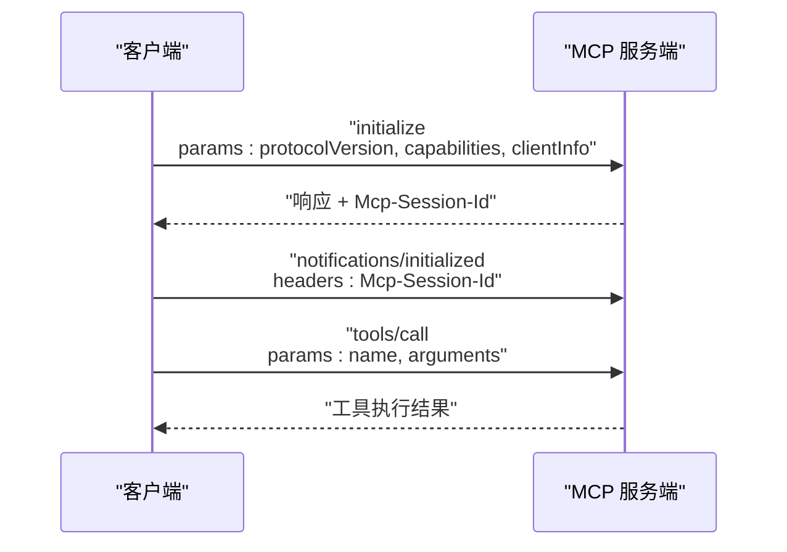

# MCP 服务器管理

<cite>
**本文引用的文件**
- [mcp-manager.js](file://src/main/services/mcp-manager.js)
- [ipc-handlers.js](file://src/main/ipc-handlers.js)
- [tab-mcp.js](file://src/renderer/js/dashboard/tab-mcp.js)
- [paths.js](file://src/main/utils/paths.js)
- [logger.js](file://src/main/utils/logger.js)
- [start-mcp.sh](file://resources/skills/xiaohongshu/scripts/start-mcp.sh)
- [stop-mcp.sh](file://resources/skills/xiaohongshu/scripts/stop-mcp.sh)
- [mcp-call.sh](file://resources/skills/xiaohongshu/scripts/mcp-call.sh)
- [status.sh](file://resources/skills/xiaohongshu/scripts/status.sh)
</cite>

## 目录
1. [简介](#简介)
2. [项目结构](#项目结构)
3. [核心组件](#核心组件)
4. [架构总览](#架构总览)
5. [详细组件分析](#详细组件分析)
6. [依赖关系分析](#依赖关系分析)
7. [性能考虑](#性能考虑)
8. [故障排除指南](#故障排除指南)
9. [结论](#结论)
10. [附录](#附录)

## 简介
本指南面向需要在系统中添加、配置与管理 MCP（Model Context Protocol）服务器的用户与运维人员。文档基于仓库中的现有实现，系统性介绍 MCP 服务器的管理能力、交互流程、配置要点、健康检查与故障排查方法，并提供常见 MCP 服务器的配置示例与最佳实践建议。

## 项目结构
围绕 MCP 服务器管理的相关模块分布如下：
- 主进程服务层：负责读写配置、执行 IPC 处理、封装底层操作
- 渲染进程界面层：提供 MCP 服务器的增删改查与刷新展示
- 工具脚本：提供 MCP 服务的启动、停止、调用与状态检查
- 配置与日志：统一的配置文件位置与日志输出

**图表来源**
- [ipc-handlers.js:525-540](file://src/main/ipc-handlers.js#L525-L540)
- [mcp-manager.js:1-101](file://src/main/services/mcp-manager.js#L1-L101)
- [paths.js:1-124](file://src/main/utils/paths.js#L1-L124)
- [logger.js:1-75](file://src/main/utils/logger.js#L1-L75)
- [tab-mcp.js:1-199](file://src/renderer/js/dashboard/tab-mcp.js#L1-L199)
- [start-mcp.sh:1-167](file://resources/skills/xiaohongshu/scripts/start-mcp.sh#L1-L167)
- [stop-mcp.sh:1-30](file://resources/skills/xiaohongshu/scripts/stop-mcp.sh#L1-L30)
- [mcp-call.sh:1-82](file://resources/skills/xiaohongshu/scripts/mcp-call.sh#L1-L82)
- [status.sh:1-6](file://resources/skills/xiaohongshu/scripts/status.sh#L1-L6)

**章节来源**
- [ipc-handlers.js:525-540](file://src/main/ipc-handlers.js#L525-L540)
- [mcp-manager.js:1-101](file://src/main/services/mcp-manager.js#L1-L101)
- [paths.js:1-124](file://src/main/utils/paths.js#L1-L124)
- [logger.js:1-75](file://src/main/utils/logger.js#L1-L75)
- [tab-mcp.js:1-199](file://src/renderer/js/dashboard/tab-mcp.js#L1-L199)
- [start-mcp.sh:1-167](file://resources/skills/xiaohongshu/scripts/start-mcp.sh#L1-L167)
- [stop-mcp.sh:1-30](file://resources/skills/xiaohongshu/scripts/stop-mcp.sh#L1-L30)
- [mcp-call.sh:1-82](file://resources/skills/xiaohongshu/scripts/mcp-call.sh#L1-L82)
- [status.sh:1-6](file://resources/skills/xiaohongshu/scripts/status.sh#L1-L6)

## 核心组件
- MCP 管理器（主进程）：负责 MCP 服务器配置的读取、写入、新增、删除与更新；维护配置备份；记录日志
- IPC 处理器：注册 MCP 相关的 IPC 方法，桥接渲染进程与主进程服务
- 渲染进程标签页：提供 MCP 服务器列表展示、新增、编辑、删除与刷新
- 路径与配置：定义配置文件路径与日志目录，支持不同执行模式（WSL/原生）
- 日志：统一的日志输出，便于排障
- 小红书 MCP 示例脚本：提供启动、停止、调用与状态检查的参考实现

**章节来源**
- [mcp-manager.js:1-101](file://src/main/services/mcp-manager.js#L1-L101)
- [ipc-handlers.js:525-540](file://src/main/ipc-handlers.js#L525-L540)
- [tab-mcp.js:1-199](file://src/renderer/js/dashboard/tab-mcp.js#L1-L199)
- [paths.js:1-124](file://src/main/utils/paths.js#L1-L124)
- [logger.js:1-75](file://src/main/utils/logger.js#L1-L75)

## 架构总览
MCP 服务器管理采用“渲染进程发起请求 → 主进程 IPC 处理 → 服务层执行操作”的分层设计。配置持久化通过 JSON 文件实现，具备自动备份机制。

**图表来源**
- [ipc-handlers.js:525-540](file://src/main/ipc-handlers.js#L525-L540)
- [mcp-manager.js:15-25](file://src/main/services/mcp-manager.js#L15-L25)
- [logger.js:57-67](file://src/main/utils/logger.js#L57-L67)

## 详细组件分析

### MCP 管理器（主进程）
职责与行为：
- 读取配置：解析配置文件，若不存在或解析失败返回空对象
- 写入配置：创建目录、备份旧配置、写入新配置
- 列表查询：返回服务器名称、命令、参数、环境变量与启用状态
- 新增：以名称为键存储服务器配置，默认启用
- 删除：按名称删除并写回配置
- 更新：支持仅更新命令、参数、环境变量与启用状态

**图表来源**
- [mcp-manager.js:5-99](file://src/main/services/mcp-manager.js#L5-L99)
- [paths.js:8-9](file://src/main/utils/paths.js#L8-L9)
- [logger.js:57-67](file://src/main/utils/logger.js#L57-L67)

**章节来源**
- [mcp-manager.js:6-25](file://src/main/services/mcp-manager.js#L6-L25)
- [mcp-manager.js:27-37](file://src/main/services/mcp-manager.js#L27-L37)
- [mcp-manager.js:39-58](file://src/main/services/mcp-manager.js#L39-L58)
- [mcp-manager.js:60-74](file://src/main/services/mcp-manager.js#L60-L74)
- [mcp-manager.js:76-98](file://src/main/services/mcp-manager.js#L76-L98)

### IPC 处理器（主进程）
注册 MCP 相关的 IPC 方法，供渲染进程调用：
- mcp:list
- mcp:add
- mcp:remove
- mcp:update

这些处理器实例化 MCP 管理器并转发调用，返回结果给渲染进程。

**章节来源**
- [ipc-handlers.js:525-540](file://src/main/ipc-handlers.js#L525-L540)

### 渲染进程标签页（MCP）
功能与交互：
- 展示 MCP 服务器列表（名称、命令、参数）
- 新增：弹窗输入名称、命令、参数（每行一个）、环境变量（JSON）
- 编辑：弹窗修改命令、参数、环境变量
- 删除：确认后调用删除接口
- 刷新：重新拉取列表

**图表来源**
- [tab-mcp.js:17-198](file://src/renderer/js/dashboard/tab-mcp.js#L17-L198)
- [ipc-handlers.js:525-540](file://src/main/ipc-handlers.js#L525-L540)

**章节来源**
- [tab-mcp.js:3-21](file://src/renderer/js/dashboard/tab-mcp.js#L3-L21)
- [tab-mcp.js:23-74](file://src/renderer/js/dashboard/tab-mcp.js#L23-L74)
- [tab-mcp.js:76-133](file://src/renderer/js/dashboard/tab-mcp.js#L76-L133)
- [tab-mcp.js:135-185](file://src/renderer/js/dashboard/tab-mcp.js#L135-L185)
- [tab-mcp.js:187-198](file://src/renderer/js/dashboard/tab-mcp.js#L187-L198)

### 配置文件与路径
- 配置文件路径：由路径工具提供，支持自定义环境变量覆盖
- 日志目录：位于用户临时目录下的固定路径
- 执行模式：支持原生与 WSL 两种模式，路径映射不同

**章节来源**
- [paths.js:8-9](file://src/main/utils/paths.js#L8-L9)
- [paths.js:67-82](file://src/main/utils/paths.js#L67-L82)
- [paths.js:84-107](file://src/main/utils/paths.js#L84-L107)

### 日志记录
- 统一格式：时间戳 + 日志级别 + 清洗后的消息
- 输出位置：配置目录下的日志文件
- 用途：记录 MCP 服务器新增、删除、更新等关键操作

**章节来源**
- [logger.js:45-71](file://src/main/utils/logger.js#L45-L71)

### MCP 服务器示例脚本（小红书）
- 启动脚本：自动检测桌面环境、准备 cookies、启动 MCP 服务并输出端点与日志路径
- 停止脚本：停止 MCP 服务并清理 Xvfb
- 调用脚本：演示 JSON-RPC 初始化、会话头传递与工具调用
- 状态脚本：调用工具脚本进行登录状态检查

**图表来源**
- [start-mcp.sh:18-87](file://resources/skills/xiaohongshu/scripts/start-mcp.sh#L18-L87)
- [start-mcp.sh:116-166](file://resources/skills/xiaohongshu/scripts/start-mcp.sh#L116-L166)

**章节来源**
- [start-mcp.sh:1-167](file://resources/skills/xiaohongshu/scripts/start-mcp.sh#L1-L167)
- [stop-mcp.sh:1-30](file://resources/skills/xiaohongshu/scripts/stop-mcp.sh#L1-L30)
- [mcp-call.sh:51-82](file://resources/skills/xiaohongshu/scripts/mcp-call.sh#L51-L82)
- [status.sh:1-6](file://resources/skills/xiaohongshu/scripts/status.sh#L1-L6)

## 依赖关系分析
- 渲染进程依赖主进程提供的 IPC 接口
- 主进程依赖 MCP 管理器进行配置读写
- MCP 管理器依赖路径工具与日志工具
- 外部脚本作为 MCP 服务器的参考实现，与 UI 无直接耦合

**图表来源**
- [tab-mcp.js:1-199](file://src/renderer/js/dashboard/tab-mcp.js#L1-L199)
- [ipc-handlers.js:525-540](file://src/main/ipc-handlers.js#L525-L540)
- [mcp-manager.js:1-101](file://src/main/services/mcp-manager.js#L1-L101)
- [paths.js:1-124](file://src/main/utils/paths.js#L1-L124)
- [logger.js:1-75](file://src/main/utils/logger.js#L1-L75)
- [start-mcp.sh:1-167](file://resources/skills/xiaohongshu/scripts/start-mcp.sh#L1-L167)

**章节来源**
- [ipc-handlers.js:525-540](file://src/main/ipc-handlers.js#L525-L540)
- [mcp-manager.js:1-101](file://src/main/services/mcp-manager.js#L1-L101)

## 性能考虑
- 配置读写：采用一次性读取与写入，避免频繁 I/O；写入前进行目录创建与备份，保证数据安全
- 日志输出：统一格式与清洗，减少异常字符影响；日志文件按天滚动，便于维护
- 外部脚本：启动时进行环境检测与必要准备，避免重复启动与资源冲突

[本节为通用指导，无需特定文件引用]

## 故障排除指南
- 连接超时
  - 检查 MCP 服务是否已启动（参考启动脚本输出的端点与日志）
  - 使用调用脚本进行最小化验证，确认网络可达与端口正确
  - 查看日志文件定位错误原因
- 认证失败
  - 确认 cookies 同步路径与权限
  - 如使用代理，检查 no_proxy 配置
- 协议不兼容
  - 调用脚本展示了协议版本字段，确保 MCP 服务端支持相应版本
- 配置损坏
  - 配置写入前会生成备份文件，可回滚至备份
  - 检查配置文件格式与键值完整性

**章节来源**
- [start-mcp.sh:147-166](file://resources/skills/xiaohongshu/scripts/start-mcp.sh#L147-L166)
- [mcp-call.sh:51-82](file://resources/skills/xiaohongshu/scripts/mcp-call.sh#L51-L82)
- [mcp-manager.js:21-24](file://src/main/services/mcp-manager.js#L21-L24)
- [logger.js:57-67](file://src/main/utils/logger.js#L57-L67)

## 结论
本指南基于现有代码实现了 MCP 服务器的可视化管理与基础健康检查能力。通过 IPC 与脚本的配合，用户可以便捷地添加、配置与管理 MCP 服务器，并借助日志与备份机制提升稳定性与可维护性。后续可扩展包括连接测试、健康检查、性能监控等功能，以进一步完善 MCP 服务器的生命周期管理。

[本节为总结性内容，无需特定文件引用]

## 附录

### MCP 协议交互模式（客户端/服务端）
- 初始化：客户端发送 initialize 请求并携带协议版本与客户端信息
- 会话头：服务端返回会话标识，后续请求需携带会话头
- 工具调用：客户端通过 tools/call 方法调用工具，服务端返回结果

**图表来源**
- [mcp-call.sh:51-82](file://resources/skills/xiaohongshu/scripts/mcp-call.sh#L51-L82)

### 常见 MCP 服务器配置示例（基于现有实现）
- 命令：如 npx、node、python 等
- 参数：每行一个，例如包含服务器包名与选项
- 环境变量：JSON 格式字符串，用于传入认证凭据或运行时参数

**章节来源**
- [tab-mcp.js:83-99](file://src/renderer/js/dashboard/tab-mcp.js#L83-L99)
- [tab-mcp.js:142-154](file://src/renderer/js/dashboard/tab-mcp.js#L142-L154)

### 最佳实践
- 使用稳定的命令与参数组合，避免动态拼接导致的注入风险
- 对环境变量进行严格校验与最小权限原则
- 启动前检查依赖与端口占用，避免冲突
- 定期查看日志与备份，确保可恢复性

[本节为通用指导，无需特定文件引用]