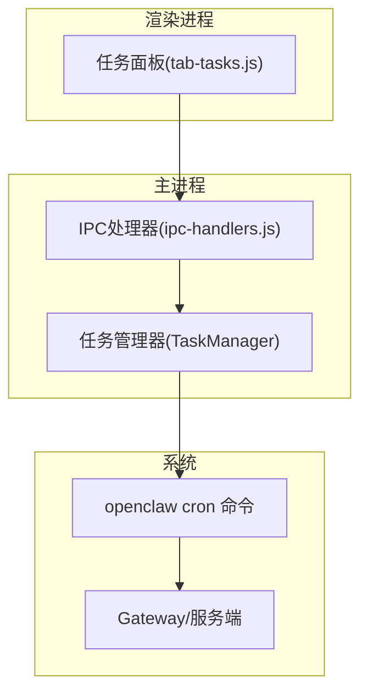
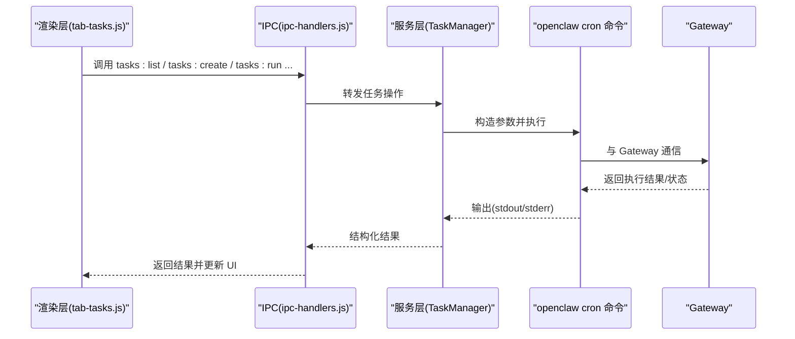
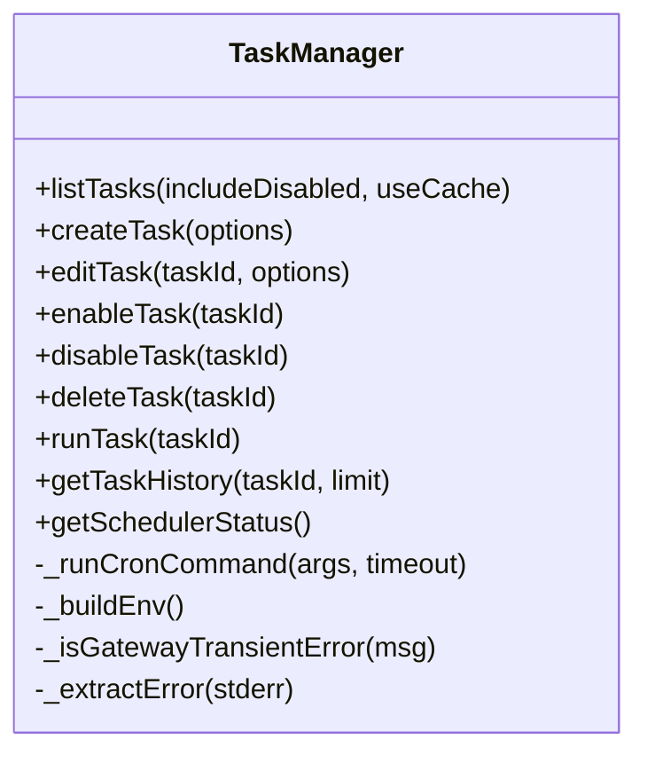
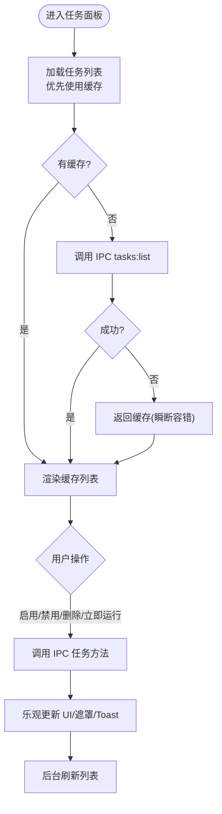
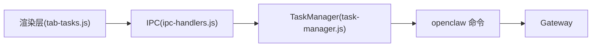

# 任务管理

<cite>
**本文引用的文件**
- [task-manager.js](file://src/main/services/task-manager.js)
- [ipc-handlers.js](file://src/main/ipc-handlers.js)
- [tab-tasks.js](file://src/renderer/js/dashboard/tab-tasks.js)
- [app.js](file://src/renderer/js/app.js)
- [package.json](file://package.json)
</cite>

## 目录
1. [简介](#简介)
2. [项目结构](#项目结构)
3. [核心组件](#核心组件)
4. [架构总览](#架构总览)
5. [详细组件分析](#详细组件分析)
6. [依赖关系分析](#依赖关系分析)
7. [性能考虑](#性能考虑)
8. [故障排查指南](#故障排查指南)
9. [结论](#结论)
10. [附录](#附录)

## 简介
本指南面向使用者与维护者，系统讲解“任务管理”功能的使用与运维要点，涵盖以下方面：
- 如何创建、调度、监控与管理定时任务、批处理任务与长期运行任务
- 任务优先级与资源分配机制
- 任务执行历史与状态跟踪
- 任务的暂停、恢复与取消
- 任务队列管理与优化（并发控制、负载均衡）
- 失败自动重试与错误处理
- 性能监控与资源使用查看
- 任务模板与批量操作

本系统基于 Electron 应用，通过 IPC 与主进程的任务管理模块交互，最终调用底层的 openclaw cron 命令进行任务生命周期管理。

## 项目结构
任务管理功能由三部分组成：
- 主进程服务层：负责与 openclaw 交互、封装命令行调用、缓存与错误处理
- 渲染进程 UI 层：提供任务列表、创建/编辑表单、历史查看与操作入口
- IPC 通道：桥接渲染进程与主进程服务

图表来源
- [ipc-handlers.js:672-707](file://src/main/ipc-handlers.js#L672-L707)
- [task-manager.js:158-256](file://src/main/services/task-manager.js#L158-L256)

章节来源
- [ipc-handlers.js:672-707](file://src/main/ipc-handlers.js#L672-L707)
- [task-manager.js:57-83](file://src/main/services/task-manager.js#L57-L83)
- [tab-tasks.js:37-495](file://src/renderer/js/dashboard/tab-tasks.js#L37-L495)

## 核心组件
- 任务管理器（TaskManager）
  - 作用：封装 openclaw cron 命令调用，提供任务列表、创建、编辑、启用/禁用、删除、立即运行、历史查询、调度器状态查询等能力
  - 特性：命令行参数标准化、Windows 编码解码、PATH 构建、超时控制、缓存策略、网关瞬断容错
- IPC 处理器（ipc-handlers.js）
  - 作用：注册任务相关的 IPC 方法，将渲染层调用转发至 TaskManager，并返回结果
- 任务面板（tab-tasks.js）
  - 作用：提供可视化的任务管理界面，包括列表、创建/编辑表单、历史弹窗、错误详情弹窗、加载遮罩与乐观更新
- 应用入口（app.js）
  - 作用：应用启动流程控制，决定进入向导还是仪表盘

章节来源
- [task-manager.js:57-734](file://src/main/services/task-manager.js#L57-L734)
- [ipc-handlers.js:672-707](file://src/main/ipc-handlers.js#L672-L707)
- [tab-tasks.js:2-1448](file://src/renderer/js/dashboard/tab-tasks.js#L2-L1448)
- [app.js:1-72](file://src/renderer/js/app.js#L1-L72)

## 架构总览
任务管理采用“渲染层 -> IPC -> 服务层”的分层设计，服务层通过子进程调用 openclaw 的 cron 命令与 Gateway 交互。UI 层负责用户交互与状态反馈，服务层负责可靠性与健壮性。

图表来源
- [ipc-handlers.js:672-707](file://src/main/ipc-handlers.js#L672-L707)
- [task-manager.js:158-256](file://src/main/services/task-manager.js#L158-L256)

## 详细组件分析

### 任务管理器（TaskManager）
- 职责
  - 任务 CRUD：创建、编辑、启用、禁用、删除
  - 任务执行：立即运行
  - 历史查询：按任务 ID 获取执行历史
  - 状态查询：获取调度器状态
  - 缓存策略：任务列表 30 秒 TTL；网关瞬断时返回陈旧缓存
  - 错误处理：过滤 ANSI 颜色与无关日志，提取关键错误信息
- 关键实现要点
  - 命令行参数构造：统一使用“=分隔”以规避 Windows CMD 解析问题
  - 环境构建：合并 PATH，确保 openclaw 与 Node.js 可用
  - 超时控制：不同命令设置不同超时，避免阻塞
  - 瞬断容错：识别 Gateway 临时连接失败，优先返回缓存
- 适用场景
  - 定时任务：通过 cron/at/every 等调度方式创建
  - 批处理任务：通过“立即运行”触发一次性执行
  - 长期运行任务：通过 Gateway/Agent 能力承载，任务管理器负责生命周期与状态查询

图表来源
- [task-manager.js:57-734](file://src/main/services/task-manager.js#L57-L734)

章节来源
- [task-manager.js:57-734](file://src/main/services/task-manager.js#L57-L734)

### IPC 处理器（ipc-handlers.js）
- 职责
  - 注册 tasks:* 相关 IPC 方法，转发到 TaskManager
  - 统一异常捕获与错误回传
- 与 UI 的对接
  - 渲染层通过 window.openclawAPI.tasks.* 调用
  - IPC 层将结果返回给 UI，驱动乐观更新与错误提示

章节来源
- [ipc-handlers.js:672-707](file://src/main/ipc-handlers.js#L672-L707)

### 任务面板（tab-tasks.js）
- 职责
  - 渲染任务列表与卡片，展示状态、下次/上次执行时间、错误计数
  - 提供创建/编辑表单，支持多种调度方式（每日/每周/每月/一次性/间隔/Cron）
  - 支持 IM 通知渠道与目标配置（本地存储）
  - 历史弹窗与错误详情弹窗
  - 加载遮罩与乐观更新，防止重复操作
- 交互流程
  - 列表加载 -> 缓存优先 -> 异步刷新
  - 操作按钮 -> IPC -> 服务层 -> 成功后乐观更新 UI

图表来源
- [tab-tasks.js:37-495](file://src/renderer/js/dashboard/tab-tasks.js#L37-L495)
- [tab-tasks.js:932-1060](file://src/renderer/js/dashboard/tab-tasks.js#L932-L1060)

章节来源
- [tab-tasks.js:2-1448](file://src/renderer/js/dashboard/tab-tasks.js#L2-L1448)

### 应用入口（app.js）
- 职责
  - 应用启动检测 OpenClaw 安装状态，决定进入向导或仪表盘
  - 与 DashboardController 协作初始化各面板

章节来源
- [app.js:1-72](file://src/renderer/js/app.js#L1-L72)

## 依赖关系分析
- 渲染层依赖
  - window.openclawAPI.tasks.*：通过 IPC 调用主进程任务管理能力
- 主进程依赖
  - TaskManager：封装 openclaw cron 命令
  - ShellExecutor/Logger/paths：辅助工具
- 外部依赖
  - openclaw：任务调度与执行载体
  - Gateway：任务执行的后端服务

图表来源
- [ipc-handlers.js:672-707](file://src/main/ipc-handlers.js#L672-L707)
- [task-manager.js:158-256](file://src/main/services/task-manager.js#L158-L256)

章节来源
- [ipc-handlers.js:672-707](file://src/main/ipc-handlers.js#L672-L707)
- [task-manager.js:158-256](file://src/main/services/task-manager.js#L158-L256)

## 性能考虑
- 列表缓存
  - 任务列表缓存 30 秒，减少频繁调用，提升响应速度
  - 网关瞬断时返回陈旧缓存，保证 UI 可用性
- 超时控制
  - 不同命令设置不同超时，避免长时间阻塞
- 乐观更新与加载遮罩
  - 操作时显示遮罩与提示，改善用户体验
- 资源与并发
  - 任务执行由 openclaw/Gateway 负责，建议通过调度策略与资源配额控制并发
  - 避免在同一时间创建过多高资源消耗任务

章节来源
- [task-manager.js:65-73](file://src/main/services/task-manager.js#L65-L73)
- [task-manager.js:262-271](file://src/main/services/task-manager.js#L262-L271)
- [tab-tasks.js:932-964](file://src/renderer/js/dashboard/tab-tasks.js#L932-L964)

## 故障排查指南
- 常见错误与定位
  - 网关瞬断：识别关键字（如 gateway closed、1006、econnrefused 等），返回缓存并提示“状态陈旧”
  - 命令行错误：从 stderr 提取关键行，过滤 ANSI 与无关信息
  - 超时：根据命令设置的超时判断是否为网络/服务延迟
- 排查步骤
  - 查看任务卡片右上角“错误: N 次(点击查看)”详情
  - 在历史弹窗中查看最近执行记录与耗时
  - 使用“调度器状态”接口确认调度器健康状况
- 建议
  - 若出现大量连续错误，检查提示词、模型配置与通知目标
  - 对于超时任务，适当提高 timeout 或拆分任务

章节来源
- [task-manager.js:262-326](file://src/main/services/task-manager.js#L262-L326)
- [task-manager.js:579-606](file://src/main/services/task-manager.js#L579-L606)
- [tab-tasks.js:763-800](file://src/renderer/js/dashboard/tab-tasks.js#L763-L800)
- [tab-tasks.js:863-897](file://src/renderer/js/dashboard/tab-tasks.js#L863-L897)

## 结论
本任务管理功能以 TaskManager 为核心，结合 IPC 与 UI 层，提供了完整的任务生命周期管理能力。其特性包括：
- 可靠的命令行封装与错误处理
- 列表缓存与网关瞬断容错
- 丰富的调度方式与可视化表单
- 历史与状态跟踪，便于运维与排障

建议在生产环境中配合调度策略与资源配额，合理规划任务并发与执行窗口，以获得更稳定的性能表现。

## 附录

### 任务创建与调度指南
- 创建任务
  - 通过“新建任务”表单填写标题、提示词、工作目录、到期时间等
  - 选择调度方式：每日/每周/每月/一次性/间隔/Cron
  - 配置高级选项（时区、模型、禁用后创建等）
- 调度方式说明
  - Cron：标准 Cron 表达式
  - 一次性：指定日期时间
  - 间隔：分钟/小时/天为单位的周期
- 通知配置
  - 可选飞书/钉钉/企业微信，填写对应目标 ID
  - 通知目标保存在本地存储，编辑时可清空

章节来源
- [tab-tasks.js:37-495](file://src/renderer/js/dashboard/tab-tasks.js#L37-L495)
- [tab-tasks.js:1299-1317](file://src/renderer/js/dashboard/tab-tasks.js#L1299-L1317)

### 任务执行与状态跟踪
- 立即运行
  - 在任务卡片点击“立即运行”，触发一次执行
- 历史记录
  - 在任务卡片点击“历史”，查看最近执行记录与状态
- 调度器状态
  - 通过“调度器状态”接口查看底层调度器健康状况

章节来源
- [tab-tasks.js:1024-1050](file://src/renderer/js/dashboard/tab-tasks.js#L1024-L1050)
- [tab-tasks.js:863-897](file://src/renderer/js/dashboard/tab-tasks.js#L863-L897)
- [task-manager.js:712-731](file://src/main/services/task-manager.js#L712-L731)

### 任务暂停、恢复与取消
- 暂停/恢复
  - 通过“禁用/启用”按钮切换任务状态
- 取消
  - 任务执行由 openclaw/Gateway 控制；取消通常通过禁用任务或终止执行流程实现
  - 若任务处于执行中，建议等待其自然结束或联系后端

章节来源
- [tab-tasks.js:966-1022](file://src/renderer/js/dashboard/tab-tasks.js#L966-L1022)
- [task-manager.js:479-534](file://src/main/services/task-manager.js#L479-L534)

### 任务队列管理与优化
- 并发控制
  - 通过调度策略限制同时运行的任务数量
  - 避免高资源消耗任务集中执行
- 负载均衡
  - 将任务分散到不同时间段或节点（若存在多实例）
- 超时与重试
  - 为任务设置合理 timeout
  - 对于瞬断错误自动重试，避免人工干预

章节来源
- [task-manager.js:174-181](file://src/main/services/task-manager.js#L174-L181)
- [task-manager.js:262-271](file://src/main/services/task-manager.js#L262-L271)

### 任务模板与批量操作
- 模板
  - 可在表单中复用常用配置（标题、提示词、模型、时区等）
- 批量操作
  - 通过 UI 逐项启用/禁用/删除
  - 批量创建可通过多次调用 IPC 实现（建议在自动化脚本中）

章节来源
- [tab-tasks.js:1299-1367](file://src/renderer/js/dashboard/tab-tasks.js#L1299-L1367)
- [ipc-handlers.js:677-695](file://src/main/ipc-handlers.js#L677-L695)