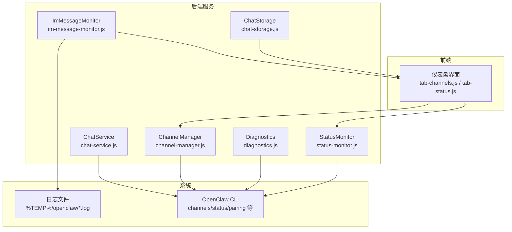
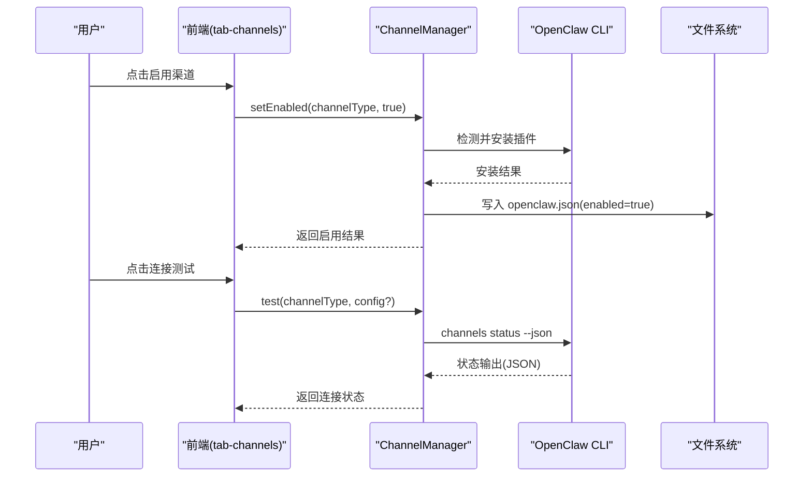
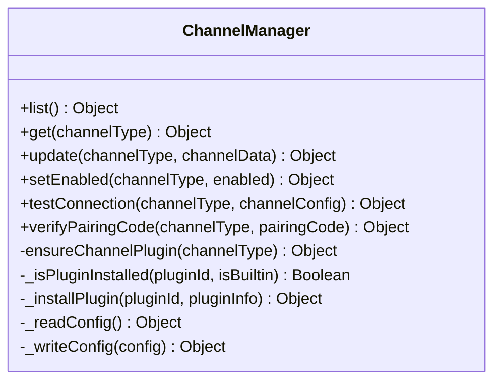
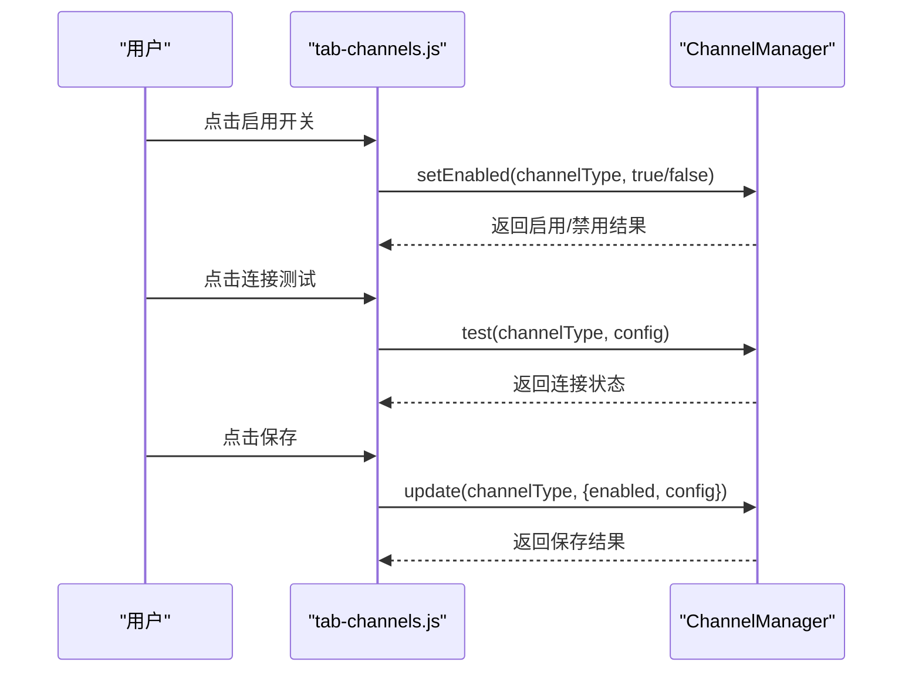
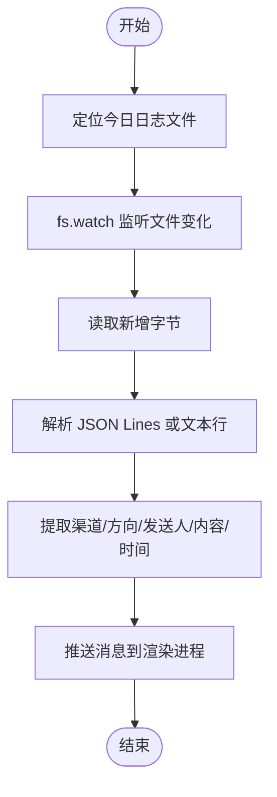
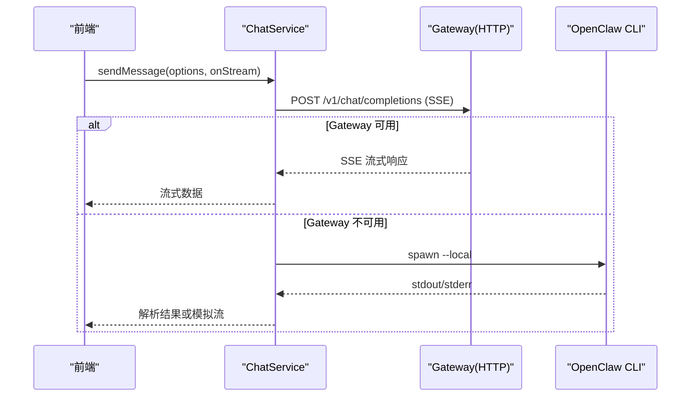
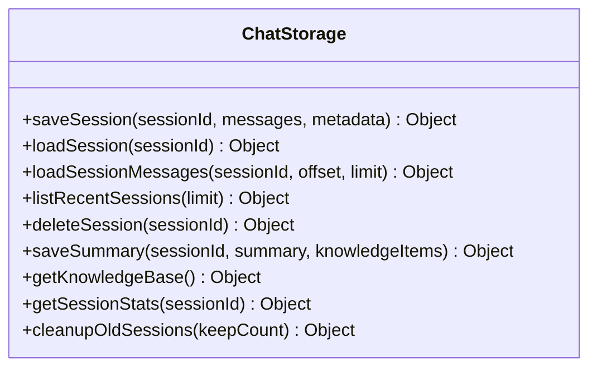
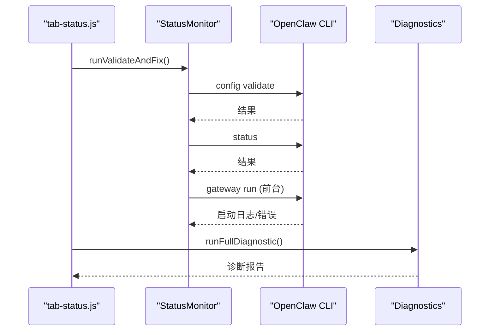
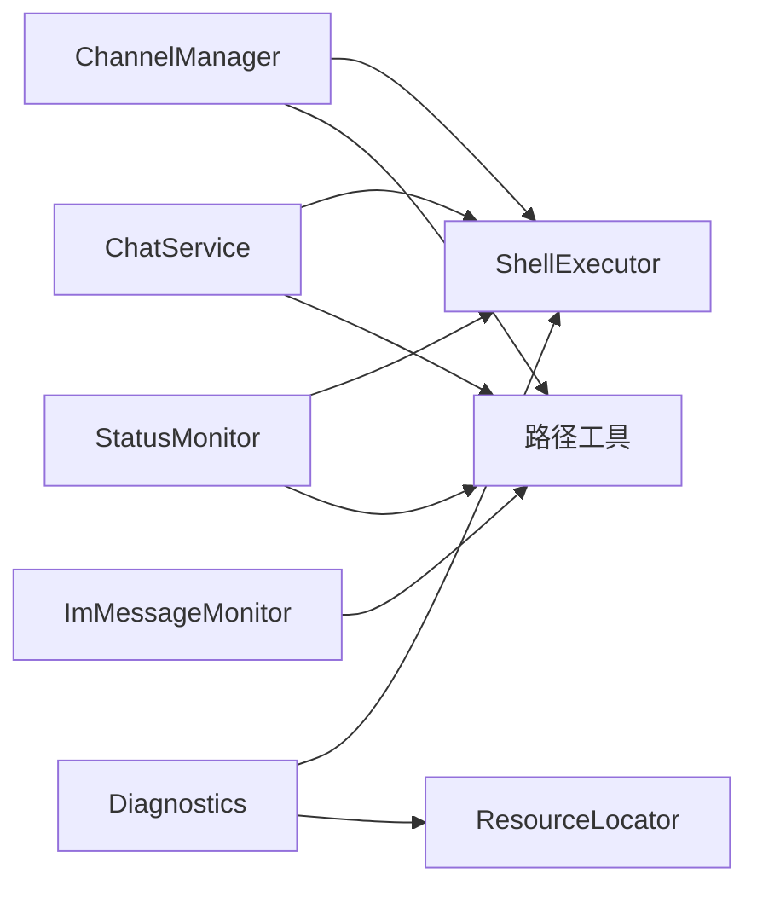

# 即时通讯渠道

<cite>
**本文引用的文件**
- [channel-manager.js](file://src/main/services/channel-manager.js)
- [tab-channels.js](file://src/renderer/js/dashboard/tab-channels.js)
- [im-message-monitor.js](file://src/main/services/im-message-monitor.js)
- [chat-service.js](file://src/main/services/chat-service.js)
- [chat-storage.js](file://src/main/services/chat-storage.js)
- [status-monitor.js](file://src/main/services/status-monitor.js)
- [diagnostics.js](file://src/main/utils/diagnostics.js)
- [tab-status.js](file://src/renderer/js/dashboard/tab-status.js)
- [onboard-config-writer.js](file://src/main/services/onboard-config-writer.js)
- [openclaw-installer.js](file://src/main/services/openclaw-installer.js)
</cite>

## 目录
1. [简介](#简介)
2. [项目结构](#项目结构)
3. [核心组件](#核心组件)
4. [架构总览](#架构总览)
5. [详细组件分析](#详细组件分析)
6. [依赖关系分析](#依赖关系分析)
7. [性能考虑](#性能考虑)
8. [故障排除指南](#故障排除指南)
9. [结论](#结论)
10. [附录](#附录)

## 简介
本指南面向即时通讯渠道管理功能，涵盖微信、钉钉、QQ、飞书等主流平台的渠道配置、启用、连接测试、消息转发与同步、状态监控、故障诊断与恢复、以及消息历史与归档能力。读者将了解如何在管理界面中添加与配置渠道，如何验证连接质量，如何通过日志监控渠道消息，以及如何进行故障排查与恢复。

## 项目结构
本功能主要由三部分组成：
- 渠道配置与管理：后端服务负责渠道定义、配置读写、插件安装与启用、连接测试与配对码验证；前端仪表盘提供可视化配置界面。
- 消息监听与同步：通过监听 OpenClaw 日志文件，实时提取飞书、钉钉、微信、Slack、Telegram、Discord 等渠道消息，推送至渲染进程的智能对话面板。
- 状态监控与诊断：提供服务状态轮询、增强诊断（doctor --fix）、版本检查、安装与更新流程等。

图表来源
- [channel-manager.js:1-747](file://src/main/services/channel-manager.js#L1-L747)
- [tab-channels.js:1-414](file://src/renderer/js/dashboard/tab-channels.js#L1-L414)
- [im-message-monitor.js:1-498](file://src/main/services/im-message-monitor.js#L1-L498)
- [chat-service.js:1-1345](file://src/main/services/chat-service.js#L1-L1345)
- [chat-storage.js:1-333](file://src/main/services/chat-storage.js#L1-L333)
- [status-monitor.js:1-274](file://src/main/services/status-monitor.js#L1-L274)
- [diagnostics.js:1-196](file://src/main/utils/diagnostics.js#L1-L196)
- [tab-status.js:1-460](file://src/renderer/js/dashboard/tab-status.js#L1-L460)

章节来源
- [channel-manager.js:1-747](file://src/main/services/channel-manager.js#L1-L747)
- [tab-channels.js:1-414](file://src/renderer/js/dashboard/tab-channels.js#L1-L414)
- [im-message-monitor.js:1-498](file://src/main/services/im-message-monitor.js#L1-L498)
- [chat-service.js:1-1345](file://src/main/services/chat-service.js#L1-L1345)
- [chat-storage.js:1-333](file://src/main/services/chat-storage.js#L1-L333)
- [status-monitor.js:1-274](file://src/main/services/status-monitor.js#L1-L274)
- [diagnostics.js:1-196](file://src/main/utils/diagnostics.js#L1-L196)
- [tab-status.js:1-460](file://src/renderer/js/dashboard/tab-status.js#L1-L460)

## 核心组件
- ChannelManager：负责渠道定义、配置读写、启用/禁用、插件安装与检测、连接测试、配对码验证。
- ImMessageMonitor：监听 OpenClaw 日志文件，解析并推送 IM 渠道消息到前端。
- ChatService：提供智能对话能力，支持 Gateway HTTP SSE 与 CLI 降级模式。
- ChatStorage：会话历史持久化、分页加载、知识沉淀与归档。
- StatusMonitor：服务状态轮询、doctor --fix、Gateway 前台运行诊断。
- Diagnostics：系统环境与 OpenClaw 安装状态诊断。
- 前端仪表盘：tab-channels.js 提供渠道配置界面；tab-status.js 提供状态与诊断界面。

章节来源
- [channel-manager.js:1-747](file://src/main/services/channel-manager.js#L1-L747)
- [im-message-monitor.js:1-498](file://src/main/services/im-message-monitor.js#L1-L498)
- [chat-service.js:1-1345](file://src/main/services/chat-service.js#L1-L1345)
- [chat-storage.js:1-333](file://src/main/services/chat-storage.js#L1-L333)
- [status-monitor.js:1-274](file://src/main/services/status-monitor.js#L1-L274)
- [diagnostics.js:1-196](file://src/main/utils/diagnostics.js#L1-L196)
- [tab-channels.js:1-414](file://src/renderer/js/dashboard/tab-channels.js#L1-L414)
- [tab-status.js:1-460](file://src/renderer/js/dashboard/tab-status.js#L1-L460)

## 架构总览
本功能采用“配置驱动 + 日志监听 + 服务状态监控”的架构：
- 渠道配置通过 ChannelManager 写入 openclaw.json，启用时自动检测并安装对应 openclaw 插件。
- 消息通过 openclaw channels status 与日志文件双通道监控，ImMessageMonitor 解析并推送消息。
- ChatService 优先使用 Gateway HTTP SSE，失败时降级到 CLI 模式；ChatStorage 负责历史与归档。
- StatusMonitor 与 Diagnostics 提供服务状态与系统诊断能力。

图表来源
- [channel-manager.js:249-596](file://src/main/services/channel-manager.js#L249-L596)
- [tab-channels.js:213-317](file://src/renderer/js/dashboard/tab-channels.js#L213-L317)

章节来源
- [channel-manager.js:249-596](file://src/main/services/channel-manager.js#L249-L596)
- [tab-channels.js:213-317](file://src/renderer/js/dashboard/tab-channels.js#L213-L317)

## 详细组件分析

### 渠道配置与管理（ChannelManager）
- 渠道定义：支持飞书、钉钉、QQ、企业微信等，定义字段、是否多账户、是否需要配对等。
- 配置读写：读取/写入 openclaw.json，自动备份旧配置。
- 启用/禁用：启用时检测并安装对应 openclaw 插件；禁用时仅更新状态。
- 连接测试：自动校验配置完整性，必要时先写入配置，再执行 channels status --json 获取状态。
- 配对码验证：通过 openclaw pairing approve 验证并保存配对码（飞书适用）。

图表来源
- [channel-manager.js:8-747](file://src/main/services/channel-manager.js#L8-L747)

章节来源
- [channel-manager.js:12-72](file://src/main/services/channel-manager.js#L12-L72)
- [channel-manager.js:75-110](file://src/main/services/channel-manager.js#L75-L110)
- [channel-manager.js:115-140](file://src/main/services/channel-manager.js#L115-L140)
- [channel-manager.js:145-173](file://src/main/services/channel-manager.js#L145-L173)
- [channel-manager.js:178-240](file://src/main/services/channel-manager.js#L178-L240)
- [channel-manager.js:249-295](file://src/main/services/channel-manager.js#L249-L295)
- [channel-manager.js:311-351](file://src/main/services/channel-manager.js#L311-L351)
- [channel-manager.js:362-395](file://src/main/services/channel-manager.js#L362-L395)
- [channel-manager.js:447-471](file://src/main/services/channel-manager.js#L447-L471)
- [channel-manager.js:484-596](file://src/main/services/channel-manager.js#L484-L596)
- [channel-manager.js:603-653](file://src/main/services/channel-manager.js#L603-L653)

### 前端渠道配置界面（tab-channels.js）
- 渲染渠道列表与配置表单，支持密码可见切换、清空输入、连接测试、配对码验证。
- 启用/禁用切换时调用后端 setEnabled，显示插件安装进度与结果。
- 保存配置时合并表单值并调用后端 update。

图表来源
- [tab-channels.js:213-392](file://src/renderer/js/dashboard/tab-channels.js#L213-L392)

章节来源
- [tab-channels.js:7-47](file://src/renderer/js/dashboard/tab-channels.js#L7-L47)
- [tab-channels.js:213-392](file://src/renderer/js/dashboard/tab-channels.js#L213-L392)

### 消息监听与同步（ImMessageMonitor）
- 监听 %TEMP%\openclaw\openclaw-YYYY-MM-DD.log，每日滚动。
- 解析 tslog JSON Lines 或文本行，提取渠道、消息方向、发送人、时间戳等。
- 支持飞书、钉钉、微信、Slack、Telegram、Discord 等渠道识别与规范化。
- 通过回调将消息推送到渲染进程，用于智能对话面板展示。

图表来源
- [im-message-monitor.js:138-244](file://src/main/services/im-message-monitor.js#L138-L244)
- [im-message-monitor.js:246-286](file://src/main/services/im-message-monitor.js#L246-L286)
- [im-message-monitor.js:299-494](file://src/main/services/im-message-monitor.js#L299-L494)

章节来源
- [im-message-monitor.js:39-59](file://src/main/services/im-message-monitor.js#L39-L59)
- [im-message-monitor.js:138-244](file://src/main/services/im-message-monitor.js#L138-L244)
- [im-message-monitor.js:246-286](file://src/main/services/im-message-monitor.js#L246-L286)
- [im-message-monitor.js:299-494](file://src/main/services/im-message-monitor.js#L299-L494)

### 智能对话与消息流（ChatService）
- 优先使用 Gateway HTTP SSE，失败时降级到 CLI --local 模式。
- 支持思考阶段、生成阶段的状态推进，提供流式输出与错误兜底。
- 会话锁清理：自动清理过期 session lock，避免并发访问阻塞。

图表来源
- [chat-service.js:347-536](file://src/main/services/chat-service.js#L347-L536)
- [chat-service.js:968-984](file://src/main/services/chat-service.js#L968-L984)
- [chat-service.js:1005-1280](file://src/main/services/chat-service.js#L1005-L1280)

章节来源
- [chat-service.js:92-116](file://src/main/services/chat-service.js#L92-L116)
- [chat-service.js:347-536](file://src/main/services/chat-service.js#L347-L536)
- [chat-service.js:968-984](file://src/main/services/chat-service.js#L968-L984)
- [chat-service.js:1005-1280](file://src/main/services/chat-service.js#L1005-L1280)

### 会话历史与归档（ChatStorage）
- 保存/加载会话，支持分页加载与统计。
- 保存总结与知识沉淀，维护知识库文件。
- 清理过期会话，控制存储空间。

图表来源
- [chat-storage.js:15-333](file://src/main/services/chat-storage.js#L15-L333)

章节来源
- [chat-storage.js:51-90](file://src/main/services/chat-storage.js#L51-L90)
- [chat-storage.js:98-128](file://src/main/services/chat-storage.js#L98-L128)
- [chat-storage.js:133-166](file://src/main/services/chat-storage.js#L133-L166)
- [chat-storage.js:199-222](file://src/main/services/chat-storage.js#L199-L222)
- [chat-storage.js:257-270](file://src/main/services/chat-storage.js#L257-L270)
- [chat-storage.js:275-300](file://src/main/services/chat-storage.js#L275-L300)
- [chat-storage.js:305-329](file://src/main/services/chat-storage.js#L305-L329)

### 状态监控与诊断（StatusMonitor / Diagnostics）
- StatusMonitor：轮询服务状态、运行 doctor --fix、前台运行 Gateway 捕获启动错误。
- Diagnostics：系统环境检查、资源文件检查、OpenClaw 安装状态检查、生成诊断报告。

图表来源
- [status-monitor.js:80-130](file://src/main/services/status-monitor.js#L80-L130)
- [status-monitor.js:169-269](file://src/main/services/status-monitor.js#L169-L269)
- [diagnostics.js:14-44](file://src/main/utils/diagnostics.js#L14-L44)
- [diagnostics.js:114-146](file://src/main/utils/diagnostics.js#L114-L146)
- [tab-status.js:322-372](file://src/renderer/js/dashboard/tab-status.js#L322-L372)

章节来源
- [status-monitor.js:8-274](file://src/main/services/status-monitor.js#L8-L274)
- [diagnostics.js:1-196](file://src/main/utils/diagnostics.js#L1-L196)
- [tab-status.js:322-372](file://src/renderer/js/dashboard/tab-status.js#L322-L372)

### 安装与配置写入（OnboardConfigWriter / OpenClawInstaller）
- OnboardConfigWriter：将表单数据转换为 openclaw.json 结构，写入 .env 与 auth-profiles.json。
- OpenClawInstaller：安装/更新 openclaw，写入默认配置，启动 Gateway，补全扩展 README。

章节来源
- [onboard-config-writer.js:13-328](file://src/main/services/onboard-config-writer.js#L13-L328)
- [onboard-config-writer.js:349-410](file://src/main/services/onboard-config-writer.js#L349-L410)
- [openclaw-installer.js:117-438](file://src/main/services/openclaw-installer.js#L117-L438)
- [openclaw-installer.js:534-576](file://src/main/services/openclaw-installer.js#L534-L576)

## 依赖关系分析
- ChannelManager 依赖 ShellExecutor 与日志/路径工具，调用 openclaw skills install 与 channels status。
- ImMessageMonitor 依赖日志路径工具，解析 tslog JSON Lines 与文本行。
- ChatService 依赖 ShellExecutor 与路径工具，调用 openclaw agent 与 gateway。
- StatusMonitor 依赖 ShellExecutor 与路径工具，调用 openclaw doctor/status/gateway run。
- Diagnostics 依赖 ShellExecutor 与资源定位工具，检查系统与 OpenClaw 安装状态。

图表来源
- [channel-manager.js:1-7](file://src/main/services/channel-manager.js#L1-L7)
- [im-message-monitor.js:28-32](file://src/main/services/im-message-monitor.js#L28-L32)
- [chat-service.js:14-21](file://src/main/services/chat-service.js#L14-L21)
- [status-monitor.js:1-7](file://src/main/services/status-monitor.js#L1-L7)
- [diagnostics.js:1-6](file://src/main/utils/diagnostics.js#L1-L6)

章节来源
- [channel-manager.js:1-7](file://src/main/services/channel-manager.js#L1-L7)
- [im-message-monitor.js:28-32](file://src/main/services/im-message-monitor.js#L28-L32)
- [chat-service.js:14-21](file://src/main/services/chat-service.js#L14-L21)
- [status-monitor.js:1-7](file://src/main/services/status-monitor.js#L1-L7)
- [diagnostics.js:1-6](file://src/main/utils/diagnostics.js#L1-L6)

## 性能考虑
- 日志监听采用 fs.watch 并按天滚动，避免大文件读取压力。
- Gateway SSE 优先，减少 CLI 冷启动与模型推理延迟。
- 会话锁清理避免长时间阻塞，提升并发稳定性。
- 前端分页加载历史消息，降低内存占用。

## 故障排除指南
- 网络问题：检查 Gateway 端口与绑定地址，确认防火墙放行；必要时使用 doctor --fix 修复。
- 认证失败：核对 API Key/Token 是否正确写入 .env 与 auth-profiles.json；确认 provider 配置正确。
- 插件未安装：启用渠道时自动安装对应 openclaw 插件；若失败，手动运行 openclaw skills install <pluginId>。
- API 限制：关注 Provider 速率限制与配额；适当调整模型与上下文长度。
- 日志解析异常：确认日志格式为 tslog JSON Lines；检查日志文件是否存在与可读。
- 会话锁阻塞：ChatService 会自动清理过期锁；若仍阻塞，重启 Gateway 或清理 session 文件。

章节来源
- [status-monitor.js:80-130](file://src/main/services/status-monitor.js#L80-L130)
- [diagnostics.js:14-44](file://src/main/utils/diagnostics.js#L14-L44)
- [chat-service.js:826-963](file://src/main/services/chat-service.js#L826-L963)
- [tab-status.js:322-372](file://src/renderer/js/dashboard/tab-status.js#L322-L372)

## 结论
本功能通过“配置驱动 + 日志监听 + 服务状态监控”的架构，实现了对主流即时通讯渠道的统一管理与消息同步。前端提供直观的配置界面，后端保障渠道插件安装、连接测试与配对验证，日志解析实现消息实时转发，服务与诊断模块确保系统稳定与可运维性。结合会话历史与归档能力，用户可高效管理与追踪渠道消息。

## 附录
- 支持的渠道类型与字段定义参见 ChannelManager 的 CHANNEL_DEFINITIONS。
- 渠道插件映射参见 CHANNEL_PLUGIN_MAP。
- 渠道消息识别与规范化参见 IM_CHANNEL_NAMES 与 CHANNEL_NORMALIZE。
- 安装与更新流程参见 OpenClawInstaller 的 install/update。

章节来源
- [channel-manager.js:12-72](file://src/main/services/channel-manager.js#L12-L72)
- [channel-manager.js:39-59](file://src/main/services/channel-manager.js#L39-L59)
- [openclaw-installer.js:117-438](file://src/main/services/openclaw-installer.js#L117-L438)