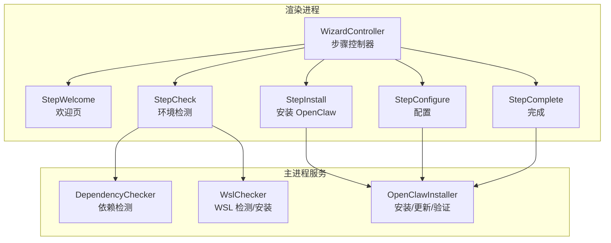
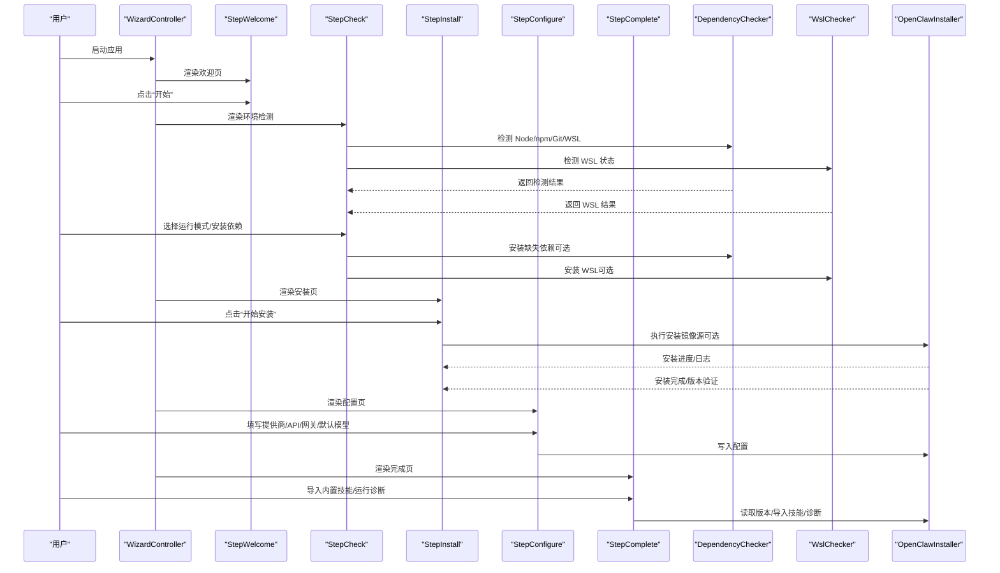
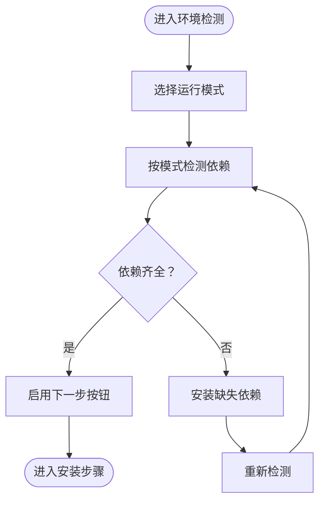
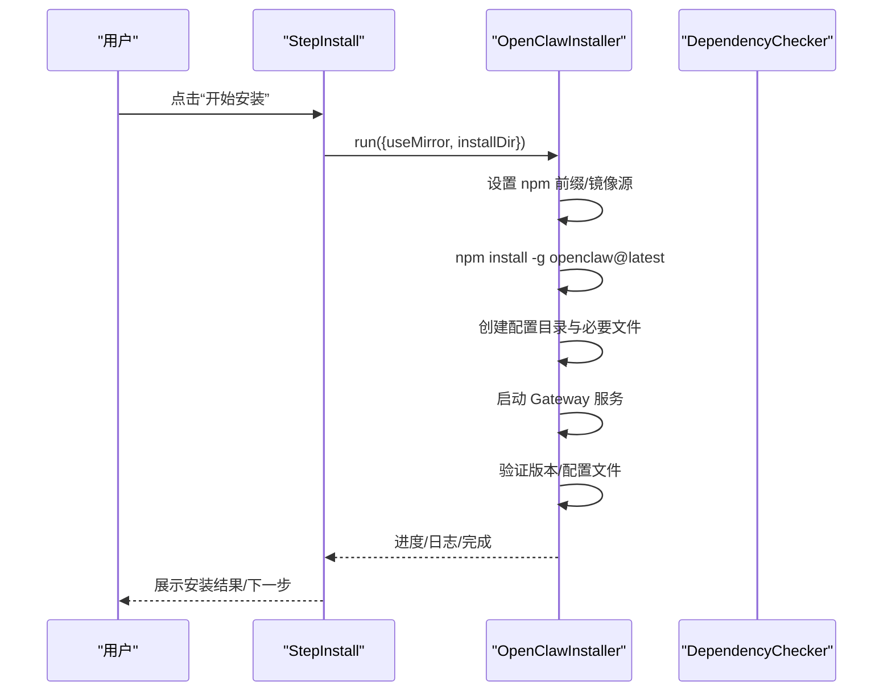
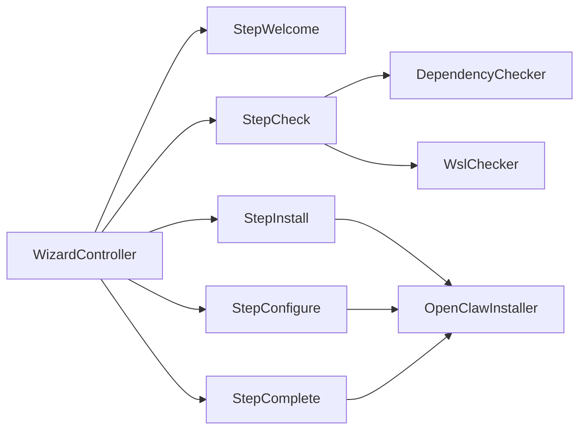

# 安装向导使用

<cite>
**本文引用的文件**
- [README.md](file://README.md)
- [wizard-controller.js](file://src/renderer/js/wizard/wizard-controller.js)
- [step-welcome.js](file://src/renderer/js/wizard/step-welcome.js)
- [step-check.js](file://src/renderer/js/wizard/step-check.js)
- [step-install.js](file://src/renderer/js/wizard/step-install.js)
- [step-configure.js](file://src/renderer/js/wizard/step-configure.js)
- [step-complete.js](file://src/renderer/js/wizard/step-complete.js)
- [dependency-checker.js](file://src/main/services/dependency-checker.js)
- [openclaw-installer.js](file://src/main/services/openclaw-installer.js)
- [wsl-checker.js](file://src/main/services/wsl-checker.js)
- [INSTALLATION_FIX_GUIDE.md](file://docs/INSTALLATION_FIX_GUIDE.md)
- [TROUBLESHOOTING.md](file://docs/TROUBLESHOOTING.md)
- [defaults.js](file://src/main/config/defaults.js)
</cite>

## 目录
1. [简介](#简介)
2. [项目结构](#项目结构)
3. [核心组件](#核心组件)
4. [架构总览](#架构总览)
5. [详细组件分析](#详细组件分析)
6. [依赖关系分析](#依赖关系分析)
7. [性能考虑](#性能考虑)
8. [故障排查指南](#故障排查指南)
9. [结论](#结论)
10. [附录](#附录)

## 简介
本指南面向首次安装 OpenClaw 的用户，系统讲解“安装向导”的五步流程：欢迎页面、环境检测、依赖安装、OpenClaw 安装与配置、完成页面。文档覆盖每一步的操作界面与功能、环境检测内容、依赖项列表、安装进度显示、配置选项，以及常见问题的解决方案与最佳实践。

## 项目结构
安装向导位于渲染进程的 wizard 子目录，采用“步骤控制器 + 多步骤组件”的分层设计，步骤间通过控制器进行导航与状态传递；主进程提供依赖检测、WSL 管理、OpenClaw 安装与更新等核心服务。

图示来源
- [wizard-controller.js:1-91](file://src/renderer/js/wizard/wizard-controller.js#L1-L91)
- [step-welcome.js:1-49](file://src/renderer/js/wizard/step-welcome.js#L1-L49)
- [step-check.js:1-506](file://src/renderer/js/wizard/step-check.js#L1-L506)
- [step-install.js:1-180](file://src/renderer/js/wizard/step-install.js#L1-L180)
- [step-configure.js:1-350](file://src/renderer/js/wizard/step-configure.js#L1-L350)
- [step-complete.js:1-245](file://src/renderer/js/wizard/step-complete.js#L1-L245)
- [dependency-checker.js:1-800](file://src/main/services/dependency-checker.js#L1-L800)
- [wsl-checker.js:1-311](file://src/main/services/wsl-checker.js#L1-L311)
- [openclaw-installer.js:1-780](file://src/main/services/openclaw-installer.js#L1-L780)

章节来源
- [README.md: 7-13:7-13](file://README.md#L7-L13)
- [wizard-controller.js: 2-L45:2-45](file://src/renderer/js/wizard/wizard-controller.js#L2-L45)

## 核心组件
- 步骤控制器：负责当前步骤索引、步骤渲染、前进/后退、执行模式切换与完成回调。
- 步骤组件：分别实现欢迎页、环境检测、OpenClaw 安装、配置、完成五个步骤的 UI 与交互。
- 主进程服务：依赖检测（Node.js、npm、Git、WSL）、WSL 安装与检测、OpenClaw 安装/更新/版本验证。

章节来源
- [wizard-controller.js: 2-L91:2-91](file://src/renderer/js/wizard/wizard-controller.js#L2-L91)
- [step-check.js: 11-L373:11-373](file://src/renderer/js/wizard/step-check.js#L11-L373)
- [step-install.js: 2-L180:2-180](file://src/renderer/js/wizard/step-install.js#L2-L180)
- [step-configure.js: 2-L350:2-350](file://src/renderer/js/wizard/step-configure.js#L2-L350)
- [step-complete.js: 2-L245:2-245](file://src/renderer/js/wizard/step-complete.js#L2-L245)
- [dependency-checker.js: 133-L800:133-800](file://src/main/services/dependency-checker.js#L133-L800)
- [wsl-checker.js: 4-L311:4-311](file://src/main/services/wsl-checker.js#L4-L311)
- [openclaw-installer.js: 10-L780:10-780](file://src/main/services/openclaw-installer.js#L10-L780)

## 架构总览
安装向导的前后端协作流程如下：

图示来源
- [wizard-controller.js: 8-L89:8-89](file://src/renderer/js/wizard/wizard-controller.js#L8-L89)
- [step-check.js: 18-L77:18-77](file://src/renderer/js/wizard/step-check.js#L18-L77)
- [step-install.js: 5-L75:5-75](file://src/renderer/js/wizard/step-install.js#L5-L75)
- [step-configure.js: 7-L135:7-135](file://src/renderer/js/wizard/step-configure.js#L7-L135)
- [step-complete.js: 6-L101:6-101](file://src/renderer/js/wizard/step-complete.js#L6-L101)
- [dependency-checker.js: 149-L229:149-229](file://src/main/services/dependency-checker.js#L149-L229)
- [wsl-checker.js: 9-L98:9-98](file://src/main/services/wsl-checker.js#L9-L98)
- [openclaw-installer.js: 117-L438:117-438](file://src/main/services/openclaw-installer.js#L117-L438)

## 详细组件分析

### 步骤一：欢迎页面（Welcome）
- 功能：展示产品功能清单与引导按钮，点击后进入下一步。
- 交互：绑定“开始”按钮事件，调用控制器前进到环境检测步骤。
- 界面要点：卡片式功能列表、强调“主要功能”，按钮居中突出。

章节来源
- [step-welcome.js: 2-L49:2-49](file://src/renderer/js/wizard/step-welcome.js#L2-L49)
- [wizard-controller.js: 37-L41:37-41](file://src/renderer/js/wizard/wizard-controller.js#L37-L41)

### 步骤二：环境检测（Check）
- 功能：选择运行模式（原生 Windows / WSL），检测 Node.js、npm、Git、WSL 状态，必要时自动安装。
- 检测内容：
  - Node.js：版本、是否满足最低版本要求（>=18，WSL 模式要求更高）。
  - npm：是否可用。
  - Git：Windows 原生模式下检测。
  - WSL：WSL 版本、发行版列表、状态。
- 依赖安装：
  - Node.js：原生模式先安装 Git 再安装 Node.js；WSL 模式直接在 WSL 中安装 Node.js。
  - WSL：通过提升权限安装，支持进度回调与重启提示。
- 界面要点：模式选择卡片、依赖检测列表、安装按钮、重检按钮、下一步按钮状态联动。

图示来源
- [step-check.js: 18-L77:18-77](file://src/renderer/js/wizard/step-check.js#L18-L77)
- [step-check.js: 193-L230:193-230](file://src/renderer/js/wizard/step-check.js#L193-L230)
- [step-check.js: 420-L503:420-503](file://src/renderer/js/wizard/step-check.js#L420-L503)
- [dependency-checker.js: 149-L229:149-229](file://src/main/services/dependency-checker.js#L149-L229)
- [wsl-checker.js: 113-L212:113-212](file://src/main/services/wsl-checker.js#L113-L212)

章节来源
- [step-check.js: 11-L373:11-373](file://src/renderer/js/wizard/step-check.js#L11-L373)
- [dependency-checker.js: 133-L800:133-800](file://src/main/services/dependency-checker.js#L133-L800)
- [wsl-checker.js: 4-L311:4-311](file://src/main/services/wsl-checker.js#L4-L311)

### 步骤三：安装 OpenClaw（Install）
- 功能：根据运行模式执行全局安装，支持镜像源切换，显示安装进度与终端日志，安装完成后验证版本。
- 进度与日志：
  - 进度条与百分比。
  - 步骤标签（准备、镜像源、npm 安装、创建配置目录、启动 Gateway、验证）。
  - 终端滚动输出，区分普通、成功、错误信息。
- 选项：镜像源开关（npmmirror.com）。
- 验证：安装完成后读取版本并校验配置文件完整性。

图示来源
- [step-install.js: 58-L150:58-150](file://src/renderer/js/wizard/step-install.js#L58-L150)
- [openclaw-installer.js: 117-L438:117-438](file://src/main/services/openclaw-installer.js#L117-L438)
- [defaults.js: 34-L70:34-70](file://src/main/config/defaults.js#L34-L70)

章节来源
- [step-install.js: 2-L180:2-180](file://src/renderer/js/wizard/step-install.js#L2-L180)
- [openclaw-installer.js: 10-L780:10-780](file://src/main/services/openclaw-installer.js#L10-L780)
- [defaults.js: 1-L180:1-180](file://src/main/config/defaults.js#L1-L180)

### 步骤四：配置（Configure）
- 功能：图形化配置 AI 服务商、API Key、Base URL、默认模型、Gateway 端口与绑定、默认模型、工作空间等。
- 交互：
  - 服务商选择与动态字段渲染（自定义/预设）。
  - API Key 明文/密文切换。
  - 网关端口/绑定/IP 白名单、令牌生成。
  - 默认模型（编程/聊天）。
  - 高级选项：工作空间路径选择。
  - 连接测试：填写后可即时验证连通性与可用性。
  - 保存并下一步：写入 onboard 配置。
- 注意：即使服务商不要求 API Key（如本地 Ollama），也需至少填写 Base URL 与模型名称。

章节来源
- [step-configure.js: 7-L350:7-350](file://src/renderer/js/wizard/step-configure.js#L7-L350)

### 步骤五：完成（Complete）
- 功能：展示安装结果、版本号、内置技能导入、运行诊断。
- 选项：
  - 版本显示：安装完成后读取版本。
  - 内置技能：勾选导入，显示进度条与结果统计。
  - 诊断：逐项运行 doctor 步骤，展示每步输出与总体结果。
  - 打开仪表盘：结束安装流程。
- 注意：导入技能过程可监听进度事件，失败项会单独列出。

章节来源
- [step-complete.js: 6-L245:6-245](file://src/renderer/js/wizard/step-complete.js#L6-L245)

## 依赖关系分析
- 步骤控制器与步骤组件：控制器持有步骤数组与当前索引，负责渲染与导航。
- 环境检测步骤依赖主进程服务：
  - DependencyChecker：检测 Node/npm/Git/WSL。
  - WslChecker：检测/安装 WSL。
- 安装步骤依赖 OpenClawInstaller：执行安装、写入配置、启动服务、验证版本。
- 配置步骤依赖 OpenClawInstaller 写入配置。
- 完成步骤依赖 OpenClawInstaller 读取版本、导入技能、运行诊断。

图示来源
- [wizard-controller.js: 2-L45:2-45](file://src/renderer/js/wizard/wizard-controller.js#L2-L45)
- [step-check.js: 11-L373:11-373](file://src/renderer/js/wizard/step-check.js#L11-L373)
- [step-install.js: 2-L180:2-180](file://src/renderer/js/wizard/step-install.js#L2-L180)
- [step-configure.js: 2-L350:2-350](file://src/renderer/js/wizard/step-configure.js#L2-L350)
- [step-complete.js: 2-L245:2-245](file://src/renderer/js/wizard/step-complete.js#L2-L245)
- [dependency-checker.js: 133-L800:133-800](file://src/main/services/dependency-checker.js#L133-L800)
- [wsl-checker.js: 4-L311:4-311](file://src/main/services/wsl-checker.js#L4-L311)
- [openclaw-installer.js: 10-L780:10-780](file://src/main/services/openclaw-installer.js#L10-L780)

章节来源
- [wizard-controller.js: 2-L91:2-91](file://src/renderer/js/wizard/wizard-controller.js#L2-L91)
- [step-check.js: 11-L373:11-373](file://src/renderer/js/wizard/step-check.js#L11-L373)
- [step-install.js: 2-L180:2-180](file://src/renderer/js/wizard/step-install.js#L2-L180)
- [step-configure.js: 2-L350:2-350](file://src/renderer/js/wizard/step-configure.js#L2-L350)
- [step-complete.js: 2-L245:2-245](file://src/renderer/js/wizard/step-complete.js#L2-L245)
- [dependency-checker.js: 133-L800:133-800](file://src/main/services/dependency-checker.js#L133-L800)
- [wsl-checker.js: 4-L311:4-311](file://src/main/services/wsl-checker.js#L4-L311)
- [openclaw-installer.js: 10-L780:10-780](file://src/main/services/openclaw-installer.js#L10-L780)

## 性能考虑
- 安装超时与并发：安装阶段使用较长超时（数分钟），并行检测依赖以缩短等待时间。
- 进度反馈：通过 onProgress 回调实时更新 UI，避免长时间无响应。
- 镜像源：默认使用 npm 官方源，可切换国内镜像以提升网络稳定性。
- 诊断与补救：完成页提供 doctor 诊断，自动汇总各步骤输出，便于定位问题。

章节来源
- [defaults.js: 34-L70:34-70](file://src/main/config/defaults.js#L34-L70)
- [openclaw-installer.js: 600-L618:600-618](file://src/main/services/openclaw-installer.js#L600-L618)
- [step-complete.js: 205-L243:205-243](file://src/renderer/js/wizard/step-complete.js#L205-L243)

## 故障排查指南
- 网络连接失败
  - 切换镜像源（npmmirror.com）。
  - 手动执行安装命令排查网络策略或代理。
  - 参考：[TROUBLESHOOTING.md: 66-78:66-78](file://docs/TROUBLESHOOTING.md#L66-L78)
- 权限不足
  - WSL 安装需要管理员提权；若 UAC 拒绝，按提示重新尝试。
  - 参考：[wsl-checker.js: 113-L212:113-212](file://src/main/services/wsl-checker.js#L113-L212)
- 磁盘空间不足
  - npm 全局安装需要一定空间；清理旧版本残留后再试。
  - 参考：[openclaw-installer.js: 216-L282:216-282](file://src/main/services/openclaw-installer.js#L216-L282)
- 依赖检测异常
  - 依赖检测增强方案（改进 PATH、多路径扫描、注册表查询等）。
  - 参考：[INSTALLATION_FIX_GUIDE.md: 17-L418:17-418](file://docs/INSTALLATION_FIX_GUIDE.md#L17-L418)
- 资源文件缺失
  - 确认 resources/nodejs 与 resources/gitbash 下的安装包存在。
  - 参考：[TROUBLESHOOTING.md: 32-L65:32-65](file://docs/TROUBLESHOOTING.md#L32-L65)
- 安装后命令不可用
  - 在“环境变量”标签页检查/添加 PATH。
  - 参考：[README.md: 260-L288:260-288](file://README.md#L260-L288)

章节来源
- [INSTALLATION_FIX_GUIDE.md: 1-L418:1-418](file://docs/INSTALLATION_FIX_GUIDE.md#L1-L418)
- [TROUBLESHOOTING.md: 1-L219:1-219](file://docs/TROUBLESHOOTING.md#L1-L219)
- [wsl-checker.js: 113-L212:113-212](file://src/main/services/wsl-checker.js#L113-L212)
- [openclaw-installer.js: 216-L282:216-282](file://src/main/services/openclaw-installer.js#L216-L282)
- [README.md: 260-L288:260-288](file://README.md#L260-L288)

## 结论
安装向导通过清晰的五步流程与完善的错误处理机制，帮助用户在 Windows 与 WSL 环境中顺利完成 OpenClaw 的安装与配置。建议在安装前确保网络稳定、具备必要权限，并在遇到问题时利用内置诊断与镜像源切换功能快速定位与解决。

## 附录
- 安装模式选择
  - 原生 Windows：直接使用 npm 全局安装，适合大多数用户。
  - WSL：在 WSL 中安装 Node.js 与 OpenClaw，适合需要类 Unix 环境的用户。
  - 参考：[step-check.js: 174-L191:174-191](file://src/renderer/js/wizard/step-check.js#L174-L191)
- 最佳实践
  - 使用镜像源提升安装速度。
  - 安装完成后运行诊断，确保各项依赖与配置正确。
  - 定期更新 OpenClaw，保持功能与安全补丁同步。
  - 参考：[README.md: 25-L35:25-35](file://README.md#L25-L35)