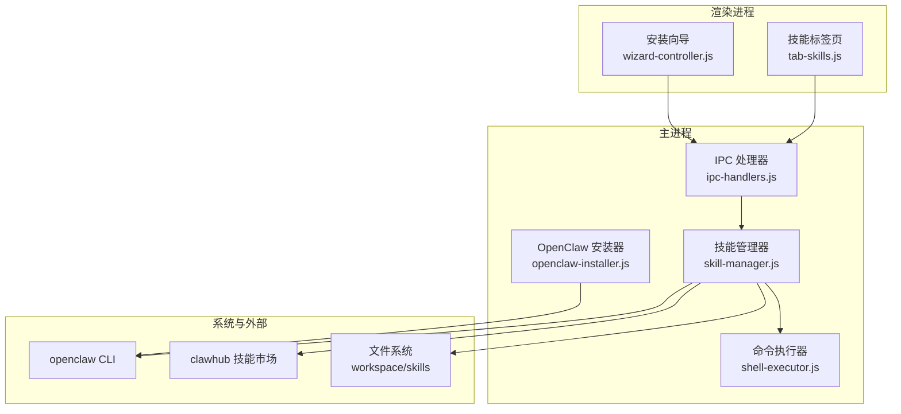
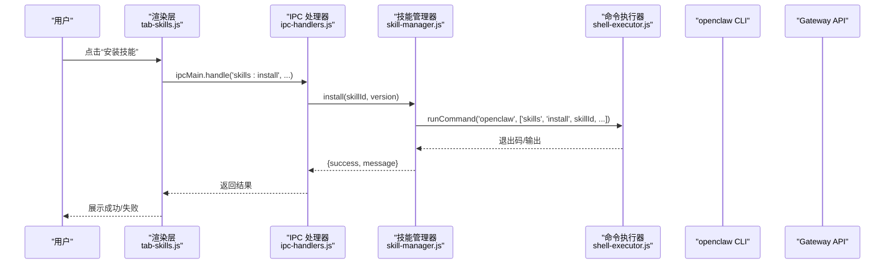
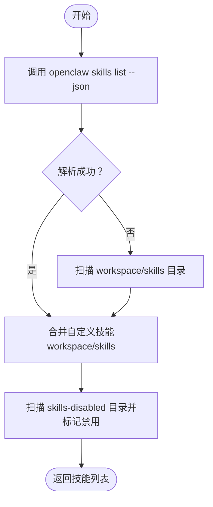
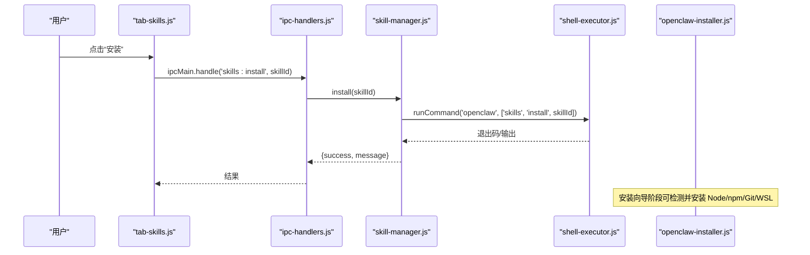
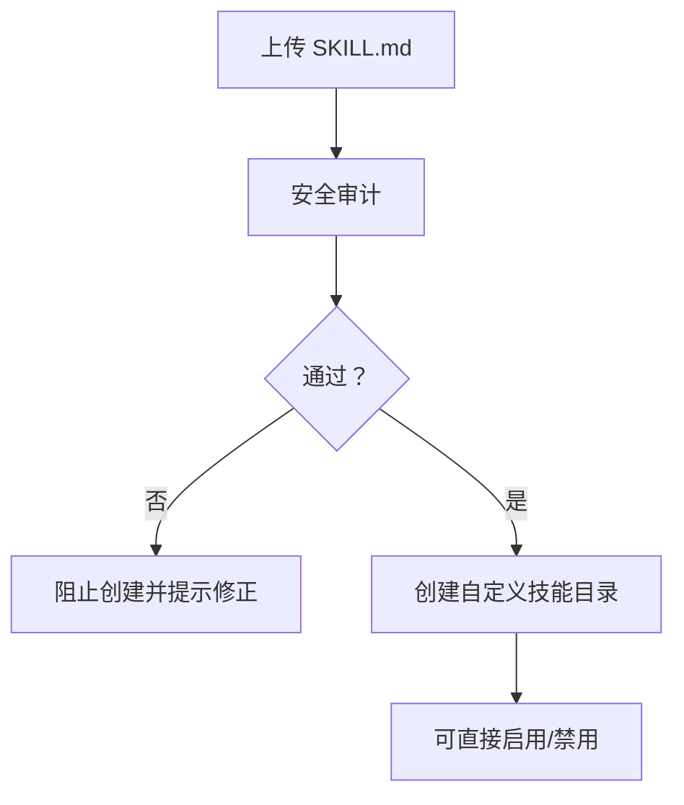
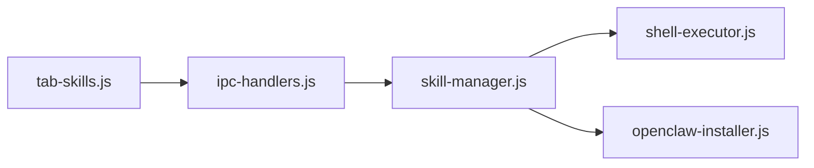

# 技能生态系统

<cite>
**本文档引用的文件**
- [README.md](file://README.md)
- [package.json](file://package.json)
- [skill-manager.js](file://src/main/services/skill-manager.js)
- [tab-skills.js](file://src/renderer/js/dashboard/tab-skills.js)
- [ipc-handlers.js](file://src/main/ipc-handlers.js)
- [shell-executor.js](file://src/main/utils/shell-executor.js)
- [openclaw-installer.js](file://src/main/services/openclaw-installer.js)
- [wizard-controller.js](file://src/renderer/js/wizard/wizard-controller.js)
- [SKILL.md](file://resources/skills/agent-mail/SKILL.md)
- [SKILL.md](file://resources/skills/pdf/SKILL.md)
</cite>

## 目录
1. [简介](#简介)
2. [项目结构](#项目结构)
3. [核心组件](#核心组件)
4. [架构总览](#架构总览)
5. [详细组件分析](#详细组件分析)
6. [依赖关系分析](#依赖关系分析)
7. [性能考虑](#性能考虑)
8. [故障排查指南](#故障排查指南)
9. [结论](#结论)
10. [附录](#附录)

## 简介
本指南面向使用者与维护者，系统讲解技能生态系统的完整使用流程：技能发现、安装、配置、测试、管理与故障排查。OpenClaw 安装管理器基于 Electron，提供全中文图形化界面，支持 Windows 10/11。技能生态围绕“技能商店”与“工作空间”两大来源展开，既支持通过技能市场（clawhub）安装官方/社区技能，也支持在工作空间内创建与管理自定义技能。

## 项目结构
- 主进程负责与系统交互、命令执行、服务控制与 IPC 注册
- 渲染进程负责 UI 展示与用户交互
- 技能相关能力由 SkillManager 统一封装，通过 IPC 暴露给渲染层
- 技能资源随应用打包，位于 resources/skills，安装后可通过 openclaw CLI 管理

图示来源
- [ipc-handlers.js:542-596](file://src/main/ipc-handlers.js#L542-L596)
- [skill-manager.js:9-100](file://src/main/services/skill-manager.js#L9-L100)
- [shell-executor.js:136-197](file://src/main/utils/shell-executor.js#L136-L197)
- [openclaw-installer.js:117-438](file://src/main/services/openclaw-installer.js#L117-L438)

章节来源
- [README.md:36-90](file://README.md#L36-L90)
- [package.json:29-34](file://package.json#L29-L34)

## 核心组件
- 技能管理器（SkillManager）
  - 负责技能列表、安装、删除、启用/禁用、搜索、探索、信息查询、更新、自定义技能创建等
  - 通过 openclaw CLI 与 Gateway API 调用底层能力
- 技能标签页（tab-skills.js）
  - 提供技能列表展示、系统/自定义标签切换、启用/禁用、删除、搜索与市场入口
- IPC 处理器（ipc-handlers.js）
  - 将渲染层的技能操作映射到主进程服务，统一错误处理与进度反馈
- 命令执行器（shell-executor.js）
  - 统一处理 Windows/Wsl 双执行模式，封装超时、编码、PATH 适配等问题
- OpenClaw 安装器（openclaw-installer.js）
  - 负责安装/更新 OpenClaw、创建必要配置文件、启动 Gateway 服务

章节来源
- [skill-manager.js:9-100](file://src/main/services/skill-manager.js#L9-L100)
- [tab-skills.js:1-100](file://src/renderer/js/dashboard/tab-skills.js#L1-L100)
- [ipc-handlers.js:542-596](file://src/main/ipc-handlers.js#L542-L596)
- [shell-executor.js:115-127](file://src/main/utils/shell-executor.js#L115-L127)
- [openclaw-installer.js:117-170](file://src/main/services/openclaw-installer.js#L117-L170)

## 架构总览
技能生态采用“渲染层 → IPC → 主进程服务 → CLI/Gateway/文件系统”的分层架构。渲染层通过 tab-skills.js 与用户交互；IPC 层将用户操作转发至 SkillManager；SkillManager 通过 ShellExecutor 调用 openclaw CLI 或直接访问 Gateway API；同时扫描 workspace/skills 目录实现自定义技能管理。

图示来源
- [ipc-handlers.js:547-549](file://src/main/ipc-handlers.js#L547-L549)
- [skill-manager.js:373-398](file://src/main/services/skill-manager.js#L373-L398)
- [shell-executor.js:136-197](file://src/main/utils/shell-executor.js#L136-L197)

## 详细组件分析

### 技能发现与商店
- 技能市场（clawhub）
  - 支持搜索、探索最新技能、查看已安装技能
  - 搜索与探索通过 npx clawhub 命令实现，具备速率限制检测
- 已安装技能列表
  - 通过 openclaw skills list --json 获取完整技能清单，解析 CLI 输出并合并自定义技能
- 自定义技能
  - 扫描 workspace/skills 与 skills-disabled 目录，识别 SKILL.md frontmatter，标注 source=openclaw-workspace

图示来源
- [skill-manager.js:133-326](file://src/main/services/skill-manager.js#L133-L326)
- [skill-manager.js:219-316](file://src/main/services/skill-manager.js#L219-L316)

章节来源
- [skill-manager.js:599-648](file://src/main/services/skill-manager.js#L599-L648)
- [skill-manager.js:711-737](file://src/main/services/skill-manager.js#L711-L737)
- [skill-manager.js:742-768](file://src/main/services/skill-manager.js#L742-L768)

### 技能安装与依赖检查
- 安装流程
  - 通过 openclaw skills install 调用 CLI 安装指定技能，支持指定版本
  - 安装后主动失效缓存，确保下次刷新能看到最新状态
- 依赖检查
  - 安装向导阶段检测 Node.js、npm、Git、WSL 等依赖，支持自动安装缺失组件
  - 支持切换 npm 镜像源（npmmirror.com）提升安装速度

图示来源
- [ipc-handlers.js:547-549](file://src/main/ipc-handlers.js#L547-L549)
- [skill-manager.js:373-398](file://src/main/services/skill-manager.js#L373-L398)
- [openclaw-installer.js:117-170](file://src/main/services/openclaw-installer.js#L117-L170)

章节来源
- [skill-manager.js:373-398](file://src/main/services/skill-manager.js#L373-L398)
- [openclaw-installer.js:600-618](file://src/main/services/openclaw-installer.js#L600-L618)

### 技能配置界面与权限
- 自定义技能创建
  - 支持上传 SKILL.md，进行基础结构、内容长度、安全风险（危险命令、敏感信息、外部脚本注入、可疑 URL）审计
  - 通过前端校验与后端审核双重保障，仅通过审核的技能方可创建
- 权限与环境要求
  - 自定义技能目录位于 workspace/skills，受 source=openclaw-workspace 标识
  - 系统技能通过 openclaw config 命令启用/禁用，遵循 CLI 配置规范

图示来源
- [tab-skills.js:524-730](file://src/renderer/js/dashboard/tab-skills.js#L524-L730)
- [tab-skills.js:569-657](file://src/renderer/js/dashboard/tab-skills.js#L569-L657)

章节来源
- [tab-skills.js:377-730](file://src/renderer/js/dashboard/tab-skills.js#L377-L730)

### 技能测试与验证
- 通过 openclaw CLI 的 skills info 与 inspect 获取技能详细信息
- 探索最新技能与浏览已安装技能，便于对比与验证
- 安装后刷新列表，确认技能状态（启用/禁用）

章节来源
- [skill-manager.js:654-681](file://src/main/services/skill-manager.js#L654-L681)
- [skill-manager.js:774-799](file://src/main/services/skill-manager.js#L774-L799)
- [tab-skills.js:105-158](file://src/renderer/js/dashboard/tab-skills.js#L105-L158)

### 技能卸载与更新
- 卸载
  - 优先通过 Gateway API 调用 skills.remove；失败时回退到直接删除文件系统中的技能目录
- 更新
  - 通过 openclaw skills update 更新指定技能
- 状态同步
  - 每次安装/删除/启用/禁用后主动失效缓存，确保 UI 与实际状态一致

章节来源
- [skill-manager.js:404-448](file://src/main/services/skill-manager.js#L404-L448)
- [skill-manager.js:687-706](file://src/main/services/skill-manager.js#L687-L706)

### 技能商店与分类体系
- 技能商店
  - 通过 clawhub 提供的 search、explore、list、inspect 等能力实现
- 分类与展示
  - 系统内置技能与自定义技能在 UI 上区分展示（系统/自定义标签页）
  - 自定义技能通过 SKILL.md frontmatter 提供描述与版本信息

章节来源
- [skill-manager.js:599-648](file://src/main/services/skill-manager.js#L599-L648)
- [skill-manager.js:711-737](file://src/main/services/skill-manager.js#L711-L737)
- [tab-skills.js:129-134](file://src/renderer/js/dashboard/tab-skills.js#L129-L134)

### 技能搜索与过滤
- 支持按关键词搜索技能市场
- 支持按名称、描述、作者等条件过滤（通过 CLI 输出解析与 UI 展示）
- 探索最新技能与查看已安装技能，辅助筛选

章节来源
- [skill-manager.js:599-648](file://src/main/services/skill-manager.js#L599-L648)
- [skill-manager.js:742-768](file://src/main/services/skill-manager.js#L742-L768)

## 依赖关系分析
- 渲染层依赖 IPC 处理器提供的技能接口
- IPC 处理器依赖 SkillManager
- SkillManager 依赖 ShellExecutor 执行 openclaw CLI 与外部命令
- OpenClaw 安装器负责安装/更新 OpenClaw 与 Gateway 服务，为技能生态提供运行环境

图示来源
- [ipc-handlers.js:542-596](file://src/main/ipc-handlers.js#L542-L596)
- [skill-manager.js:9-100](file://src/main/services/skill-manager.js#L9-L100)
- [shell-executor.js:136-197](file://src/main/utils/shell-executor.js#L136-L197)
- [openclaw-installer.js:117-170](file://src/main/services/openclaw-installer.js#L117-L170)

章节来源
- [ipc-handlers.js:542-596](file://src/main/ipc-handlers.js#L542-L596)
- [skill-manager.js:9-100](file://src/main/services/skill-manager.js#L9-L100)
- [shell-executor.js:115-127](file://src/main/utils/shell-executor.js#L115-L127)
- [openclaw-installer.js:117-170](file://src/main/services/openclaw-installer.js#L117-L170)

## 性能考虑
- 列表缓存
  - 技能列表缓存 TTL 为 60 秒，减少频繁调用 CLI/Gateway 的开销
- 并行检测
  - 依赖检测阶段对 Node/npm/Git/WSL 采用并行策略，缩短等待时间
- 超时控制
  - CLI 调用与安装流程设置合理超时，避免 UI 阻塞
- 资源打包
  - 技能资源随应用打包，安装后可直接使用，减少网络依赖

章节来源
- [skill-manager.js:11-23](file://src/main/services/skill-manager.js#L11-L23)
- [dependency-checker.js:171-176](file://src/main/services/dependency-checker.js#L171-L176)
- [shell-executor.js:136-197](file://src/main/utils/shell-executor.js#L136-L197)
- [package.json:29-34](file://package.json#L29-L34)

## 故障排查指南
- 安装后命令不可用
  - 在“环境变量”标签页点击“检查 PATH”，按提示添加到 PATH 并重启终端
- 权限问题
  - 添加 PATH 时提示需要管理员权限，可在应用中选择用户 PATH（无需管理员）
- 资源文件缺失
  - 确认 resources/nodejs 与 resources/gitbash 目录存在相应安装包
- 技能安装失败
  - 检查网络与 npm 镜像源设置，必要时切换到 npmmirror.com
  - 查看安装进度与错误日志，定位具体失败环节
- 速率限制
  - 技能搜索/探索可能触发 npm 速率限制，稍后再试或更换镜像源

章节来源
- [README.md:260-288](file://README.md#L260-L288)
- [openclaw-installer.js:600-618](file://src/main/services/openclaw-installer.js#L600-L618)
- [skill-manager.js:612-634](file://src/main/services/skill-manager.js#L612-L634)

## 结论
技能生态系统以 SkillManager 为核心，结合 IPC、CLI 与 Gateway，实现了从技能发现、安装、配置、测试到管理的完整闭环。通过自定义技能与技能市场的双轨并行，既能满足标准化需求，又能支持个性化扩展。配合完善的依赖检测与故障排查机制，用户可高效完成技能生命周期管理。

## 附录

### 技能示例与规范
- SKILL.md frontmatter
  - 常见字段：name、description、version、license、official
  - 示例参考：agent-mail、pdf 等技能的 SKILL.md
- 自定义技能创建流程
  - 上传 SKILL.md → 安全审计 → 通过后创建目录 → 可启用/禁用

章节来源
- [SKILL.md:1-10](file://resources/skills/agent-mail/SKILL.md#L1-L10)
- [SKILL.md:1-6](file://resources/skills/pdf/SKILL.md#L1-L6)
- [tab-skills.js:524-730](file://src/renderer/js/dashboard/tab-skills.js#L524-L730)