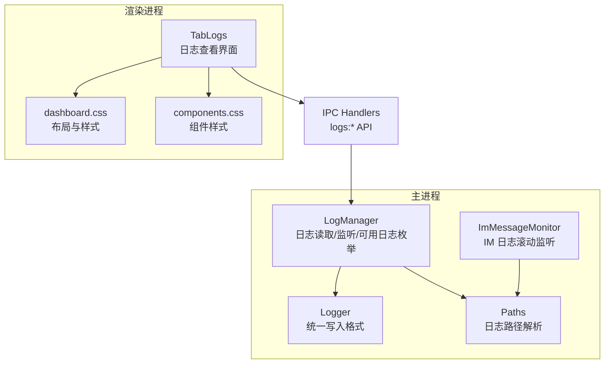
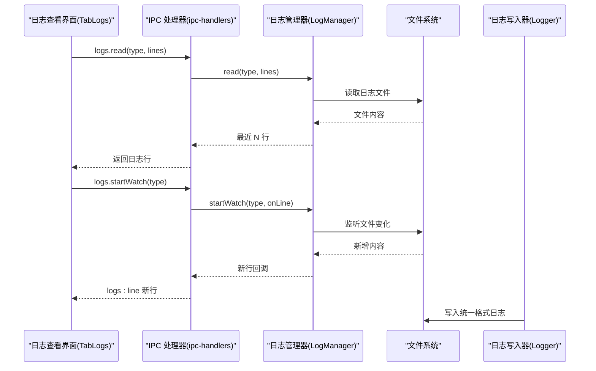
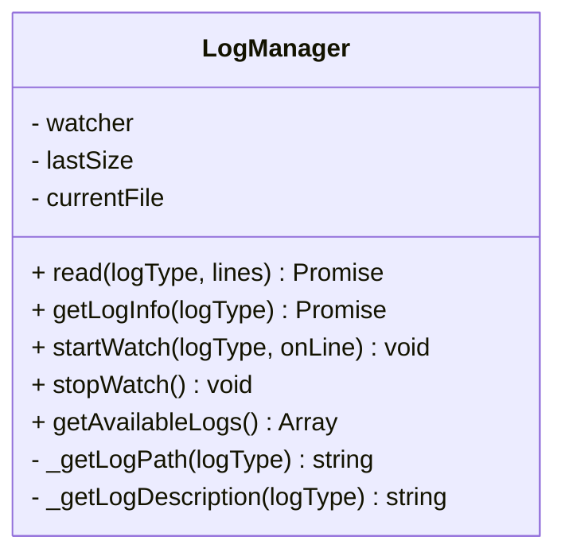
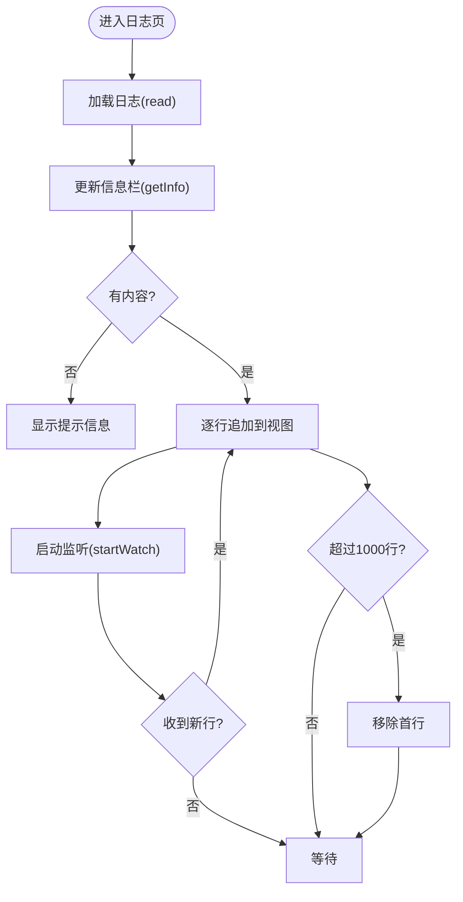
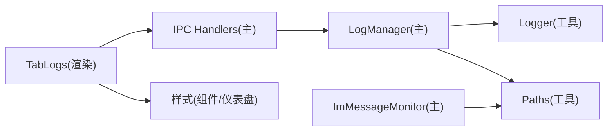

# 日志查看

<cite>
**本文引用的文件**
- [log-manager.js](file://src/main/services/log-manager.js)
- [tab-logs.js](file://src/renderer/js/dashboard/tab-logs.js)
- [logger.js](file://src/main/utils/logger.js)
- [paths.js](file://src/main/utils/paths.js)
- [ipc-handlers.js](file://src/main/ipc-handlers.js)
- [im-message-monitor.js](file://src/main/services/im-message-monitor.js)
- [dashboard.css](file://src/renderer/styles/dashboard.css)
- [components.css](file://src/renderer/styles/components.css)
</cite>

## 目录
1. [简介](#简介)
2. [项目结构](#项目结构)
3. [核心组件](#核心组件)
4. [架构总览](#架构总览)
5. [详细组件分析](#详细组件分析)
6. [依赖关系分析](#依赖关系分析)
7. [性能考量](#性能考量)
8. [故障排查指南](#故障排查指南)
9. [结论](#结论)
10. [附录](#附录)

## 简介
本指南面向使用者与维护者，系统性介绍系统日志查看功能的设计与使用方法。内容涵盖：
- 日志分类与来源（服务日志、应用日志、错误日志等）
- 日志级别（调试、信息、警告、错误）的含义与使用场景
- 日志查看界面的交互与筛选能力
- 日志文件的自动轮转与清理机制
- 日志分析最佳实践（错误模式、性能瓶颈、安全事件识别）
- 日志导出与分享流程
- 日志监控与告警配置建议

## 项目结构
日志查看功能由主进程服务、渲染进程界面与通用工具模块协同完成，关键文件如下：
- 主进程服务：负责日志文件读取、实时监听与可用日志枚举
- 渲染进程界面：提供日志选择、自动滚动、复制、清屏、右键菜单等交互
- 通用工具：统一日志写入格式与路径解析
- IPC：桥接主进程与渲染进程，暴露日志相关 API

图表来源
- [log-manager.js:1-169](file://src/main/services/log-manager.js#L1-L169)
- [tab-logs.js:1-318](file://src/renderer/js/dashboard/tab-logs.js#L1-L318)
- [logger.js:1-75](file://src/main/utils/logger.js#L1-L75)
- [paths.js:1-124](file://src/main/utils/paths.js#L1-L124)
- [ipc-handlers.js:399-416](file://src/main/ipc-handlers.js#L399-L416)
- [im-message-monitor.js:1-329](file://src/main/services/im-message-monitor.js#L1-L329)

章节来源
- [log-manager.js:1-169](file://src/main/services/log-manager.js#L1-L169)
- [tab-logs.js:1-318](file://src/renderer/js/dashboard/tab-logs.js#L1-L318)
- [logger.js:1-75](file://src/main/utils/logger.js#L1-L75)
- [paths.js:1-124](file://src/main/utils/paths.js#L1-L124)
- [ipc-handlers.js:399-416](file://src/main/ipc-handlers.js#L399-L416)
- [im-message-monitor.js:1-329](file://src/main/services/im-message-monitor.js#L1-L329)

## 核心组件
- 日志管理器（主进程）：提供日志读取、实时监听、日志信息查询与可用日志枚举
- 日志查看器（渲染进程）：提供日志选择、自动滚动、复制、清屏、右键菜单等
- 日志写入器（通用工具）：统一日志格式、时间戳、级别与清理控制字符
- 路径解析器（通用工具）：确定日志文件路径、日志目录与每日滚动文件名
- IPC 处理器（主进程）：注册日志相关 IPC API，连接渲染进程与主进程
- IM 消息监听器（主进程）：基于每日滚动的 IM 日志文件进行增量读取

章节来源
- [log-manager.js:1-169](file://src/main/services/log-manager.js#L1-L169)
- [tab-logs.js:1-318](file://src/renderer/js/dashboard/tab-logs.js#L1-L318)
- [logger.js:1-75](file://src/main/utils/logger.js#L1-L75)
- [paths.js:1-124](file://src/main/utils/paths.js#L1-L124)
- [ipc-handlers.js:399-416](file://src/main/ipc-handlers.js#L399-L416)
- [im-message-monitor.js:1-329](file://src/main/services/im-message-monitor.js#L1-L329)

## 架构总览
日志查看采用“主进程服务 + 渲染进程界面 + IPC 通信”的分层架构：
- 渲染进程通过 openclawAPI.logs 接口发起日志读取与监听请求
- 主进程通过 IPC handlers 注册的 logs:* 方法处理请求，并委托给 LogManager
- LogManager 使用 chokidar 实时监听日志文件变化，增量推送新行
- 渲染进程根据日志内容自动着色（错误/警告/信息/调试），并支持自动滚动与复制

图表来源
- [ipc-handlers.js:399-416](file://src/main/ipc-handlers.js#L399-L416)
- [log-manager.js:42-131](file://src/main/services/log-manager.js#L42-L131)
- [logger.js:45-71](file://src/main/utils/logger.js#L45-L71)
- [tab-logs.js:196-263](file://src/renderer/js/dashboard/tab-logs.js#L196-L263)

## 详细组件分析

### 日志管理器（主进程）
职责与特性：
- 提供日志读取：按需读取指定类型的日志文件，返回最近 N 行
- 提供日志信息：返回日志是否存在、大小、修改时间、描述等
- 实时监听：基于 chokidar 监听日志文件变化，增量推送新行
- 可用日志枚举：扫描 HOME 目录下的 app.log、gateway.log、installer-manager.log，以及 logs 目录下的 .log 文件

图表来源
- [log-manager.js:14-165](file://src/main/services/log-manager.js#L14-L165)

章节来源
- [log-manager.js:1-169](file://src/main/services/log-manager.js#L1-L169)

### 日志查看器（渲染进程）
职责与特性：
- 日志选择：支持选择 app、gateway、installer 三类日志
- 自动滚动：开启时新日志自动滚动到底部
- 复制与清屏：一键复制全部日志或清空显示
- 右键菜单：复制选中、复制全部、全选、快捷提示
- 日志着色：根据关键字匹配自动区分错误、警告、信息、调试级别
- 限制行数：最多保留 1000 行，防止内存膨胀

图表来源
- [tab-logs.js:196-285](file://src/renderer/js/dashboard/tab-logs.js#L196-L285)

章节来源
- [tab-logs.js:1-318](file://src/renderer/js/dashboard/tab-logs.js#L1-L318)
- [components.css:302-319](file://src/renderer/styles/components.css#L302-L319)

### 日志写入器（通用工具）
职责与特性：
- 统一日志格式：时间戳 + 级别 + 消息
- 控制字符清理：去除 ANSI 转义序列与非打印控制字符
- 目录确保：自动创建日志目录
- 级别方法：info、warn、error、debug

章节来源
- [logger.js:1-75](file://src/main/utils/logger.js#L1-L75)

### 路径解析器（通用工具）
职责与特性：
- OPENCLAW_HOME：主目录，默认 ~/.openclaw
- LOGS_DIR：logs 子目录
- 日志目录：临时目录下的 openclaw 子目录（每日滚动）
- 每日滚动文件名：openclaw-YYYY-MM-DD.log

章节来源
- [paths.js:1-124](file://src/main/utils/paths.js#L1-L124)

### IPC 处理器（主进程）
职责与特性：
- 注册 logs:* API：logs.read、logs.getInfo、logs.watch-start/stop
- 与 LogManager 协作：转发请求与回调
- 与渲染进程通信：通过 logs:line 推送新行

章节来源
- [ipc-handlers.js:399-416](file://src/main/ipc-handlers.js#L399-L416)

### IM 消息监听器（主进程）
职责与特性：
- 基于每日滚动的 IM 日志文件进行增量读取
- 午夜定时滚动切换文件
- 异常重试与 watcher 关闭策略

章节来源
- [im-message-monitor.js:1-329](file://src/main/services/im-message-monitor.js#L1-L329)

## 依赖关系分析
- 渲染进程依赖 openclawAPI.logs 接口，该接口由主进程 IPC handlers 注册
- 主进程 LogManager 依赖 chokidar 实时监听，依赖 Logger 统一写入格式
- 路径解析器提供日志文件路径，支撑 LogManager 与 IM 监听器
- 日志查看界面依赖 CSS 样式定义日志视图的颜色与布局

图表来源
- [tab-logs.js:1-318](file://src/renderer/js/dashboard/tab-logs.js#L1-L318)
- [ipc-handlers.js:399-416](file://src/main/ipc-handlers.js#L399-L416)
- [log-manager.js:1-169](file://src/main/services/log-manager.js#L1-L169)
- [logger.js:1-75](file://src/main/utils/logger.js#L1-L75)
- [paths.js:1-124](file://src/main/utils/paths.js#L1-L124)
- [im-message-monitor.js:1-329](file://src/main/services/im-message-monitor.js#L1-L329)

章节来源
- [tab-logs.js:1-318](file://src/renderer/js/dashboard/tab-logs.js#L1-L318)
- [ipc-handlers.js:399-416](file://src/main/ipc-handlers.js#L399-L416)
- [log-manager.js:1-169](file://src/main/services/log-manager.js#L1-L169)
- [logger.js:1-75](file://src/main/utils/logger.js#L1-L75)
- [paths.js:1-124](file://src/main/utils/paths.js#L1-L124)
- [im-message-monitor.js:1-329](file://src/main/services/im-message-monitor.js#L1-L329)

## 性能考量
- 监听策略：主进程使用 chokidar 并启用轮询，间隔 1000ms，兼顾稳定性与资源占用
- 视图限制：渲染进程最多保留 1000 行，避免长时间查看导致内存膨胀
- 增量读取：主进程仅读取新增字节，减少 IO 压力
- 控制字符清理：写入器清理 ANSI 与控制字符，避免终端色彩影响日志可读性
- 样式优化：日志视图使用等宽字体与预换行策略，提升长行可读性

[本节为通用指导，无需特定文件引用]

## 故障排查指南
常见问题与解决思路：
- 日志为空或提示不存在
  - 检查对应日志文件是否存在（app.log、gateway.log、installer-manager.log）
  - 确认日志路径是否正确（OPENCLAW_HOME）
- 无法实时刷新
  - 检查主进程 chokidar 是否成功启动
  - 查看主进程日志中是否有 watch 错误
- 日志内容乱码或颜色异常
  - 写入器已清理 ANSI 与控制字符；若仍异常，检查上游日志源
- 日志过多导致卡顿
  - 渲染进程已限制最大行数；可手动清屏或关闭自动滚动
- IM 日志未显示
  - 确认 IM 日志目录与每日滚动文件存在
  - 检查午夜滚动定时器是否正常触发

章节来源
- [log-manager.js:108-130](file://src/main/services/log-manager.js#L108-L130)
- [tab-logs.js:250-285](file://src/renderer/js/dashboard/tab-logs.js#L250-L285)
- [logger.js:31-43](file://src/main/utils/logger.js#L31-L43)
- [im-message-monitor.js:170-214](file://src/main/services/im-message-monitor.js#L170-L214)

## 结论
日志查看功能通过清晰的分层设计与 IPC 通信，实现了稳定、易用的日志浏览体验。主进程负责可靠读取与监听，渲染进程提供直观的交互与着色，配合统一的日志写入格式与路径解析，满足日常运维与问题定位需求。建议在生产环境中结合自动轮转与定期清理策略，持续优化日志存储与检索效率。

[本节为总结，无需特定文件引用]

## 附录

### 日志级别与使用场景
- 调试（DEBUG）：开发与排障时的详细信息，便于定位问题
- 信息（INFO）：常规运行状态与关键流程节点
- 警告（WARN）：潜在问题但不影响整体运行
- 错误（ERROR）：发生错误或异常，需要人工干预

章节来源
- [logger.js:57-71](file://src/main/utils/logger.js#L57-L71)
- [tab-logs.js:273-285](file://src/renderer/js/dashboard/tab-logs.js#L273-L285)

### 日志分类与筛选
- 分类：服务日志（gateway）、应用日志（app）、安装管理器日志（installer）
- 筛选：界面支持自动滚动、清屏、复制、右键菜单；可通过关键字快速定位（错误/警告/调试关键字匹配）

章节来源
- [log-manager.js:21-40](file://src/main/services/log-manager.js#L21-L40)
- [tab-logs.js:13-18](file://src/renderer/js/dashboard/tab-logs.js#L13-L18)
- [tab-logs.js:273-285](file://src/renderer/js/dashboard/tab-logs.js#L273-L285)

### 日志搜索与过滤
- 关键词搜索：界面通过关键字匹配自动着色，便于快速识别错误/警告/调试
- 时间范围筛选：当前实现未提供时间范围筛选功能，建议在上游日志源或外部工具中实现

章节来源
- [tab-logs.js:273-285](file://src/renderer/js/dashboard/tab-logs.js#L273-L285)

### 日志文件自动轮转与清理
- 自动轮转：IM 日志按日滚动（openclaw-YYYY-MM-DD.log），午夜定时切换
- 清理机制：当前未见自动清理策略；建议结合系统日志轮转工具或定期任务清理旧文件

章节来源
- [paths.js:67-82](file://src/main/utils/paths.js#L67-L82)
- [im-message-monitor.js:202-214](file://src/main/services/im-message-monitor.js#L202-L214)

### 日志分析最佳实践
- 错误模式识别：关注 ERROR 级别日志，结合上下文定位异常
- 性能瓶颈：关注 INFO 中耗时操作与 WARN 中重复错误
- 安全事件：关注 ERROR 中认证失败、权限不足等敏感信息
- 建议：建立统一的错误码与上下文字段，便于自动化分析

[本节为通用指导，无需特定文件引用]

### 日志导出与分享
- 复制：右键菜单支持复制选中或全部日志
- 导出：当前未提供直接导出为文件的功能；可通过复制到剪贴板后粘贴至文档或邮件分享

章节来源
- [tab-logs.js:115-130](file://src/renderer/js/dashboard/tab-logs.js#L115-L130)
- [tab-logs.js:287-307](file://src/renderer/js/dashboard/tab-logs.js#L287-L307)

### 日志监控与告警配置
- 监控：利用实时监听能力，在界面中观察关键日志变化
- 告警：当前未提供内置告警功能；可在上游日志源或外部监控系统中配置告警规则

[本节为通用指导，无需特定文件引用]