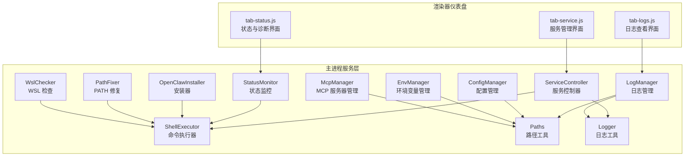
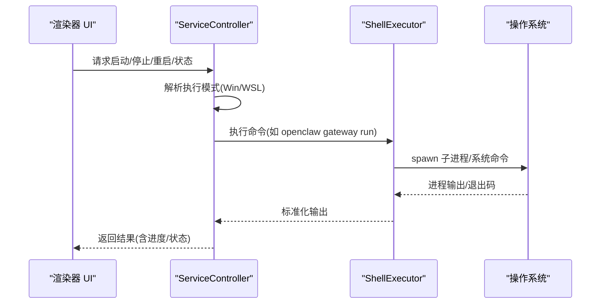
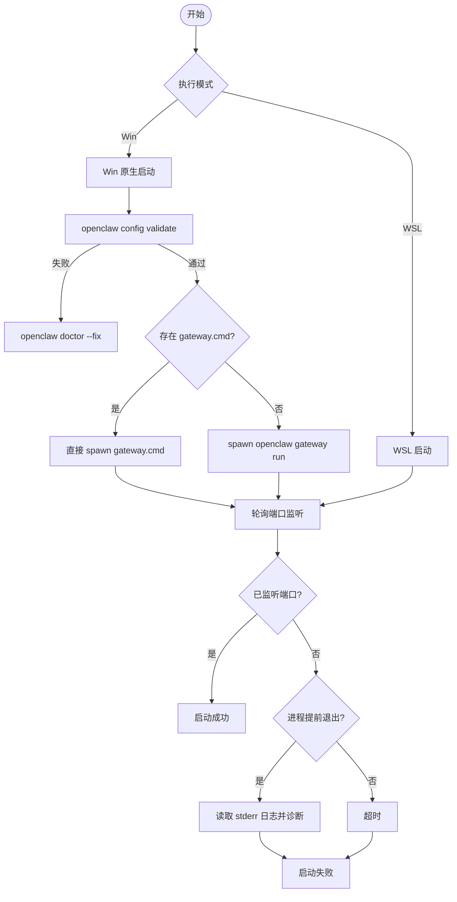
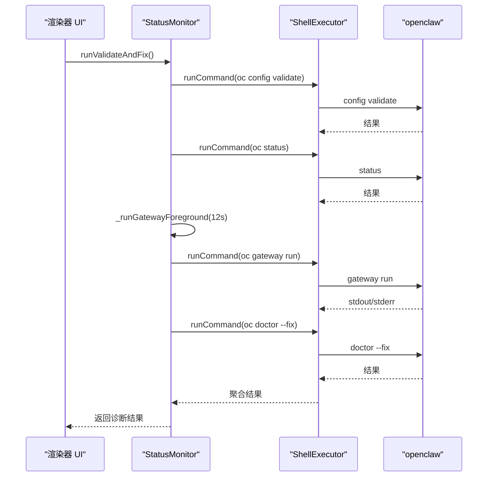
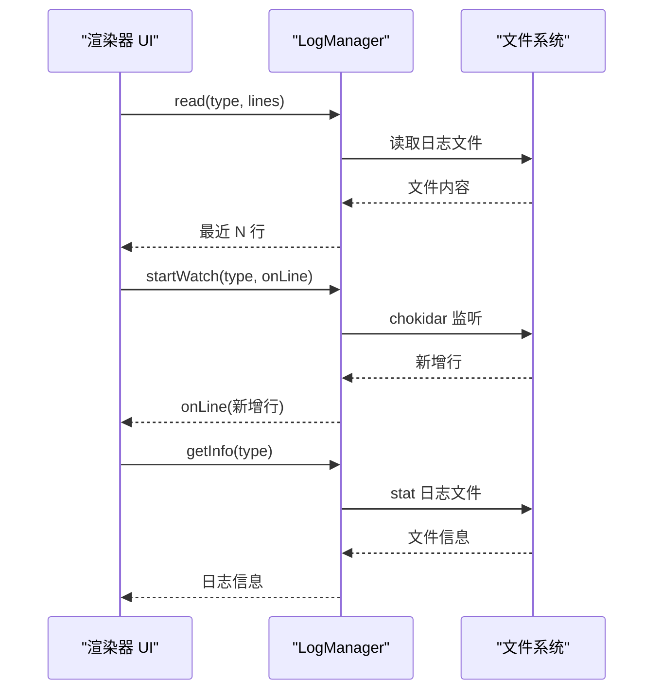
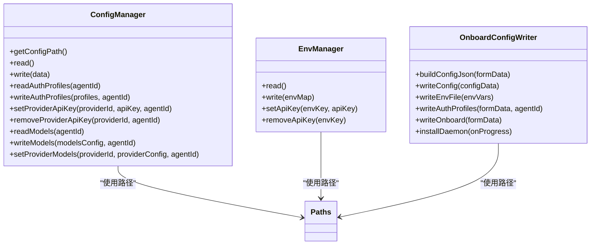
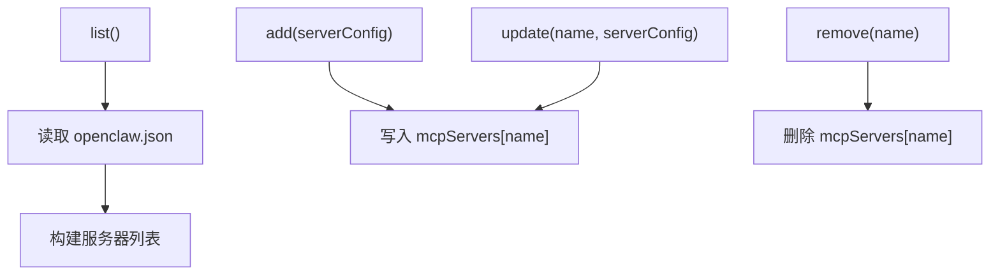
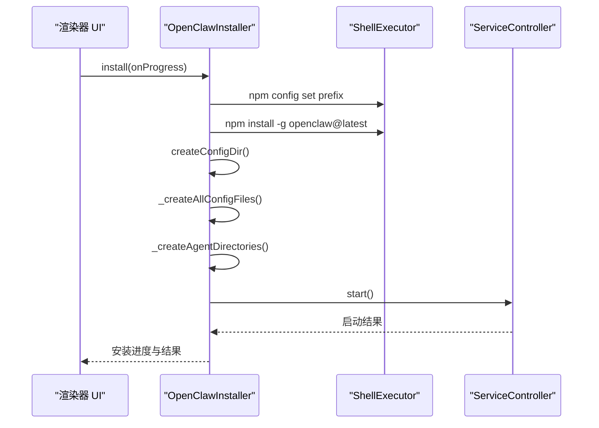
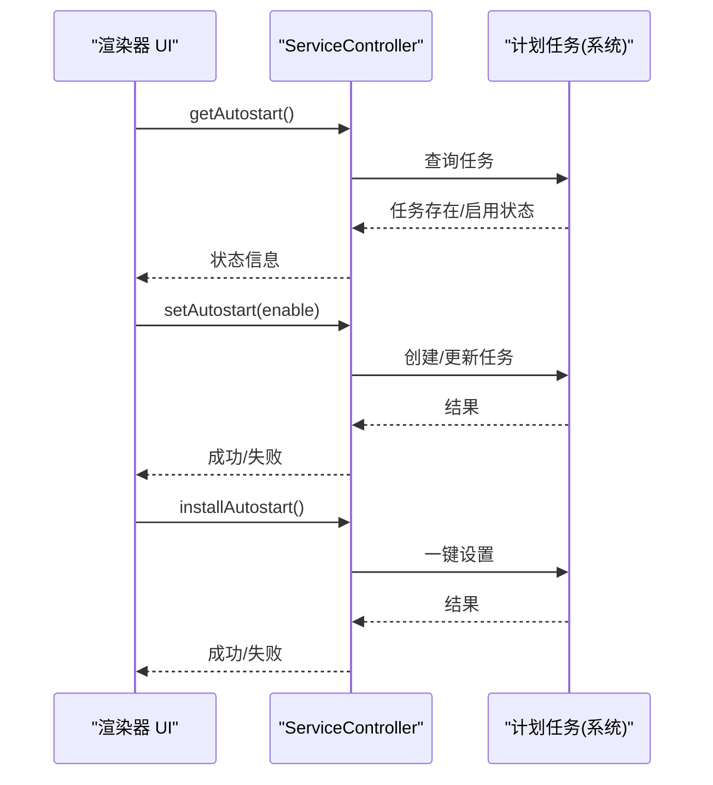
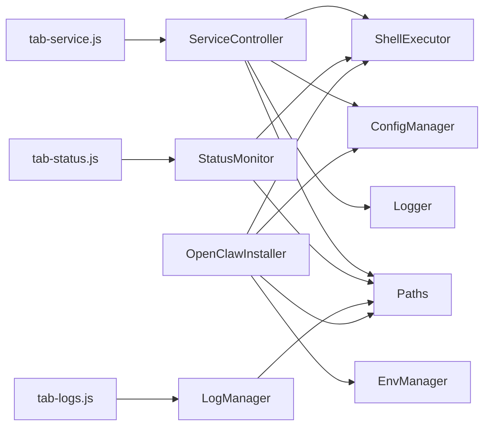

# 服务管理

<cite>
**本文档引用的文件**
- [service-controller.js](file://src/main/services/service-controller.js)
- [mcp-manager.js](file://src/main/services/mcp-manager.js)
- [openclaw-installer.js](file://src/main/services/openclaw-installer.js)
- [status-monitor.js](file://src/main/services/status-monitor.js)
- [log-manager.js](file://src/main/services/log-manager.js)
- [config-manager.js](file://src/main/services/config-manager.js)
- [env-manager.js](file://src/main/services/env-manager.js)
- [onboard-config-writer.js](file://src/main/services/onboard-config-writer.js)
- [path-fixer.js](file://src/main/services/path-fixer.js)
- [wsl-checker.js](file://src/main/services/wsl-checker.js)
- [shell-executor.js](file://src/main/utils/shell-executor.js)
- [logger.js](file://src/main/utils/logger.js)
- [paths.js](file://src/main/utils/paths.js)
- [tab-service.js](file://src/renderer/js/dashboard/tab-service.js)
- [tab-status.js](file://src/renderer/js/dashboard/tab-status.js)
- [tab-logs.js](file://src/renderer/js/dashboard/tab-logs.js)
</cite>

## 目录
1. [简介](#简介)
2. [项目结构](#项目结构)
3. [核心组件](#核心组件)
4. [架构总览](#架构总览)
5. [详细组件分析](#详细组件分析)
6. [依赖关系分析](#依赖关系分析)
7. [性能考虑](#性能考虑)
8. [故障排除指南](#故障排除指南)
9. [结论](#结论)
10. [附录](#附录)

## 简介
本指南面向使用者与维护者，系统讲解如何在本项目中管理 OpenClaw Gateway 服务及其他相关服务。内容涵盖服务的启动、停止、重启与监控，服务状态查看与状态指示器含义，日志的实时查看与历史查询，自动启动配置与开机自启设置，故障诊断与恢复（服务崩溃、端口冲突、权限问题等），性能监控与资源使用查看，以及服务配置的修改与重载机制。

## 项目结构
服务管理功能主要分布在主进程服务层与渲染器仪表盘两个层面：
- 主进程服务层：负责实际的服务控制、状态检测、日志管理、配置管理、环境变量管理、WSL/WIN 模式切换、依赖检测与修复等。
- 渲染器仪表盘：提供用户界面，展示服务状态、操作按钮、日志查看、自动启动开关、诊断与更新等功能。

**图表来源**
- [tab-service.js:1-430](file://src/renderer/js/dashboard/tab-service.js#L1-L430)
- [tab-status.js:1-460](file://src/renderer/js/dashboard/tab-status.js#L1-L460)
- [tab-logs.js:1-318](file://src/renderer/js/dashboard/tab-logs.js#L1-L318)
- [service-controller.js:1-1101](file://src/main/services/service-controller.js#L1-L1101)
- [status-monitor.js:1-274](file://src/main/services/status-monitor.js#L1-L274)
- [log-manager.js:1-169](file://src/main/services/log-manager.js#L1-L169)
- [config-manager.js:1-264](file://src/main/services/config-manager.js#L1-L264)
- [env-manager.js:1-116](file://src/main/services/env-manager.js#L1-L116)
- [mcp-manager.js:1-102](file://src/main/services/mcp-manager.js#L1-L102)
- [openclaw-installer.js:1-780](file://src/main/services/openclaw-installer.js#L1-L780)
- [path-fixer.js:1-139](file://src/main/services/path-fixer.js#L1-L139)
- [wsl-checker.js:1-311](file://src/main/services/wsl-checker.js#L1-L311)
- [shell-executor.js:1-471](file://src/main/utils/shell-executor.js#L1-L471)
- [logger.js:1-75](file://src/main/utils/logger.js#L1-L75)
- [paths.js:1-124](file://src/main/utils/paths.js#L1-L124)

**章节来源**
- [service-controller.js:1-1101](file://src/main/services/service-controller.js#L1-L1101)
- [tab-service.js:1-430](file://src/renderer/js/dashboard/tab-service.js#L1-L430)

## 核心组件
- 服务控制器（ServiceController）：负责 Gateway 服务的启动、停止、重启与状态查询，支持 Windows 原生与 WSL 两种执行模式，内置超时与健康检查、进程存活检测、错误诊断与自动修复触发。
- 状态监控（StatusMonitor）：封装 openclaw doctor、status、gateway run 等命令，提供增强诊断流程与前台运行捕获错误的能力。
- 日志管理（LogManager）：提供日志读取、实时监听、文件信息查询与可用日志列表枚举。
- 配置管理（ConfigManager）：读取/写入 openclaw.json 与 auth-profiles.json、备份与回滚、提供 API Key 管理。
- 环境变量管理（EnvManager）：读取/写入 .env 文件，支持 API Key 的增删改查。
- MCP 服务器管理（McpManager）：对多实例 MCP 服务器进行增删改查与启用/禁用。
- 安装器（OpenClawInstaller）：安装/更新 OpenClaw、写入默认配置、启动 Gateway、镜像源切换、验证安装完整性。
- PATH 修复（PathFixer）：检测与修复 npm 全局目录是否在系统 PATH 中。
- WSL 检查（WslChecker）：检测 WSL 安装状态、安装 WSL、在 WSL 中安装 Node.js/npm。
- ShellExecutor：跨平台命令执行器，适配 WSL 模式、超时控制、输出解码、错误处理。
- Logger/Paths：日志写入与路径解析工具。

**章节来源**
- [service-controller.js:82-1101](file://src/main/services/service-controller.js#L82-L1101)
- [status-monitor.js:9-274](file://src/main/services/status-monitor.js#L9-L274)
- [log-manager.js:14-169](file://src/main/services/log-manager.js#L14-L169)
- [config-manager.js:6-264](file://src/main/services/config-manager.js#L6-L264)
- [env-manager.js:6-116](file://src/main/services/env-manager.js#L6-L116)
- [mcp-manager.js:5-102](file://src/main/services/mcp-manager.js#L5-L102)
- [openclaw-installer.js:10-780](file://src/main/services/openclaw-installer.js#L10-L780)
- [path-fixer.js:5-139](file://src/main/services/path-fixer.js#L5-L139)
- [wsl-checker.js:4-311](file://src/main/services/wsl-checker.js#L4-L311)
- [shell-executor.js:62-471](file://src/main/utils/shell-executor.js#L62-L471)
- [logger.js:7-75](file://src/main/utils/logger.js#L7-L75)
- [paths.js:5-124](file://src/main/utils/paths.js#L5-L124)

## 架构总览
服务管理采用“渲染器 UI -> 主进程服务层”的分层设计。渲染器通过 IPC 接口调用主进程服务层提供的 API，主进程服务层通过 ShellExecutor 执行系统命令或子进程，结合日志与配置工具完成服务生命周期管理。

**图表来源**
- [tab-service.js:125-401](file://src/renderer/js/dashboard/tab-service.js#L125-L401)
- [service-controller.js:123-364](file://src/main/services/service-controller.js#L123-L364)
- [shell-executor.js:136-197](file://src/main/utils/shell-executor.js#L136-L197)

## 详细组件分析

### 服务控制器（ServiceController）
- 启动流程
  - 检测执行模式（Win/WSL），分别调用对应启动策略。
  - Win 原生模式：优先使用 ~/.openclaw/gateway.cmd 直接启动，避免 UAC；若失败则回退到 openclaw gateway run；启动前执行 openclaw config validate 并在失败时尝试 doctor --fix。
  - WSL 模式：通过 bash 脚本启动。
  - 启动后轮询 netstat 检测端口监听，结合 PID 文件与进程存活检测，确保服务真正可用。
- 停止流程
  - Win 原生模式：通过 taskkill /F /T 按 PID 杀进程，清理 PID 文件，二次验证端口关闭。
  - WSL 模式：通过 bash 脚本停止。
- 重启流程：先 stop，等待 2 秒，再 start。
- 状态查询
  - Win：通过 netstat 查询监听端口，解析 PID，读取 PID 文件，返回运行状态与端口信息。
  - WSL：通过 bash 脚本查询状态。
- 进程环境构建
  - _buildEnv：构建包含 node.exe 目录、npm 全局目录、nvm 目录、PowerShell 注册表读取的 PATH，注入 ~/.openclaw/.env 中的环境变量，确保 openclaw.json 中 ${VAR} 变量展开。

**图表来源**
- [service-controller.js:123-364](file://src/main/services/service-controller.js#L123-L364)
- [service-controller.js:667-732](file://src/main/services/service-controller.js#L667-L732)

**章节来源**
- [service-controller.js:123-364](file://src/main/services/service-controller.js#L123-L364)
- [service-controller.js:554-636](file://src/main/services/service-controller.js#L554-L636)
- [service-controller.js:654-732](file://src/main/services/service-controller.js#L654-L732)
- [service-controller.js:366-523](file://src/main/services/service-controller.js#L366-L523)

### 状态监控（StatusMonitor）
- 提供 openclaw doctor、status、gateway run 等命令的封装。
- 增强诊断流程：config validate -> status -> gateway run（前台短跑捕获错误）-> doctor --fix（当上述任一步失败时触发）。
- 前台运行 gateway run：捕获 stdout/stderr，超时后强制结束，用于快速定位启动失败原因。

**图表来源**
- [status-monitor.js:80-130](file://src/main/services/status-monitor.js#L80-L130)
- [status-monitor.js:169-269](file://src/main/services/status-monitor.js#L169-L269)

**章节来源**
- [status-monitor.js:80-130](file://src/main/services/status-monitor.js#L80-L130)
- [status-monitor.js:169-269](file://src/main/services/status-monitor.js#L169-L269)

### 日志管理（LogManager）
- 读取日志：支持 app.log、gateway.log、installer-manager.log，按行读取并返回最近 N 行。
- 实时监听：基于 chokidar 监听日志文件变化，增量推送新行。
- 日志信息：返回日志路径、是否存在、大小、修改时间等元信息。
- 可用日志枚举：扫描主目录与 logs 目录，列出可用日志文件。

**图表来源**
- [log-manager.js:42-85](file://src/main/services/log-manager.js#L42-L85)
- [log-manager.js:87-140](file://src/main/services/log-manager.js#L87-L140)
- [log-manager.js:142-165](file://src/main/services/log-manager.js#L142-L165)

**章节来源**
- [log-manager.js:42-85](file://src/main/services/log-manager.js#L42-L85)
- [log-manager.js:87-140](file://src/main/services/log-manager.js#L87-L140)
- [log-manager.js:142-165](file://src/main/services/log-manager.js#L142-L165)

### 配置与环境管理
- 配置管理（ConfigManager）
  - 读取/写入 openclaw.json，自动备份与回滚。
  - 读取/写入 auth-profiles.json 与 models.json，支持 API Key 与模型配置的增删改查。
- 环境变量管理（EnvManager）
  - 读取/写入 .env，支持 API Key 的增删改查。
- OnboardConfigWriter
  - 将向导表单数据转换为 openclaw.json 结构，写入配置与 .env，并在写入后执行 doctor --fix 自动修复。
  - 提供 installDaemon 方法启动 Gateway 服务。

**图表来源**
- [config-manager.js:6-264](file://src/main/services/config-manager.js#L6-L264)
- [env-manager.js:6-116](file://src/main/services/env-manager.js#L6-L116)
- [onboard-config-writer.js:13-521](file://src/main/services/onboard-config-writer.js#L13-L521)
- [paths.js:5-124](file://src/main/utils/paths.js#L5-L124)

**章节来源**
- [config-manager.js:11-264](file://src/main/services/config-manager.js#L11-L264)
- [env-manager.js:8-116](file://src/main/services/env-manager.js#L8-L116)
- [onboard-config-writer.js:13-521](file://src/main/services/onboard-config-writer.js#L13-L521)

### MCP 服务器管理
- 列表：读取配置中的 mcpServers，返回名称、命令、参数、环境变量与启用状态。
- 增删改：支持添加、删除、更新 MCP 服务器配置，写入时自动备份。

**图表来源**
- [mcp-manager.js:27-98](file://src/main/services/mcp-manager.js#L27-L98)

**章节来源**
- [mcp-manager.js:27-98](file://src/main/services/mcp-manager.js#L27-L98)

### 安装器（OpenClawInstaller）
- 安装：设置 npm prefix、安装 openclaw@latest、创建配置目录与必要文件、写入默认配置、启动 Gateway。
- 更新：安装最新版本并验证。
- 镜像源：设置 npm registry 为国内镜像或官方源。
- 验证：检查 openclaw.json、.env、auth-profiles.json 等文件完整性。

**图表来源**
- [openclaw-installer.js:117-438](file://src/main/services/openclaw-installer.js#L117-L438)
- [service-controller.js:123-132](file://src/main/services/service-controller.js#L123-L132)

**章节来源**
- [openclaw-installer.js:117-438](file://src/main/services/openclaw-installer.js#L117-L438)

### 自动启动与开机自启
- 渲染器 UI 提供“随系统自动启动”开关，显示计划任务状态与启用/禁用状态。
- 一键设置自启：调用主进程 API 安装计划任务，成功后隐藏提示。
- 状态刷新：轮询获取任务存在性与启用状态，同步 UI 视觉状态。

**图表来源**
- [tab-service.js:207-333](file://src/renderer/js/dashboard/tab-service.js#L207-L333)

**章节来源**
- [tab-service.js:207-333](file://src/renderer/js/dashboard/tab-service.js#L207-L333)

### WSL 与 PATH 修复
- WslChecker：检测 WSL 安装状态、安装 WSL、在 WSL 中安装 Node.js/npm。
- PathFixer：检测 npm 全局目录是否在系统 PATH 中，支持添加到用户 PATH 或系统 PATH（权限不足时回退到用户 PATH）。

**章节来源**
- [wsl-checker.js:9-311](file://src/main/services/wsl-checker.js#L9-L311)
- [path-fixer.js:5-139](file://src/main/services/path-fixer.js#L5-L139)

## 依赖关系分析
- 组件耦合
  - ServiceController 依赖 ShellExecutor、ConfigManager、Logger、paths.js。
  - StatusMonitor 依赖 ShellExecutor、paths.js。
  - LogManager 依赖 paths.js、chokidar。
  - OpenClawInstaller 依赖 ShellExecutor、paths.js、ConfigManager、EnvManager。
  - 渲染器 UI 通过 openclawAPI 调用主进程服务层。
- 外部依赖
  - Windows 系统命令：taskkill、netstat、schtasks、cmd.exe、powershell.exe。
  - WSL：wsl、bash、node/npm。
  - npm：npm install、npm config、npm view。
- 循环依赖
  - 未发现循环依赖，模块间通过工具类与路径常量解耦。

**图表来源**
- [service-controller.js:1-1101](file://src/main/services/service-controller.js#L1-L1101)
- [status-monitor.js:1-274](file://src/main/services/status-monitor.js#L1-L274)
- [log-manager.js:1-169](file://src/main/services/log-manager.js#L1-L169)
- [openclaw-installer.js:1-780](file://src/main/services/openclaw-installer.js#L1-L780)
- [tab-service.js:1-430](file://src/renderer/js/dashboard/tab-service.js#L1-L430)
- [tab-status.js:1-460](file://src/renderer/js/dashboard/tab-status.js#L1-L460)
- [tab-logs.js:1-318](file://src/renderer/js/dashboard/tab-logs.js#L1-L318)

**章节来源**
- [service-controller.js:1-1101](file://src/main/services/service-controller.js#L1-L1101)
- [status-monitor.js:1-274](file://src/main/services/status-monitor.js#L1-L274)
- [log-manager.js:1-169](file://src/main/services/log-manager.js#L1-L169)
- [openclaw-installer.js:1-780](file://src/main/services/openclaw-installer.js#L1-L780)

## 性能考虑
- 启动超时与轮询：启动过程设置超时时间，避免长时间阻塞；轮询间隔与进度更新频率平衡用户体验与 CPU 占用。
- 进程环境构建：仅注入必要 PATH 与 .env 变量，减少环境污染。
- 日志监听：使用 chokidar 并限制最大行数，避免内存膨胀。
- 命令执行：统一超时控制与输出解码，避免阻塞与乱码问题。
- WSL 模式：通过 wsl --exec 避免 PATH 问题，减少 shell 层处理成本。

[本节为通用指导，无需具体文件分析]

## 故障排除指南
- 服务崩溃
  - 使用增强诊断：运行 openclaw config validate、status、gateway run（前台短跑捕获错误）、doctor --fix。
  - 查看日志：实时监听 gateway.log 与 installer-manager.log，定位错误堆栈。
  - 重启服务：先 stop，等待旧连接关闭，再 start。
- 端口冲突
  - 检查配置中的 gateway.port，修改为未占用端口后重启。
  - 使用 netstat 检查端口占用，必要时释放占用进程。
- 权限问题
  - Win 原生模式：避免 UAC 触发，使用 taskkill /F /T 杀进程；若仍失败，检查用户权限。
  - PATH 问题：使用 PathFixer 检测 npm 全局目录是否在 PATH 中，必要时添加到用户 PATH。
- WSL 环境
  - 使用 WslChecker 检查 WSL 安装状态与 Node.js/npm 可用性，必要时在 WSL 中安装。
- 配置错误
  - 使用 ConfigManager 读取/写入 openclaw.json，确保字段合法；使用 EnvManager 写入 .env。
  - 安装器写入默认配置后自动执行 doctor --fix 修复常见问题。

**章节来源**
- [status-monitor.js:80-130](file://src/main/services/status-monitor.js#L80-L130)
- [log-manager.js:87-140](file://src/main/services/log-manager.js#L87-L140)
- [service-controller.js:554-636](file://src/main/services/service-controller.js#L554-L636)
- [path-fixer.js:113-139](file://src/main/services/path-fixer.js#L113-L139)
- [wsl-checker.js:214-307](file://src/main/services/wsl-checker.js#L214-L307)
- [openclaw-installer.js:476-492](file://src/main/services/openclaw-installer.js#L476-L492)

## 结论
本项目的服务管理功能通过清晰的分层设计与完善的工具链，实现了对 OpenClaw Gateway 服务的全生命周期管理。渲染器 UI 提供直观的操作入口，主进程服务层负责复杂的状态检测、日志管理与系统集成，配合安装器、诊断工具与环境修复工具，能够满足大多数部署与运维场景的需求。建议在生产环境中结合日志监控、自动诊断与定期更新策略，确保服务稳定运行。

[本节为总结性内容，无需具体文件分析]

## 附录

### 服务状态指示器含义
- 未安装：未检测到 OpenClaw 配置目录。
- 运行中：服务监听配置端口，PID 可用。
- 已停止：服务未监听配置端口，可能已停止或未启动。

**章节来源**
- [tab-service.js:183-205](file://src/renderer/js/dashboard/tab-service.js#L183-L205)
- [tab-status.js:248-267](file://src/renderer/js/dashboard/tab-status.js#L248-L267)

### 服务日志查看与历史查询
- 实时查看：选择日志类型（installer、app、gateway），开启自动滚动，实时接收新行。
- 历史查询：读取最近 N 行日志，支持复制、清空与刷新。
- 右键菜单：支持复制选中内容、复制全部、全选等便捷操作。

**章节来源**
- [tab-logs.js:196-244](file://src/renderer/js/dashboard/tab-logs.js#L196-L244)
- [log-manager.js:42-85](file://src/main/services/log-manager.js#L42-L85)
- [log-manager.js:87-140](file://src/main/services/log-manager.js#L87-L140)

### 服务配置修改与重载机制
- 修改配置：通过 ConfigManager 读取/写入 openclaw.json，自动备份与回滚。
- 写入 .env：通过 EnvManager 写入 API Key 等环境变量。
- 自动修复：安装器写入配置后执行 doctor --fix，自动修正非法字段与缺失文件。
- 重载生效：Gateway 重启后加载新配置；MCP 服务器配置变更需重启对应实例。

**章节来源**
- [config-manager.js:212-260](file://src/main/services/config-manager.js#L212-L260)
- [env-manager.js:26-88](file://src/main/services/env-manager.js#L26-L88)
- [onboard-config-writer.js:476-492](file://src/main/services/onboard-config-writer.js#L476-L492)
- [mcp-manager.js:76-98](file://src/main/services/mcp-manager.js#L76-L98)