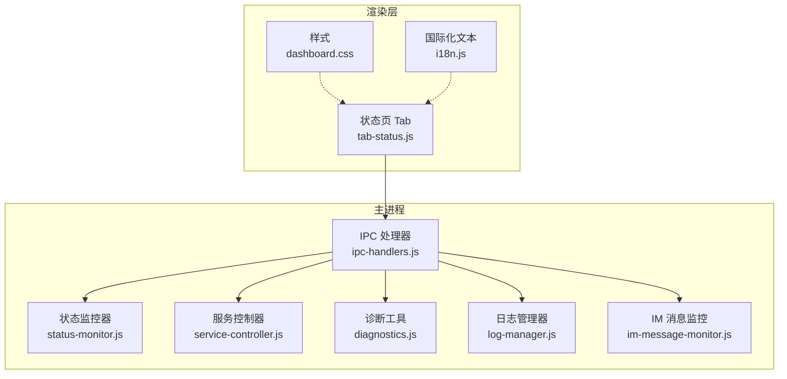
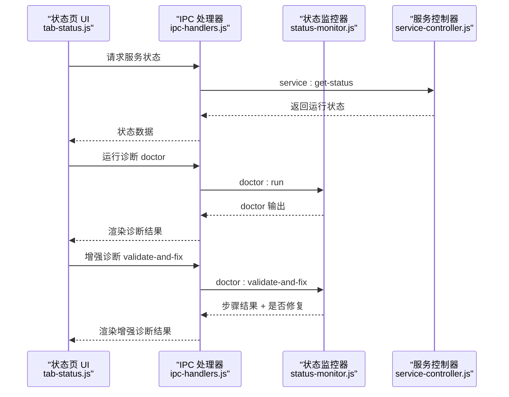
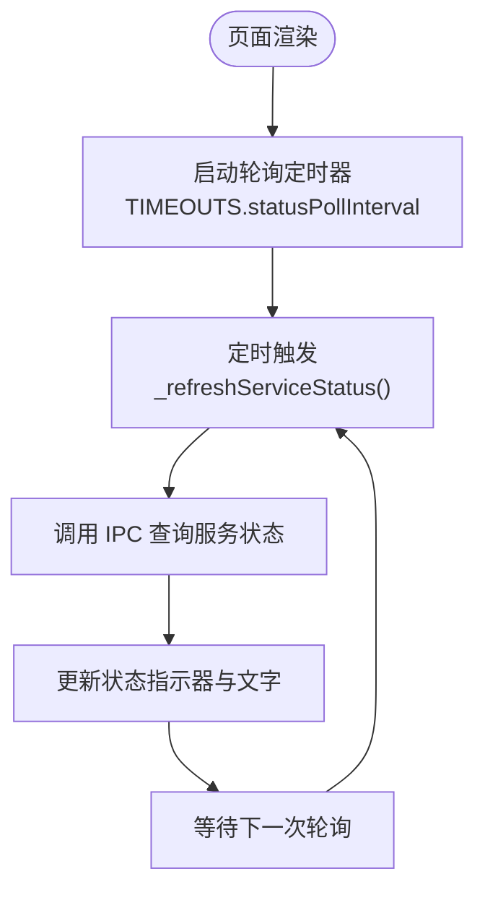
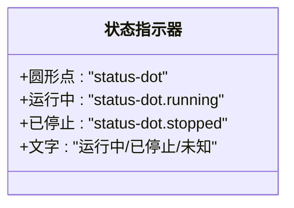
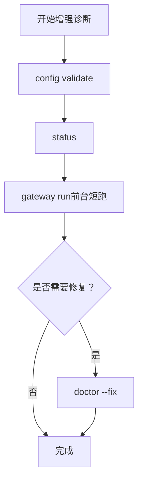
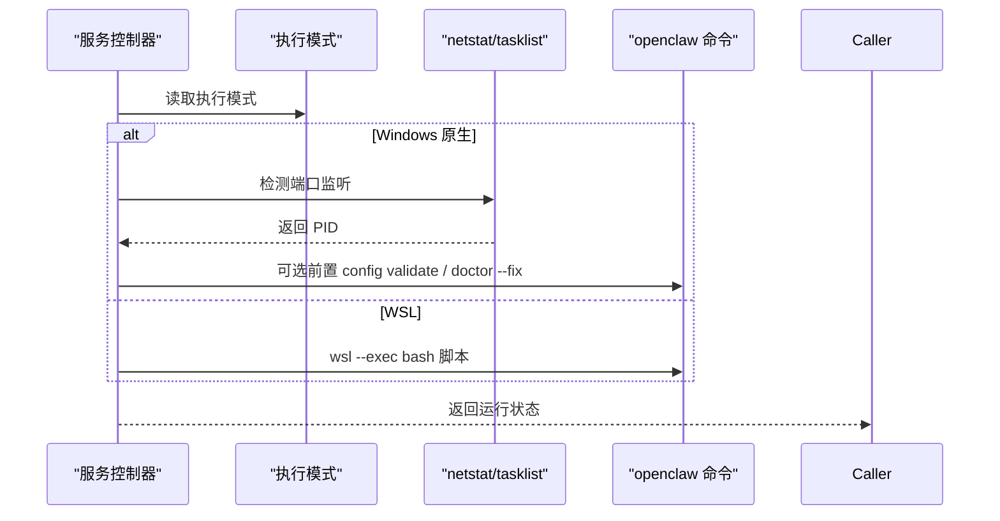
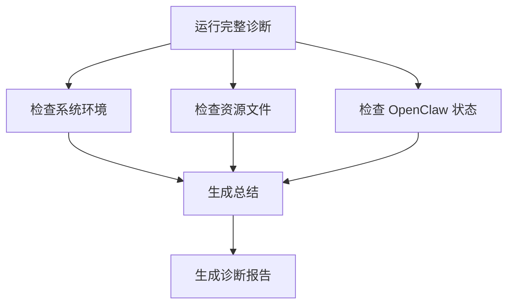
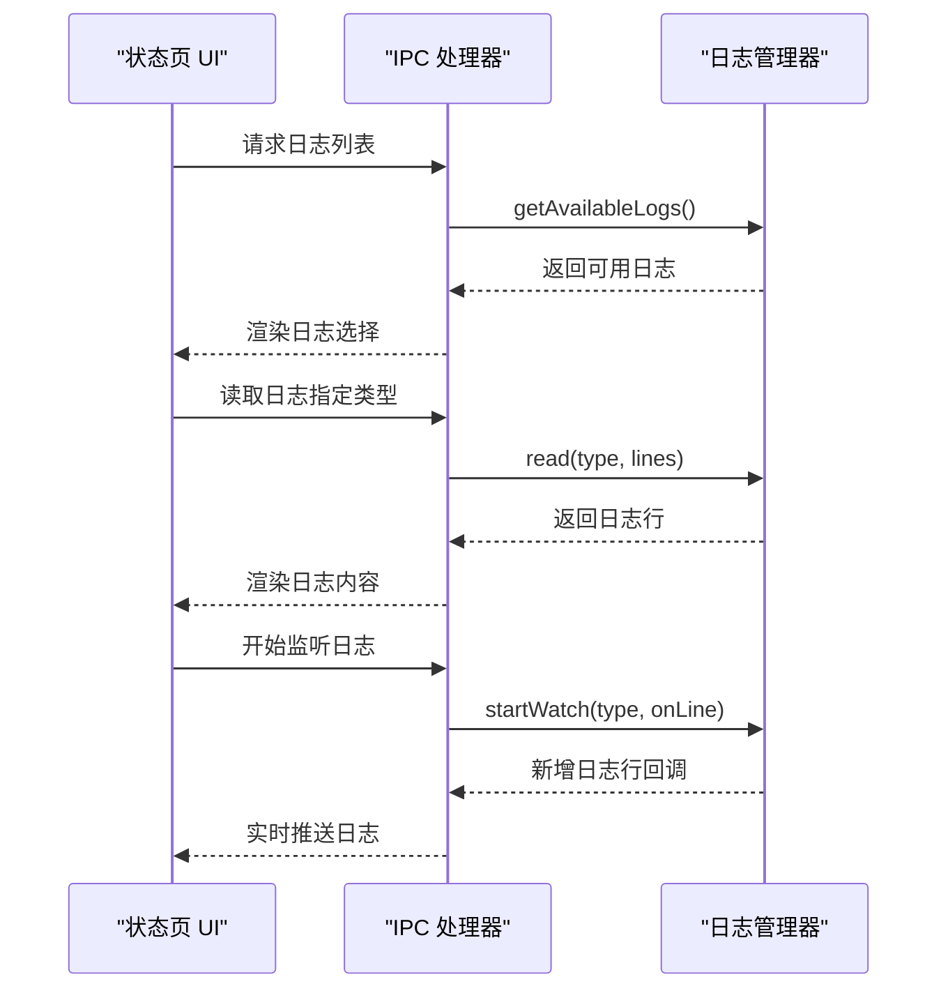
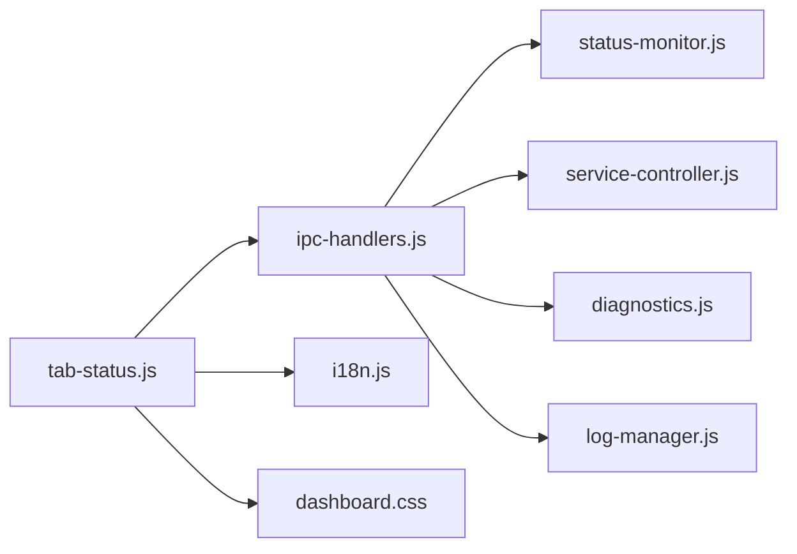

# 状态监控

<cite>
**本文档引用的文件**
- [status-monitor.js](file://src/main/services/status-monitor.js)
- [tab-status.js](file://src/renderer/js/dashboard/tab-status.js)
- [ipc-handlers.js](file://src/main/ipc-handlers.js)
- [service-controller.js](file://src/main/services/service-controller.js)
- [diagnostics.js](file://src/main/utils/diagnostics.js)
- [dashboard.css](file://src/renderer/styles/dashboard.css)
- [i18n.js](file://src/renderer/js/utils/i18n.js)
- [defaults.js](file://src/main/config/defaults.js)
- [log-manager.js](file://src/main/services/log-manager.js)
- [im-message-monitor.js](file://src/main/services/im-message-monitor.js)
</cite>

## 目录
1. [简介](#简介)
2. [项目结构](#项目结构)
3. [核心组件](#核心组件)
4. [架构总览](#架构总览)
5. [详细组件分析](#详细组件分析)
6. [依赖关系分析](#依赖关系分析)
7. [性能考虑](#性能考虑)
8. [故障排查指南](#故障排查指南)
9. [结论](#结论)
10. [附录](#附录)

## 简介
本指南面向使用者与运维人员，系统讲解状态监控功能的设计与使用方法。内容涵盖：
- 服务状态检查与健康评估
- 依赖项验证与诊断流程
- 性能指标显示与自动刷新机制
- 状态指示器含义与解读
- 常见异常识别与处理建议
- 状态历史记录与趋势分析思路
- 状态刷新与自动更新的使用方法

## 项目结构
状态监控功能由三部分协同实现：
- 渲染层（Dashboard 状态页）：负责 UI 展示、交互与轮询刷新
- 主进程服务层：封装状态查询、诊断与服务控制
- IPC 通道：在渲染层与主进程之间传递状态与指令

图示来源
- [tab-status.js:1-111](file://src/renderer/js/dashboard/tab-status.js#L1-L111)
- [ipc-handlers.js:26-51](file://src/main/ipc-handlers.js#L26-L51)
- [status-monitor.js:9-273](file://src/main/services/status-monitor.js#L9-L273)
- [service-controller.js:82-117](file://src/main/services/service-controller.js#L82-L117)
- [diagnostics.js:10-44](file://src/main/utils/diagnostics.js#L10-L44)
- [log-manager.js:14-28](file://src/main/services/log-manager.js#L14-L28)
- [im-message-monitor.js:95-119](file://src/main/services/im-message-monitor.js#L95-L119)

章节来源
- [tab-status.js:1-111](file://src/renderer/js/dashboard/tab-status.js#L1-L111)
- [ipc-handlers.js:26-51](file://src/main/ipc-handlers.js#L26-L51)

## 核心组件
- 状态监控器（StatusMonitor）：封装 openclaw 命令调用，提供 doctor 诊断、增强诊断（含自动修复）、状态查询与版本查询能力
- 服务控制器（ServiceController）：封装 Gateway 服务的启动、停止、重启与状态查询，支持 Windows 原生与 WSL 两种模式
- 诊断工具（Diagnostics）：提供系统环境、资源与 OpenClaw 状态的综合诊断
- 日志管理器（LogManager）：提供日志读取、实时监听与可用日志枚举
- IM 消息监控（ImMessageMonitor）：从日志中解析并推送 IM 渠道消息事件
- 渲染层状态页（TabStatus）：负责 UI 呈现、按钮交互、轮询刷新与 doctor 结果渲染

章节来源
- [status-monitor.js:9-273](file://src/main/services/status-monitor.js#L9-L273)
- [service-controller.js:82-769](file://src/main/services/service-controller.js#L82-L769)
- [diagnostics.js:10-196](file://src/main/utils/diagnostics.js#L10-L196)
- [log-manager.js:14-168](file://src/main/services/log-manager.js#L14-L168)
- [im-message-monitor.js:95-329](file://src/main/services/im-message-monitor.js#L95-L329)
- [tab-status.js:2-460](file://src/renderer/js/dashboard/tab-status.js#L2-L460)

## 架构总览
状态监控的端到端流程如下：

图示来源
- [tab-status.js:322-332](file://src/renderer/js/dashboard/tab-status.js#L322-L332)
- [ipc-handlers.js:389-397](file://src/main/ipc-handlers.js#L389-L397)
- [status-monitor.js:48-130](file://src/main/services/status-monitor.js#L48-L130)
- [service-controller.js:654-662](file://src/main/services/service-controller.js#L654-L662)

## 详细组件分析

### 状态页 UI 与自动刷新
- 自动刷新：状态页在渲染完成后启动轮询，周期性调用服务状态刷新函数
- 轮询间隔：来自默认配置，每 5 秒刷新一次
- UI 呈现：服务状态以“运行中/已停止/未知”三种状态展示，配合圆形指示器颜色（绿色/红色）

图示来源
- [tab-status.js:118-128](file://src/renderer/js/dashboard/tab-status.js#L118-L128)
- [tab-status.js:299-320](file://src/renderer/js/dashboard/tab-status.js#L299-L320)
- [defaults.js:47-48](file://src/main/config/defaults.js#L47-L48)

章节来源
- [tab-status.js:113-128](file://src/renderer/js/dashboard/tab-status.js#L113-L128)
- [tab-status.js:299-320](file://src/renderer/js/dashboard/tab-status.js#L299-L320)
- [defaults.js:47-48](file://src/main/config/defaults.js#L47-L48)

### 状态指示器与含义
- 圆点颜色与状态
  - 绿色：运行中（running）
  - 红色：已停止（stopped）
  - 文字：运行中/已停止/未知
- 样式定义：通过 CSS 类 status-dot.running 与 status-dot.stopped 控制颜色与阴影效果

图示来源
- [dashboard.css:152-163](file://src/renderer/styles/dashboard.css#L152-L163)
- [tab-status.js:247-267](file://src/renderer/js/dashboard/tab-status.js#L247-L267)

章节来源
- [dashboard.css:152-163](file://src/renderer/styles/dashboard.css#L152-L163)
- [tab-status.js:247-267](file://src/renderer/js/dashboard/tab-status.js#L247-L267)

### 诊断检查与增强诊断
- doctor：调用 openclaw doctor，返回整体输出
- 增强诊断（validate-and-fix）：按顺序执行以下步骤并聚合结果
  1) openclaw config validate：校验配置合法性
  2) openclaw status：查看 gateway/agent 运行状态
  3) openclaw gateway run（前台短跑，捕获启动日志/错误）：快速定位启动失败原因
  4) 若上述任一步骤失败，则执行 openclaw doctor --fix 自动修复
- 结果渲染：以步骤图标（✅/❌/⚠️）与输出内容呈现，顶部汇总总体结果与是否执行修复

图示来源
- [status-monitor.js:80-130](file://src/main/services/status-monitor.js#L80-L130)
- [status-monitor.js:169-269](file://src/main/services/status-monitor.js#L169-L269)
- [tab-status.js:322-372](file://src/renderer/js/dashboard/tab-status.js#L322-L372)

章节来源
- [status-monitor.js:80-130](file://src/main/services/status-monitor.js#L80-L130)
- [status-monitor.js:169-269](file://src/main/services/status-monitor.js#L169-L269)
- [tab-status.js:322-372](file://src/renderer/js/dashboard/tab-status.js#L322-L372)

### 服务状态查询与模式适配
- 服务控制器根据执行模式（WSL/原生）选择不同的启动与状态查询策略
- Windows 原生模式：优先使用 .cmd 启动脚本，避免 UAC；通过 netstat 检测端口占用；支持前置配置校验与 doctor --fix
- WSL 模式：通过 WSL 调用 bash 脚本执行启动/停止/状态

图示来源
- [service-controller.js:123-132](file://src/main/services/service-controller.js#L123-L132)
- [service-controller.js:654-769](file://src/main/services/service-controller.js#L654-L769)
- [ipc-handlers.js:373-375](file://src/main/ipc-handlers.js#L373-L375)

章节来源
- [service-controller.js:123-132](file://src/main/services/service-controller.js#L123-L132)
- [service-controller.js:654-769](file://src/main/services/service-controller.js#L654-L769)
- [ipc-handlers.js:373-375](file://src/main/ipc-handlers.js#L373-L375)

### 诊断工具与系统环境检查
- 诊断工具提供系统环境、资源文件与 OpenClaw 状态的综合检查，并生成总结
- 生成报告：包含系统平台、Node/npm/Git 版本、资源文件存在性、OpenClaw 安装状态与版本、配置目录存在性等

图示来源
- [diagnostics.js:14-44](file://src/main/utils/diagnostics.js#L14-L44)
- [diagnostics.js:151-179](file://src/main/utils/diagnostics.js#L151-L179)

章节来源
- [diagnostics.js:14-44](file://src/main/utils/diagnostics.js#L14-L44)
- [diagnostics.js:151-179](file://src/main/utils/diagnostics.js#L151-L179)

### 日志查看与趋势分析
- 日志读取：支持读取指定日志类型的最后 N 行
- 实时监听：基于 chokidar 监听日志文件变更，增量推送新增行
- 可用日志枚举：列出 app.log、gateway.log、installer-manager.log 等可用日志
- 趋势分析：通过长期观察日志中的错误/警告/信息级别消息，结合服务状态轮询，形成系统健康趋势

图示来源
- [log-manager.js:42-85](file://src/main/services/log-manager.js#L42-L85)
- [log-manager.js:87-131](file://src/main/services/log-manager.js#L87-L131)
- [log-manager.js:142-165](file://src/main/services/log-manager.js#L142-L165)

章节来源
- [log-manager.js:42-85](file://src/main/services/log-manager.js#L42-L85)
- [log-manager.js:87-131](file://src/main/services/log-manager.js#L87-L131)
- [log-manager.js:142-165](file://src/main/services/log-manager.js#L142-L165)

### 状态历史记录与趋势分析
- 状态历史：通过服务状态轮询（默认 5 秒）与日志监听，形成状态变化的时间序列
- 趋势分析：结合日志中的错误/警告信息与服务状态，识别异常波动与持续性问题
- 建议：定期导出诊断报告与日志，建立基线，对比后续变化

章节来源
- [defaults.js:47-48](file://src/main/config/defaults.js#L47-L48)
- [log-manager.js:87-131](file://src/main/services/log-manager.js#L87-L131)
- [diagnostics.js:184-192](file://src/main/utils/diagnostics.js#L184-L192)

## 依赖关系分析
- 渲染层依赖 IPC 处理器暴露的服务接口
- IPC 处理器聚合多个服务模块（状态监控器、服务控制器、诊断工具、日志管理器等）
- 服务控制器与状态监控器依赖 ShellExecutor 与系统命令（cmd/netstat/taskkill 等）
- 状态页依赖国际化文本与样式定义

图示来源
- [ipc-handlers.js:26-51](file://src/main/ipc-handlers.js#L26-L51)
- [tab-status.js:2-460](file://src/renderer/js/dashboard/tab-status.js#L2-L460)

章节来源
- [ipc-handlers.js:26-51](file://src/main/ipc-handlers.js#L26-L51)
- [tab-status.js:2-460](file://src/renderer/js/dashboard/tab-status.js#L2-L460)

## 性能考虑
- 轮询间隔：默认 5 秒，平衡实时性与系统开销
- 前台启动诊断：对 gateway run 采用短超时（约 12 秒）前台运行，快速判断启动失败原因
- 日志监听：使用 chokidar 与增量读取，避免全量扫描
- 超时设置：服务启动、安装、CLI 命令等均有合理超时，防止 UI 长时间阻塞

章节来源
- [defaults.js:47-48](file://src/main/config/defaults.js#L47-L48)
- [status-monitor.js:169-269](file://src/main/services/status-monitor.js#L169-L269)
- [log-manager.js:101-131](file://src/main/services/log-manager.js#L101-L131)

## 故障排查指南
- 服务未启动
  - 现象：状态显示“已停止”，日志中出现启动失败或进程异常退出
  - 排查要点：检查 openclaw.json 配置合法性、端口占用、版本是否过旧
  - 处理建议：运行 doctor --fix 自动修复；必要时手动执行 openclaw config validate 与 openclaw gateway run 查看详细错误
- 端口占用
  - 现象：启动后进程很快退出或超时
  - 排查要点：确认配置端口是否被其他进程占用
  - 处理建议：更换端口或释放占用端口
- 内存不足
  - 现象：启动过程中出现 OOM 或频繁重启
  - 排查要点：观察日志中的内存相关错误
  - 处理建议：增加系统内存或降低并发负载
- 诊断与修复
  - 使用“运行诊断”与“增强诊断（validate-and-fix）”快速定位问题并自动修复
  - 若修复后仍失败，查看 doctor 输出与日志，结合服务状态轮询确认最终状态

章节来源
- [service-controller.js:314-338](file://src/main/services/service-controller.js#L314-L338)
- [status-monitor.js:169-269](file://src/main/services/status-monitor.js#L169-L269)
- [tab-status.js:322-372](file://src/renderer/js/dashboard/tab-status.js#L322-L372)

## 结论
状态监控功能通过“渲染层轮询 + 主进程诊断/服务控制 + 日志监听”的组合，提供了直观、实时且可诊断的系统健康视图。用户可借助状态页的自动刷新、诊断工具与日志趋势分析，快速识别并处理常见异常，保障 OpenClaw 网关稳定运行。

## 附录

### 状态刷新与自动更新使用方法
- 刷新：点击“刷新”按钮手动触发一次状态查询
- 自动刷新：页面加载后自动启动轮询（默认 5 秒），持续更新服务状态
- 更新：在状态页点击“一键更新”，可查看更新进度与结果

章节来源
- [tab-status.js:96-110](file://src/renderer/js/dashboard/tab-status.js#L96-L110)
- [tab-status.js:118-128](file://src/renderer/js/dashboard/tab-status.js#L118-L128)
- [tab-status.js:409-440](file://src/renderer/js/dashboard/tab-status.js#L409-L440)

### 状态指示器含义对照
- 运行中：绿色指示器 + “运行中”
- 已停止：红色指示器 + “已停止”
- 未知：指示器颜色未更新 + “未知”

章节来源
- [dashboard.css:152-163](file://src/renderer/styles/dashboard.css#L152-L163)
- [tab-status.js:247-267](file://src/renderer/js/dashboard/tab-status.js#L247-L267)