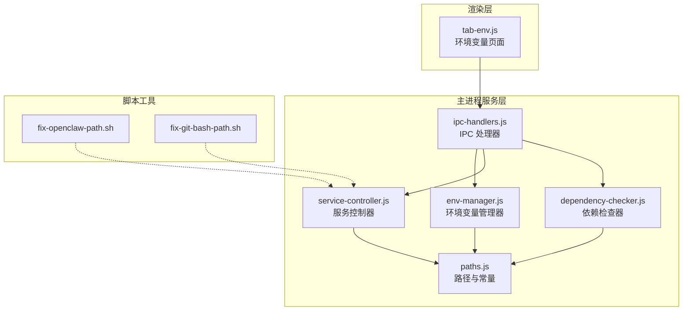
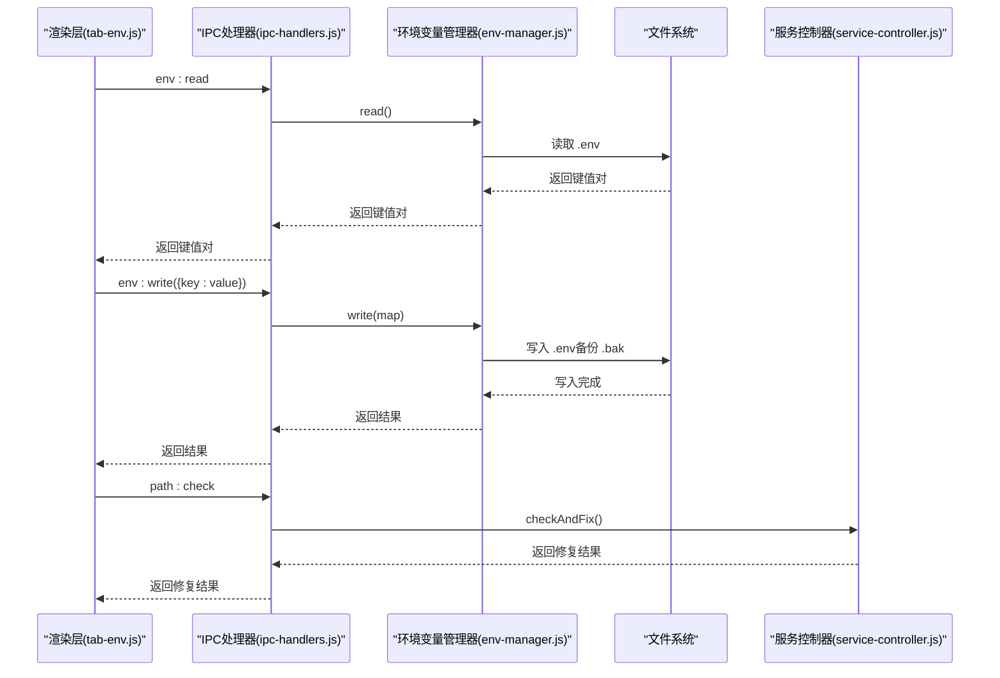
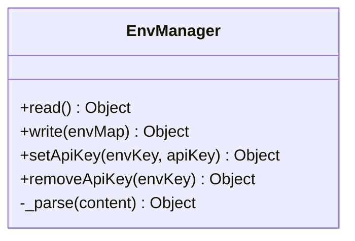
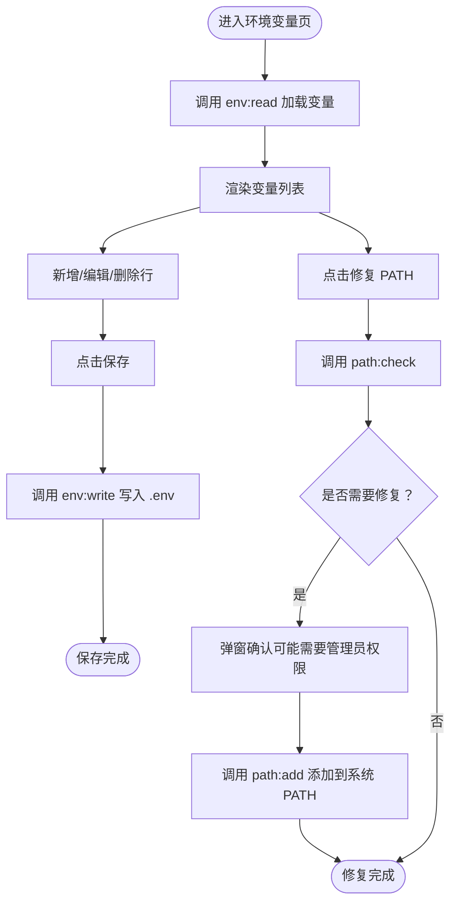
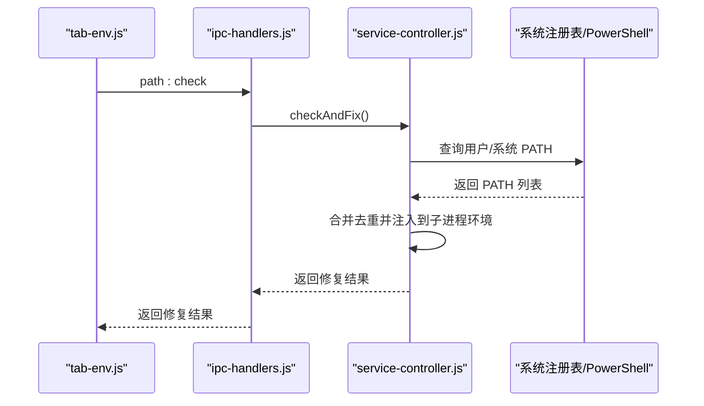
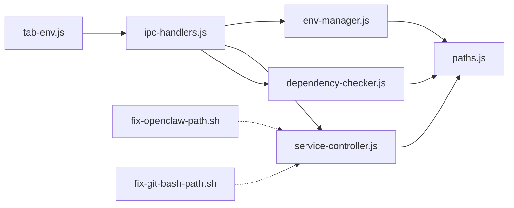

# 环境变量管理

<cite>
**本文档引用的文件**
- [env-manager.js](file://src/main/services/env-manager.js)
- [tab-env.js](file://src/renderer/js/dashboard/tab-env.js)
- [paths.js](file://src/main/utils/paths.js)
- [ipc-handlers.js](file://src/main/ipc-handlers.js)
- [service-controller.js](file://src/main/services/service-controller.js)
- [dependency-checker.js](file://src/main/services/dependency-checker.js)
- [fix-openclaw-path.sh](file://scripts/fix-openclaw-path.sh)
- [fix-git-bash-path.sh](file://scripts/fix-git-bash-path.sh)
</cite>

## 目录
1. [简介](#简介)
2. [项目结构](#项目结构)
3. [核心组件](#核心组件)
4. [架构总览](#架构总览)
5. [详细组件分析](#详细组件分析)
6. [依赖关系分析](#依赖关系分析)
7. [性能考虑](#性能考虑)
8. [故障排查指南](#故障排查指南)
9. [结论](#结论)
10. [附录](#附录)

## 简介
本指南面向使用者与维护者，系统性讲解“环境变量管理”功能的设计与使用方式。该功能允许用户查看、编辑与管理系统的环境变量，涵盖用户级与系统级变量的设置与持久化，并提供一键修复 PATH 的能力、变量值的敏感性识别与安全显示、以及与主进程 IPC 的交互流程。文档同时给出常见变量的用途与配置建议、搜索与过滤思路、导入导出能力的现状与扩展方向、变量变更的生效机制与重启要求说明，以及常见问题的排查方法。

## 项目结构
环境变量管理由三部分组成：
- 渲染层（Dashboard 页面）：负责展示与交互，提供变量列表、新增、删除、保存、敏感变量遮罩、PATH 修复入口等。
- 主进程服务层：负责实际的读写与解析逻辑，以及与系统 PATH 的集成。
- 脚本工具：提供跨平台的 PATH 修复脚本，辅助命令行场景。

**图表来源**
- [tab-env.js](file://src/renderer/js/dashboard/tab-env.js)
- [ipc-handlers.js](file://src/main/ipc-handlers.js)
- [env-manager.js](file://src/main/services/env-manager.js)
- [paths.js](file://src/main/utils/paths.js)
- [service-controller.js](file://src/main/services/service-controller.js)
- [dependency-checker.js](file://src/main/services/dependency-checker.js)
- [fix-openclaw-path.sh](file://scripts/fix-openclaw-path.sh)
- [fix-git-bash-path.sh](file://scripts/fix-git-bash-path.sh)

**章节来源**
- [tab-env.js](file://src/renderer/js/dashboard/tab-env.js)
- [ipc-handlers.js](file://src/main/ipc-handlers.js)
- [env-manager.js](file://src/main/services/env-manager.js)
- [paths.js](file://src/main/utils/paths.js)
- [service-controller.js](file://src/main/services/service-controller.js)
- [dependency-checker.js](file://src/main/services/dependency-checker.js)
- [fix-openclaw-path.sh](file://scripts/fix-openclaw-path.sh)
- [fix-git-bash-path.sh](file://scripts/fix-git-bash-path.sh)

## 核心组件
- 环境变量管理器（EnvManager）
  - 提供读取、写入、追加/合并写入单个 API Key、删除单个 API Key 的能力。
  - 解析 .env 文件，支持注释行与带引号值的去除引号处理。
- 路径常量（paths.js）
  - 定义 OPENCLAW_HOME、ENV_PATH 等路径，提供 getNpmPrefix 等辅助函数。
- IPC 处理器（ipc-handlers.js）
  - 暴露 env:read、env:write、env:set-api-key、env:remove-api-key 等接口。
  - 暴露 path:check、path:add 等 PATH 修复接口。
- 渲染层（tab-env.js）
  - 提供变量列表的增删改查、敏感变量遮罩、PATH 修复按钮与状态反馈。
- 服务控制器（service-controller.js）
  - 构建子进程环境时注入 PATH 与 .env 变量，确保子进程可见最新变量。
- 依赖检查器（dependency-checker.js）
  - 维护并刷新进程内 PATH，确保后续命令可用。
- 脚本工具（fix-openclaw-path.sh、fix-git-bash-path.sh）
  - 提供命令行层面的 PATH 修复与验证。

**章节来源**
- [env-manager.js](file://src/main/services/env-manager.js)
- [paths.js](file://src/main/utils/paths.js)
- [ipc-handlers.js](file://src/main/ipc-handlers.js)
- [tab-env.js](file://src/renderer/js/dashboard/tab-env.js)
- [service-controller.js](file://src/main/services/service-controller.js)
- [dependency-checker.js](file://src/main/services/dependency-checker.js)
- [fix-openclaw-path.sh](file://scripts/fix-openclaw-path.sh)
- [fix-git-bash-path.sh](file://scripts/fix-git-bash-path.sh)

## 架构总览
环境变量管理采用“渲染层 -> IPC -> 服务层”的分层设计，数据持久化在用户目录下的 .env 文件中。PATH 修复通过主进程与系统注册表交互，或调用脚本工具完成。

**图表来源**
- [tab-env.js](file://src/renderer/js/dashboard/tab-env.js)
- [ipc-handlers.js](file://src/main/ipc-handlers.js)
- [env-manager.js](file://src/main/services/env-manager.js)
- [service-controller.js](file://src/main/services/service-controller.js)

**章节来源**
- [ipc-handlers.js](file://src/main/ipc-handlers.js)
- [env-manager.js](file://src/main/services/env-manager.js)
- [tab-env.js](file://src/renderer/js/dashboard/tab-env.js)
- [service-controller.js](file://src/main/services/service-controller.js)

## 详细组件分析

### 环境变量管理器（EnvManager）
- 功能要点
  - 读取：若 .env 不存在返回空对象；解析键值对，忽略空行与注释行，去除值两侧空白与首尾引号。
  - 写入：若目录不存在先创建；存在旧文件先备份为 .bak；按“键=值”格式写入，注释行原样保留。
  - 单 API Key 管理：setApiKey 合并写入，removeApiKey 删除指定键。
- 数据结构与复杂度
  - 解析与写入均为线性扫描，时间复杂度 O(n)，空间复杂度 O(n)。
- 错误处理
  - 读写异常记录日志并返回空对象或错误信息，保证 UI 不崩溃。
- 与 .env 的关系
  - .env 存放于 OPENCLAW_HOME 下，用于持久化用户自定义变量与 API Key。

**图表来源**
- [env-manager.js](file://src/main/services/env-manager.js)

**章节来源**
- [env-manager.js](file://src/main/services/env-manager.js)

### 渲染层（tab-env.js）
- 功能要点
  - 展示变量列表，支持新增一行、删除行、保存到 .env。
  - 敏感变量（如 key、secret、token、password、credential）自动遮罩，可切换显示。
  - 提供“检查并修复 PATH”按钮，调用 path:check 并根据结果引导用户确认或提示管理员权限。
  - 显示常用变量参考表格，便于快速配置。
- 交互流程
  - 加载：调用 env:read 获取键值对并渲染。
  - 保存：收集所有非空键值对，调用 env:write 写入。
  - PATH 修复：调用 path:check，根据返回状态提示用户下一步操作。

**图表来源**
- [tab-env.js](file://src/renderer/js/dashboard/tab-env.js)
- [ipc-handlers.js](file://src/main/ipc-handlers.js)

**章节来源**
- [tab-env.js](file://src/renderer/js/dashboard/tab-env.js)

### PATH 修复与生效机制
- 修复入口
  - 渲染层提供“检查并修复 PATH”，调用 path:check；若需要，调用 path:add。
- 实现细节
  - 主进程通过 PowerShell 查询系统与用户 PATH，合并去重后注入到子进程环境。
  - 依赖检查器在某些场景下会刷新进程内 PATH，确保命令可用。
  - 脚本工具提供命令行修复方案，适用于 Git Bash、WSL 等场景。
- 生效范围与重启要求
  - 用户级 PATH 修改通常对新打开的终端生效；系统级 PATH 修改需要重启或注销登录。
  - 子进程（如服务、脚本）会继承修复后的 PATH，无需重启应用。

**图表来源**
- [tab-env.js](file://src/renderer/js/dashboard/tab-env.js)
- [ipc-handlers.js](file://src/main/ipc-handlers.js)
- [service-controller.js](file://src/main/services/service-controller.js)

**章节来源**
- [service-controller.js](file://src/main/services/service-controller.js)
- [dependency-checker.js](file://src/main/services/dependency-checker.js)
- [fix-openclaw-path.sh](file://scripts/fix-openclaw-path.sh)
- [fix-git-bash-path.sh](file://scripts/fix-git-bash-path.sh)

### 常见变量与配置建议
- PATH
  - 作用：决定命令查找路径。修复 PATH 后可在终端直接使用 openclaw 命令。
  - 配置：通过“检查并修复 PATH”自动完成；也可手动将 npm 全局目录加入 PATH。
- OPENCLAW_HOME
  - 作用：存放配置、日志、.env 等文件的根目录。
  - 配置：可通过环境变量 OPENCLAW_HOME 指定；否则默认位于用户目录下的 .openclaw。
- OPENCLAW_NPM_PREFIX
  - 作用：npm 安装前缀路径，影响 openclaw 命令所在位置。
  - 配置：可通过 .env 或进程环境变量设置。
- NODE_PATH
  - 作用：Node.js 模块解析路径，可用于全局模块定位。
  - 配置：在 .env 中设置，子进程构建时会注入到 PATH 与 NODE_PATH。

**章节来源**
- [paths.js](file://src/main/utils/paths.js)
- [service-controller.js](file://src/main/services/service-controller.js)

### 搜索与过滤功能
- 现状
  - 渲染层未提供变量列表的搜索与过滤 UI。
- 建议
  - 在 UI 中增加输入框，支持按变量名或值进行模糊匹配与过滤，提升大列表的可操作性。

### 导入与导出
- 现状
  - 环境变量管理器支持读写 .env 文件；未提供 .env 文件的导入/导出界面。
- 扩展方向
  - 可在 UI 中增加“导入 .env”与“导出 .env”按钮，使用 Electron 的对话框 API 选择文件路径，读取/写入 .env 内容，实现批量配置与团队共享。

### 变量值的验证与语法检查
- 现状
  - 渲染层对敏感变量进行遮罩显示，避免明文泄露。
  - 未提供变量值的语法校验（如 PATH 项合法性、JSON 值格式等）。
- 建议
  - 在保存前进行基础校验：如 PATH 项是否存在、值是否为空、特殊字符处理等；对 JSON 值提供格式校验。

## 依赖关系分析
- 组件耦合
  - tab-env.js 仅通过 IPC 与主进程交互，职责清晰。
  - env-manager.js 与 paths.js 紧密关联，读写 .env 依赖路径常量。
  - service-controller.js 与 dependency-checker.js 共同维护 PATH 的一致性。
- 外部依赖
  - PowerShell 查询系统 PATH。
  - 脚本工具在不同平台提供 PATH 修复能力。

**图表来源**
- [tab-env.js](file://src/renderer/js/dashboard/tab-env.js)
- [ipc-handlers.js](file://src/main/ipc-handlers.js)
- [env-manager.js](file://src/main/services/env-manager.js)
- [paths.js](file://src/main/utils/paths.js)
- [service-controller.js](file://src/main/services/service-controller.js)
- [dependency-checker.js](file://src/main/services/dependency-checker.js)
- [fix-openclaw-path.sh](file://scripts/fix-openclaw-path.sh)
- [fix-git-bash-path.sh](file://scripts/fix-git-bash-path.sh)

**章节来源**
- [ipc-handlers.js](file://src/main/ipc-handlers.js)
- [env-manager.js](file://src/main/services/env-manager.js)
- [paths.js](file://src/main/utils/paths.js)
- [service-controller.js](file://src/main/services/service-controller.js)
- [dependency-checker.js](file://src/main/services/dependency-checker.js)
- [fix-openclaw-path.sh](file://scripts/fix-openclaw-path.sh)
- [fix-git-bash-path.sh](file://scripts/fix-git-bash-path.sh)

## 性能考虑
- .env 文件规模
  - 读写为线性扫描，变量数量较多时建议分批编辑，减少一次性写入压力。
- PATH 合并与去重
  - 合并用户/系统 PATH 时进行去重，避免重复项导致 PATH 过长。
- 日志与错误处理
  - 异常统一记录日志，避免阻塞 UI 更新。

## 故障排查指南
- 无法在终端使用 openclaw 命令
  - 使用“检查并修复 PATH”自动修复；若提示需要管理员权限，按提示操作或将 npm 全局目录加入用户 PATH。
  - 参考脚本工具在命令行中验证修复结果。
- 子进程无法读取最新变量
  - 确认 .env 已保存且无语法错误；服务控制器会在构建子进程环境时注入 .env 变量。
- PATH 修复后仍无效
  - 新开终端或注销/重登录生效；对于系统级 PATH，需重启系统或以管理员身份运行。
- 导入/导出 .env
  - 当前未提供 UI 导入/导出，可手动编辑 .env 文件或扩展 UI 功能。

**章节来源**
- [tab-env.js](file://src/renderer/js/dashboard/tab-env.js)
- [service-controller.js](file://src/main/services/service-controller.js)
- [dependency-checker.js](file://src/main/services/dependency-checker.js)
- [fix-openclaw-path.sh](file://scripts/fix-openclaw-path.sh)
- [fix-git-bash-path.sh](file://scripts/fix-git-bash-path.sh)

## 结论
环境变量管理功能以简洁的 UI 与可靠的主进程服务为核心，实现了变量的查看、编辑、保存与 PATH 修复。通过 .env 文件实现持久化，结合服务控制器与依赖检查器确保变量在子进程与命令行环境中生效。未来可在 UI 中增强搜索/过滤、导入/导出与语法校验能力，进一步提升易用性与安全性。

## 附录
- 关键变量说明
  - PATH：命令查找路径，修复后可在终端直接使用 openclaw。
  - OPENCLAW_HOME：配置与日志根目录，默认用户目录下 .openclaw。
  - OPENCLAW_NPM_PREFIX：npm 安装前缀，影响 openclaw 命令位置。
  - NODE_PATH：Node.js 模块解析路径，可用于全局模块定位。
- 相关脚本
  - fix-openclaw-path.sh：修复 PATH 并验证 openclaw 命令可用性。
  - fix-git-bash-path.sh：为 Git Bash 场景提供 PATH 修复与包装脚本。

**章节来源**
- [paths.js](file://src/main/utils/paths.js)
- [service-controller.js](file://src/main/services/service-controller.js)
- [fix-openclaw-path.sh](file://scripts/fix-openclaw-path.sh)
- [fix-git-bash-path.sh](file://scripts/fix-git-bash-path.sh)