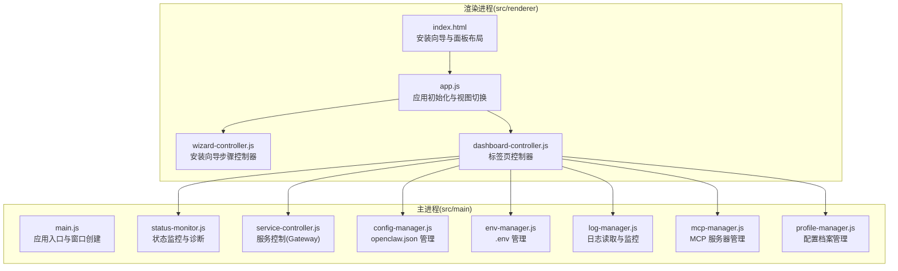
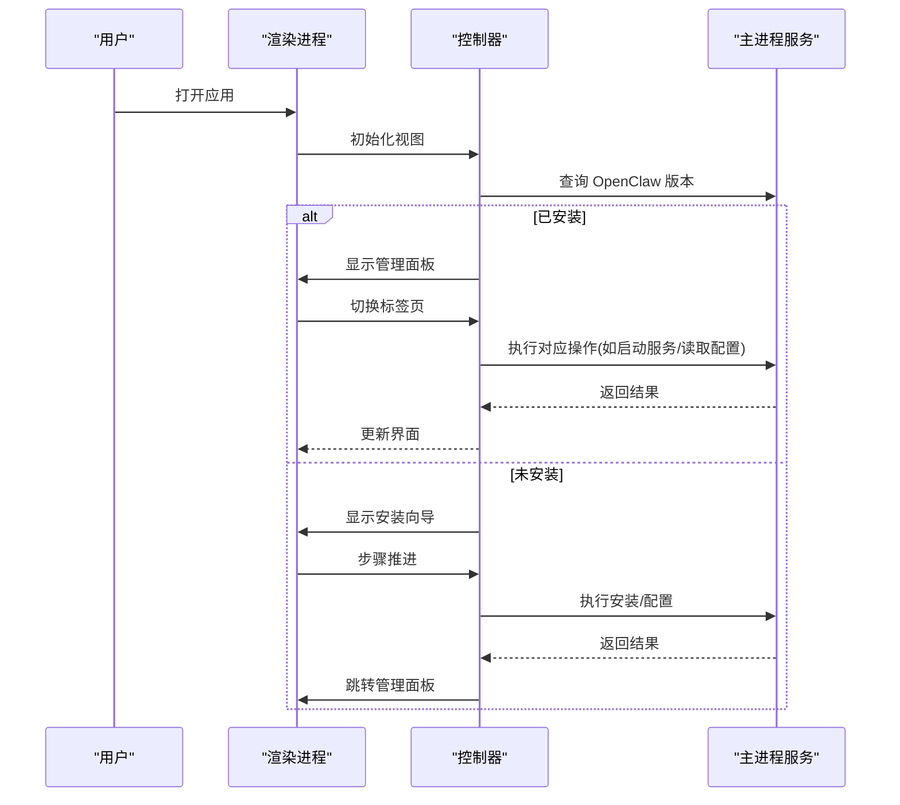
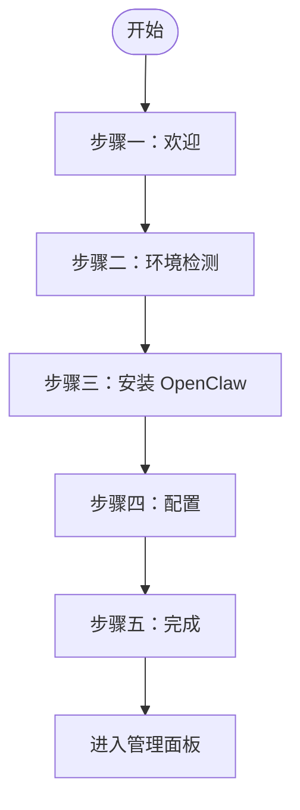
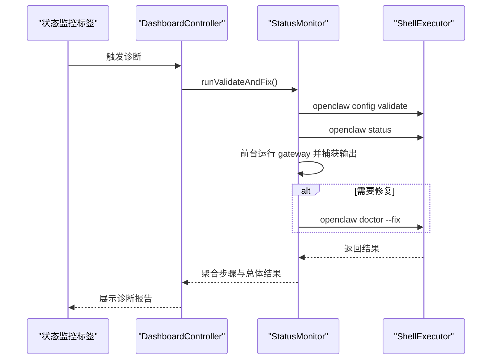
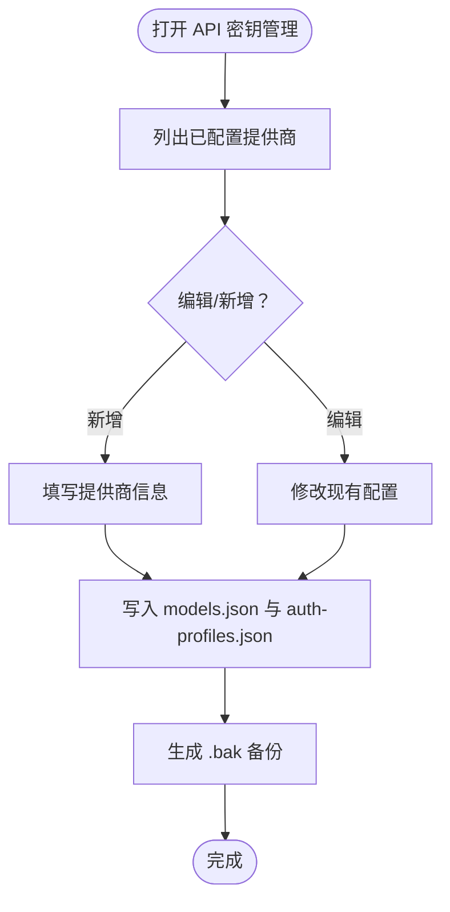
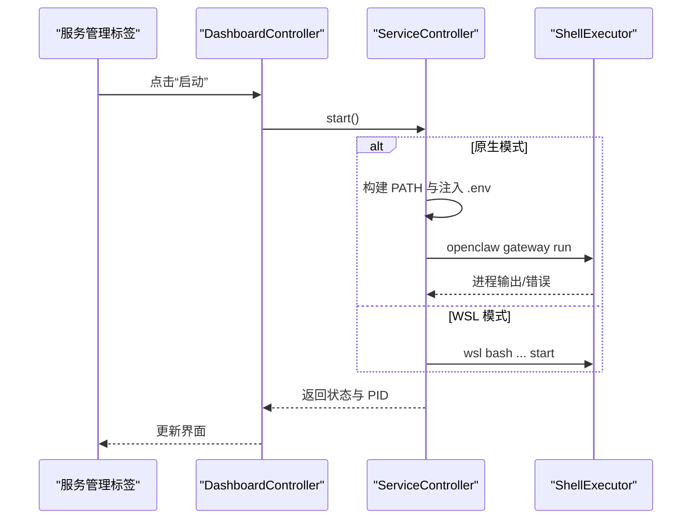
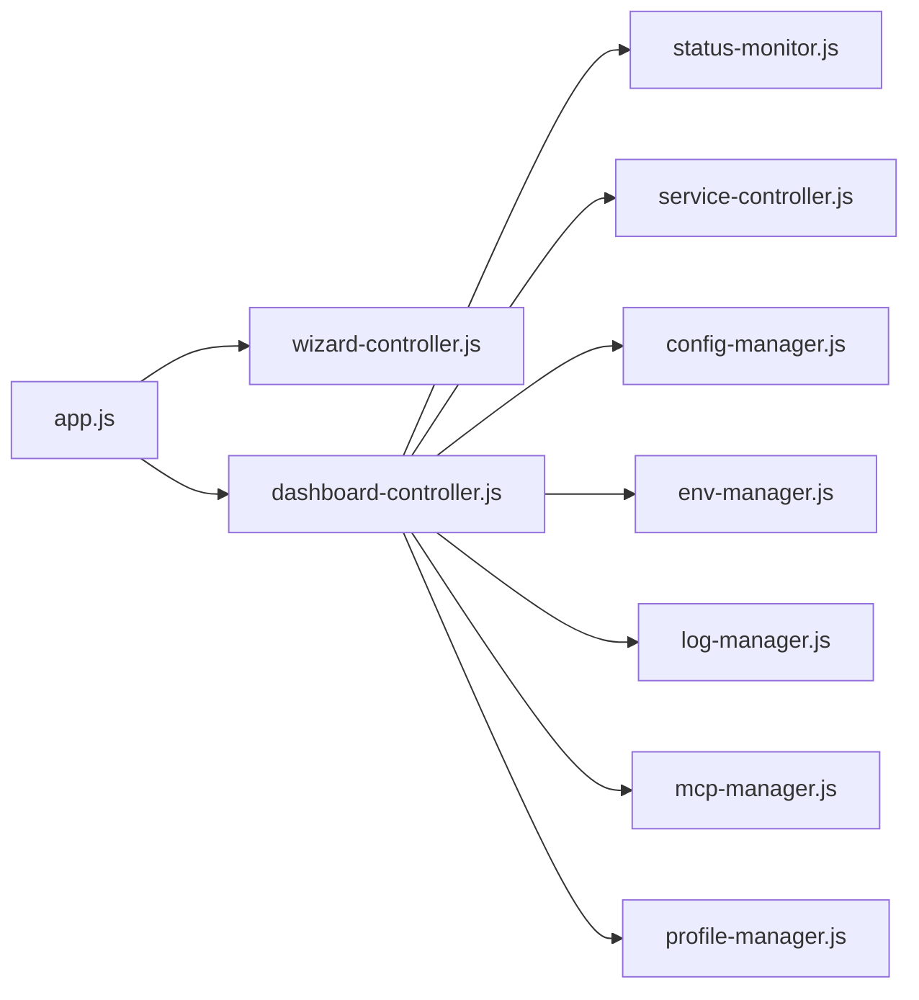

# 用户指南

<cite>
**本文引用的文件**
- [README.md](file://README.md)
- [package.json](file://package.json)
- [src/main/main.js](file://src/main/main.js)
- [src/renderer/index.html](file://src/renderer/index.html)
- [src/renderer/js/app.js](file://src/renderer/js/app.js)
- [src/renderer/js/dashboard/dashboard-controller.js](file://src/renderer/js/dashboard/dashboard-controller.js)
- [src/renderer/js/wizard/wizard-controller.js](file://src/renderer/js/wizard/wizard-controller.js)
- [src/main/services/status-monitor.js](file://src/main/services/status-monitor.js)
- [src/main/services/service-controller.js](file://src/main/services/service-controller.js)
- [src/main/services/config-manager.js](file://src/main/services/config-manager.js)
- [src/main/services/env-manager.js](file://src/main/services/env-manager.js)
- [src/main/services/log-manager.js](file://src/main/services/log-manager.js)
- [src/main/services/mcp-manager.js](file://src/main/services/mcp-manager.js)
- [src/main/services/profile-manager.js](file://src/main/services/profile-manager.js)
</cite>

## 目录
1. [简介](#简介)
2. [项目结构](#项目结构)
3. [核心组件](#核心组件)
4. [架构总览](#架构总览)
5. [详细组件分析](#详细组件分析)
6. [依赖关系分析](#依赖关系分析)
7. [性能考虑](#性能考虑)
8. [故障排除指南](#故障排除指南)
9. [结论](#结论)
10. [附录](#附录)

## 简介
本指南面向新老用户，提供 OpenClaw 安装管理器的完整使用说明。内容涵盖：
- 管理面板八个功能标签页的使用方法与操作步骤
- 安装向导的五步流程（从环境检测到完成配置）
- 技能生态系统的使用指南（发现、安装、配置与测试）
- 聊天服务的功能特性（会话管理、消息处理与流式响应）
- 最佳实践、常用技巧与故障排除方法

## 项目结构
应用采用 Electron 主进程 + 渲染进程架构，主进程负责系统命令执行与服务控制，渲染进程提供安装向导与管理面板界面。

**图表来源**
- [src/main/main.js:48-101](file://src/main/main.js#L48-L101)
- [src/renderer/index.html:14-82](file://src/renderer/index.html#L14-L82)
- [src/renderer/js/app.js:6-67](file://src/renderer/js/app.js#L6-L67)
- [src/renderer/js/wizard/wizard-controller.js:8-45](file://src/renderer/js/wizard/wizard-controller.js#L8-L45)
- [src/renderer/js/dashboard/dashboard-controller.js:23-110](file://src/renderer/js/dashboard/dashboard-controller.js#L23-L110)

**章节来源**
- [README.md:36-90](file://README.md#L36-L90)
- [src/main/main.js:48-101](file://src/main/main.js#L48-L101)
- [src/renderer/index.html:14-82](file://src/renderer/index.html#L14-L82)

## 核心组件
- 安装向导：引导用户完成环境检测、OpenClaw 安装、图形化配置与完成页面。
- 管理面板：包含状态监控、API 密钥管理、环境变量、配置编辑、服务管理、日志查看、MCP 服务器、配置档案等标签页。
- 服务控制：封装 Gateway 服务的启动、停止、重启与状态查询，支持原生与 WSL 双模式。
- 配置与环境：提供 openclaw.json 与 .env 的读写与备份机制。
- 日志系统：支持实时监控与导出，便于排障。
- MCP 与配置档案：集中管理 MCP 服务器配置与配置快照。

**章节来源**
- [README.md:7-26](file://README.md#L7-L26)
- [src/renderer/js/app.js:12-26](file://src/renderer/js/app.js#L12-L26)
- [src/renderer/js/dashboard/dashboard-controller.js:6-19](file://src/renderer/js/dashboard/dashboard-controller.js#L6-L19)

## 架构总览
应用通过 preload 桥接暴露受控 API，渲染进程通过控制器协调各标签页与主进程服务交互。

**图表来源**
- [src/renderer/js/app.js:6-67](file://src/renderer/js/app.js#L6-L67)
- [src/renderer/js/wizard/wizard-controller.js:8-45](file://src/renderer/js/wizard/wizard-controller.js#L8-L45)
- [src/renderer/js/dashboard/dashboard-controller.js:23-110](file://src/renderer/js/dashboard/dashboard-controller.js#L23-L110)

## 详细组件分析

### 安装向导（五步）
- 步骤一：欢迎页（功能介绍）
- 步骤二：环境检测（WSL 状态、运行模式选择、Node.js 与 npm 检查）
- 步骤三：安装 OpenClaw（全局安装并自动安装 Daemon 服务）
- 步骤四：配置（图形化配置 AI 服务商、API 密钥、网关参数、默认模型）
- 步骤五：完成（显示安装结果并进入管理面板）

**图表来源**
- [src/renderer/js/wizard/wizard-controller.js:8-45](file://src/renderer/js/wizard/wizard-controller.js#L8-L45)
- [src/renderer/index.html:14-50](file://src/renderer/index.html#L14-L50)

**章节来源**
- [README.md:7-13](file://README.md#L7-L13)
- [src/renderer/js/wizard/wizard-controller.js:8-45](file://src/renderer/js/wizard/wizard-controller.js#L8-L45)

### 管理面板标签页使用指南

#### 标签页一：状态监控
- 功能：查看 OpenClaw 版本、服务状态、执行诊断检查、一键更新。
- 常用操作：
  - 点击“诊断”执行增强诊断，自动校验配置并尝试修复。
  - 点击“检查更新”获取最新版本信息。
  - 查看“Gateway 状态”，定位启动失败原因。
- 故障排查：
  - 若诊断失败，优先检查 openclaw.json 合法性与端口占用。
  - WSL 模式下注意 UTF-8 编码与 PATH 设置。

**图表来源**
- [src/renderer/js/dashboard/dashboard-controller.js:62-110](file://src/renderer/js/dashboard/dashboard-controller.js#L62-L110)
- [src/main/services/status-monitor.js:80-130](file://src/main/services/status-monitor.js#L80-L130)

**章节来源**
- [README.md:15-26](file://README.md#L15-L26)
- [src/main/services/status-monitor.js:48-156](file://src/main/services/status-monitor.js#L48-L156)

#### 标签页二：API 密钥管理
- 功能：管理多个 AI 服务商的 API Key 与 Base URL，支持按 Agent 维度隔离。
- 常用操作：
  - 新增/编辑提供商配置（包含 baseUrl、apiKey、models）。
  - 为特定 Agent 写入 auth-profiles.json 与 models.json。
  - 支持备份与回滚（自动备份 .bak）。
- 最佳实践：
  - 将敏感信息写入 .env 并在配置中使用占位符引用。
  - 为不同 Agent 维护独立配置，避免相互干扰。

**图表来源**
- [src/main/services/config-manager.js:77-210](file://src/main/services/config-manager.js#L77-L210)

**章节来源**
- [README.md:15-26](file://README.md#L15-L26)
- [src/main/services/config-manager.js:77-210](file://src/main/services/config-manager.js#L77-L210)

#### 标签页三：环境变量
- 功能：编辑 OpenClaw 使用的 .env 文件，支持设置/删除 API Key。
- 常用操作：
  - 读取当前 .env 内容。
  - 设置单个 API Key（不覆盖其他条目）。
  - 删除指定 Key。
- 注意事项：
  - 写入前会生成 .bak 备份。
  - 支持注释行保留。

**章节来源**
- [README.md:15-26](file://README.md#L15-L26)
- [src/main/services/env-manager.js:10-88](file://src/main/services/env-manager.js#L10-L88)

#### 标签页四：配置编辑
- 功能：可视化与 JSON 双模式编辑 openclaw.json，支持备份与回滚。
- 常用操作：
  - 读取当前配置。
  - 修改后写入并生成 .bak。
  - 通过“诊断”校验配置合法性。
- 最佳实践：
  - 修改前先备份，复杂变更建议先在 JSON 模式下核对结构。

**章节来源**
- [README.md:15-26](file://README.md#L15-L26)
- [src/main/services/config-manager.js:212-260](file://src/main/services/config-manager.js#L212-L260)

#### 标签页五：服务管理
- 功能：启动、停止、重启 OpenClaw Gateway 服务，查看运行状态。
- 常用操作：
  - 选择执行模式（原生/WSL）。
  - 启动服务并轮询状态，捕获 stderr 用于诊断。
  - 停止服务时按 PID 强制终止进程树。
- 故障排查：
  - 若启动超时，检查 openclaw.json 与端口占用。
  - WSL 模式下确认脚本路径与权限。

**图表来源**
- [src/renderer/js/dashboard/dashboard-controller.js:62-110](file://src/renderer/js/dashboard/dashboard-controller.js#L62-L110)
- [src/main/services/service-controller.js:123-364](file://src/main/services/service-controller.js#L123-L364)

**章节来源**
- [README.md:15-26](file://README.md#L15-L26)
- [src/main/services/service-controller.js:123-364](file://src/main/services/service-controller.js#L123-L364)

#### 标签页六：日志查看
- 功能：实时查看与导出日志，支持 app.log、gateway.log、installer-manager.log。
- 常用操作：
  - 选择日志类型并加载最近 N 行。
  - 开启实时监控，增量推送新日志行。
  - 获取日志文件信息（大小、修改时间）。
- 故障排查：
  - 若日志为空，确认服务已运行或日志文件存在。

**章节来源**
- [README.md:15-26](file://README.md#L15-L26)
- [src/main/services/log-manager.js:42-165](file://src/main/services/log-manager.js#L42-L165)

#### 标签页七：MCP 服务器
- 功能：管理 MCP (Model Context Protocol) 服务器配置（命令、参数、环境变量、启用状态）。
- 常用操作：
  - 列出已配置服务器。
  - 新增/更新/删除服务器项。
  - 切换启用状态。
- 最佳实践：
  - 为每个 MCP 服务器单独维护配置，便于切换与回滚。

**章节来源**
- [README.md:15-26](file://README.md#L15-L26)
- [src/main/services/mcp-manager.js:27-98](file://src/main/services/mcp-manager.js#L27-L98)

#### 标签页八：配置档案
- 功能：创建、切换、导入/导出配置档案，实现多环境配置快速切换。
- 常用操作：
  - 创建快照：基于当前 openclaw.json 生成带时间戳的档案文件。
  - 切换档案：将目标档案复制为当前配置并备份原配置。
  - 导入/导出：支持从文件导入与导出档案。
- 最佳实践：
  - 为不同工作场景（开发/生产/测试）维护独立档案。
  - 导入前先校验 JSON 结构。

**章节来源**
- [README.md:15-26](file://README.md#L15-L26)
- [src/main/services/profile-manager.js:41-176](file://src/main/services/profile-manager.js#L41-L176)

### 聊天服务功能特性
- 会话管理：支持新建、切换与清理会话。
- 消息处理：支持普通文本与流式响应，实时展示生成过程。
- 流式响应：基于 SSE/流式接口，逐步推送消息片段，提升交互体验。
- 与服务控制联动：在服务启动后进行消息收发，确保 Gateway 可用。

[本节为概念性说明，不直接分析具体文件]

### 技能生态系统使用指南
- 技能发现：应用资源目录包含多种技能模板与脚本，可在“技能管理”标签页中浏览与安装。
- 安装：通过技能模板与脚本完成本地安装与初始化。
- 配置：根据技能文档配置所需参数（如 API Key、Base URL、模型列表等）。
- 测试：在聊天界面或专用测试脚本中验证技能可用性。

**章节来源**
- [README.md:36-90](file://README.md#L36-L90)

## 依赖关系分析
- 渲染进程依赖控制器与主进程服务，通过 IPC 通道调用。
- 控制器负责标签页渲染与激活，服务层负责具体业务逻辑。
- 资源与路径管理由工具模块提供，确保跨平台兼容。

**图表来源**
- [src/renderer/js/app.js:6-67](file://src/renderer/js/app.js#L6-L67)
- [src/renderer/js/dashboard/dashboard-controller.js:6-19](file://src/renderer/js/dashboard/dashboard-controller.js#L6-L19)

**章节来源**
- [src/renderer/js/app.js:6-67](file://src/renderer/js/app.js#L6-L67)
- [src/renderer/js/dashboard/dashboard-controller.js:6-19](file://src/renderer/js/dashboard/dashboard-controller.js#L6-L19)

## 性能考虑
- 启动与轮询：服务启动采用轮询与超时控制，避免长时间阻塞。
- 日志监控：使用文件监控增量读取，限制缓冲区大小，降低内存占用。
- 路径构建：优先使用已知安装路径与 PowerShell 注册表查询，减少 PATH 查找成本。
- 编码处理：针对 Windows GBK 编码进行回退解码，保证日志可读性。

[本节为通用指导，不直接分析具体文件]

## 故障排除指南
- PATH 环境变量问题
  - 现象：命令行提示“openclaw 不是内部或外部命令”。
  - 处理：在“环境变量”标签页点击“检查 PATH”，选择“添加到 PATH”，重启终端。
- 权限问题
  - 现象：添加 PATH 时提示需要管理员权限。
  - 处理：应用默认尝试添加到用户 PATH（无需管理员），如需系统 PATH 请以管理员身份运行。
- 资源文件缺失
  - 现象：提示找不到 Node.js 或 Git 安装包。
  - 处理：将安装包放入 resources/nodejs 与 resources/gitbash 目录。
- Gateway 启动失败
  - 现象：启动超时或进程异常退出。
  - 处理：使用“诊断”增强模式，检查 openclaw.json 与端口占用；必要时执行 doctor --fix。

**章节来源**
- [README.md:258-288](file://README.md#L258-L288)
- [src/main/services/service-controller.js:354-358](file://src/main/services/service-controller.js#L354-L358)
- [src/main/services/status-monitor.js:115-129](file://src/main/services/status-monitor.js#L115-L129)

## 结论
本指南提供了从安装向导到管理面板、从服务控制到日志监控的完整使用路径。建议新用户先完成安装向导，熟悉各标签页的基本操作；高级用户可结合配置档案与 MCP 管理实现多环境快速切换与扩展。遇到问题时，优先使用“状态监控”的诊断功能与“日志查看”定位根因。

[本节为总结性内容，不直接分析具体文件]

## 附录
- 构建与打包：支持本地与 Docker 两种构建方式，产物输出至 dist/ 目录。
- 语言与镜像：默认中文界面，支持国内镜像加速 Electron 下载。
- 常见问题：包含 PATH、权限、资源缺失等问题的解决方案与参考链接。

**章节来源**
- [README.md:117-248](file://README.md#L117-L248)
- [package.json:1-75](file://package.json#L1-L75)