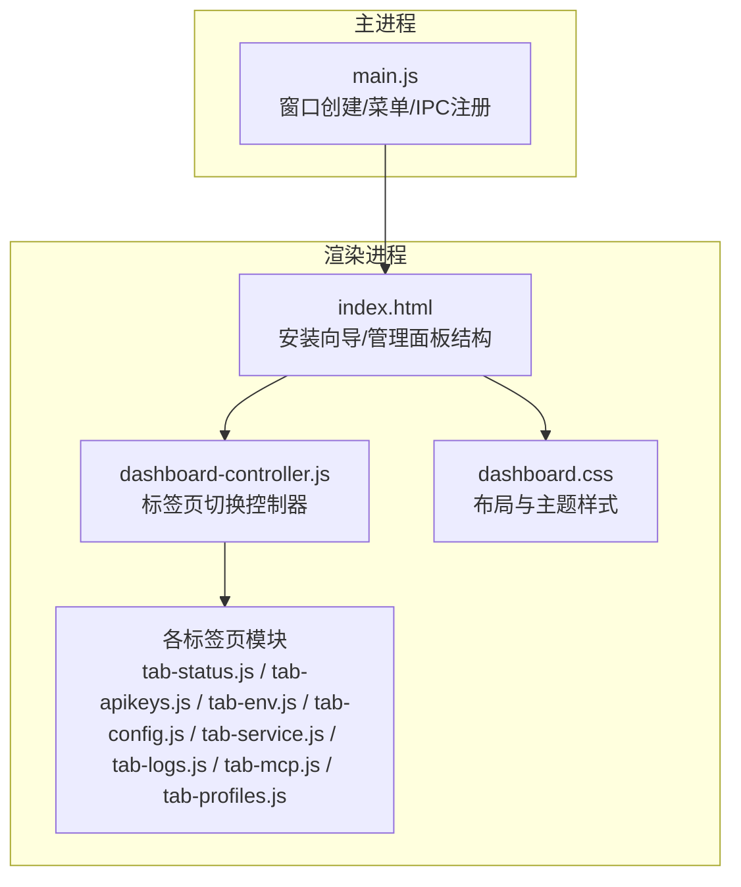
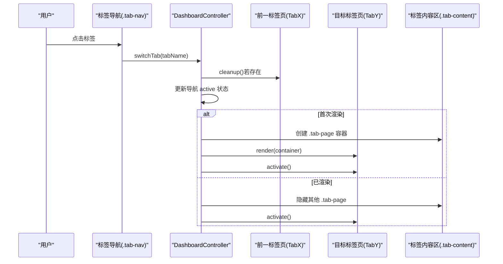
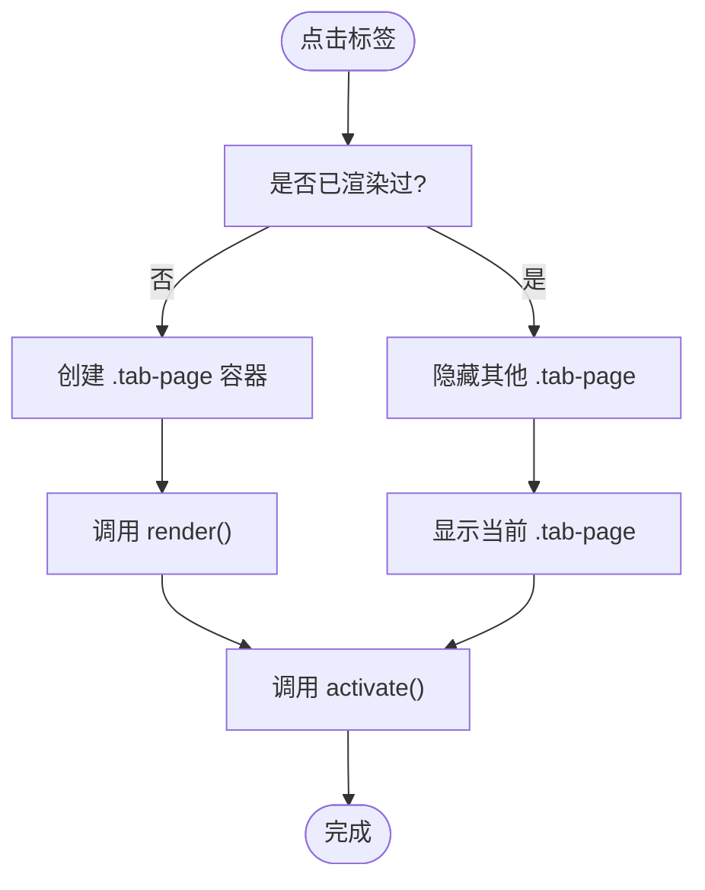
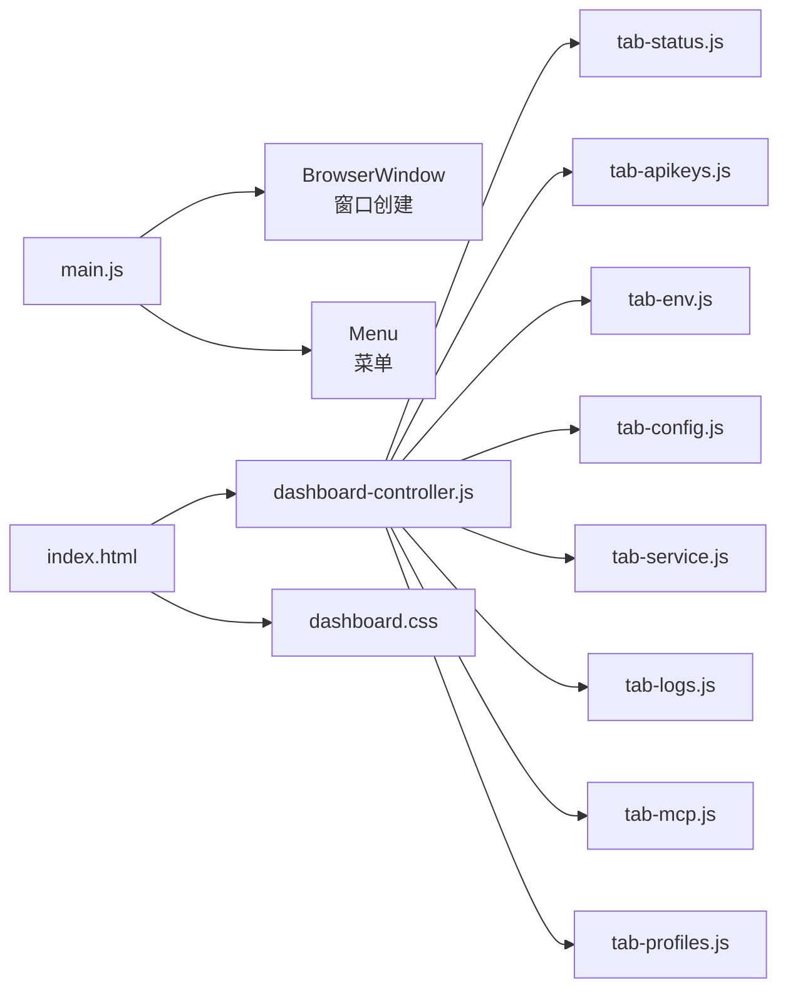

# 管理面板概览

<cite>
**本文档引用的文件**
- [src/renderer/index.html](file://src/renderer/index.html)
- [src/renderer/js/dashboard/dashboard-controller.js](file://src/renderer/js/dashboard/dashboard-controller.js)
- [src/renderer/styles/dashboard.css](file://src/renderer/styles/dashboard.css)
- [src/renderer/js/dashboard/tab-status.js](file://src/renderer/js/dashboard/tab-status.js)
- [src/renderer/js/dashboard/tab-apikeys.js](file://src/renderer/js/dashboard/tab-apikeys.js)
- [src/renderer/js/dashboard/tab-env.js](file://src/renderer/js/dashboard/tab-env.js)
- [src/renderer/js/dashboard/tab-config.js](file://src/renderer/js/dashboard/tab-config.js)
- [src/renderer/js/dashboard/tab-service.js](file://src/renderer/js/dashboard/tab-service.js)
- [src/renderer/js/dashboard/tab-logs.js](file://src/renderer/js/dashboard/tab-logs.js)
- [src/renderer/js/dashboard/tab-mcp.js](file://src/renderer/js/dashboard/tab-mcp.js)
- [src/renderer/js/dashboard/tab-profiles.js](file://src/renderer/js/dashboard/tab-profiles.js)
- [src/main/main.js](file://src/main/main.js)
- [package.json](file://package.json)
- [README.md](file://README.md)
</cite>

## 目录
1. [简介](#简介)
2. [项目结构](#项目结构)
3. [核心组件](#核心组件)
4. [架构总览](#架构总览)
5. [详细组件分析](#详细组件分析)
6. [依赖关系分析](#依赖关系分析)
7. [性能考虑](#性能考虑)
8. [故障排查指南](#故障排查指南)
9. [结论](#结论)
10. [附录](#附录)

## 简介
本指南面向首次使用 OpenClaw 管理面板的用户，系统性介绍管理面板的整体设计理念、界面布局与八个主要功能标签页的职责与使用方法。管理面板采用 Electron + 原生前端技术实现，提供全中文界面，支持 Windows 平台。面板通过“左侧垂直导航 + 右侧内容区”的布局组织各功能模块，标签页切换采用惰性渲染与激活回调机制，兼顾性能与用户体验。

## 项目结构
管理面板的核心由三部分组成：
- 主进程：负责窗口创建、菜单、IPC 注册与资源检查
- 渲染进程：负责安装向导与管理面板的 UI、标签页逻辑与样式
- 样式层：统一的主题变量、布局与组件样式

**图表来源**
- [src/main/main.js:1-121](file://src/main/main.js#L1-L121)
- [src/renderer/index.html:1-127](file://src/renderer/index.html#L1-L127)
- [src/renderer/js/dashboard/dashboard-controller.js:1-112](file://src/renderer/js/dashboard/dashboard-controller.js#L1-L112)
- [src/renderer/styles/dashboard.css:1-510](file://src/renderer/styles/dashboard.css#L1-L510)

**章节来源**
- [src/renderer/index.html:52-82](file://src/renderer/index.html#L52-L82)
- [src/main/main.js:48-101](file://src/main/main.js#L48-L101)
- [README.md:36-90](file://README.md#L36-L90)

## 核心组件
- 标签页控制器：负责标签页的初始化、切换、首次渲染与激活回调
- 标签页模块：每个标签页封装独立的渲染、交互与清理逻辑
- 样式系统：统一的布局、主题变量与组件样式，保证一致的视觉体验

关键职责与行为：
- 初始化：设置版本徽标、绑定标签页点击事件、默认加载“状态监控”标签页
- 切换机制：清理前一标签页、更新导航高亮、惰性渲染目标标签页、激活回调
- 首次渲染：创建容器、调用 render、加入已渲染集合
- 激活回调：已渲染过的标签页仅显示并触发 activate，避免重复 DOM 构建

**章节来源**
- [src/renderer/js/dashboard/dashboard-controller.js:23-111](file://src/renderer/js/dashboard/dashboard-controller.js#L23-L111)

## 架构总览
管理面板采用“主进程 + 渲染进程 + 标签页模块”的分层架构。主进程负责窗口与菜单，渲染进程承载 UI 与业务逻辑；标签页模块通过统一的控制器进行生命周期管理，实现高性能的标签页切换。

**图表来源**
- [src/renderer/js/dashboard/dashboard-controller.js:62-110](file://src/renderer/js/dashboard/dashboard-controller.js#L62-L110)

## 详细组件分析

### 标签页总览与功能定位
管理面板提供八个主要功能标签页，每个标签页均配有清晰的功能定位与常用操作入口：

- 状态监控
  - 功能：显示版本、服务状态、诊断检查、一键更新、卸载
  - 常用操作：刷新、更新、打开控制台、卸载
  - 适用场景：日常运维、问题排查、版本升级

- 智能对话
  - 功能：与 OpenClaw Agent 对话交互
  - 常用操作：发送消息、清空历史、切换模型
  - 适用场景：快速验证配置、测试对话能力

- 服务管理
  - 功能：启动/停止/重启服务、开机自启设置、操作日志
  - 常用操作：启动/停止/重启、一键设置自启
  - 适用场景：服务启停、开机自启配置

- 技能管理
  - 功能：查看/搜索/启用/禁用技能
  - 常用操作：搜索、批量启用/禁用
  - 适用场景：扩展与管理 AI 技能

- 定时任务
  - 功能：查看/管理定时任务
  - 常用操作：新增、编辑、删除、启用/禁用
  - 适用场景：自动化流程编排

- IM 插件
  - 功能：配置企业微信、钉钉、飞书等 IM 插件
  - 常用操作：添加账号、编辑配置、启用/禁用
  - 适用场景：企业级即时通讯集成

- 模型配置
  - 功能：管理多个 AI 服务商的 API Key 与 Base URL
  - 常用操作：添加/编辑/删除、设为默认、测试连接
  - 适用场景：多供应商接入、默认模型设置

- 环境变量
  - 功能：编辑 .env 文件，修复 CMD 命令可用性
  - 常用操作：添加变量、保存、检查并修复 PATH
  - 适用场景：命令行可用性、敏感变量管理

- 配置管理
  - 功能：可视化与 JSON 双模式编辑 openclaw.json
  - 常用操作：切换模式、保存、重新生成 Token
  - 适用场景：复杂配置管理、备份与恢复

- MCP 服务器
  - 功能：管理 MCP (Model Context Protocol) 服务器
  - 常用操作：添加/编辑/删除、参数与环境变量配置
  - 适用场景：协议服务器接入与管理

- 配置档案
  - 功能：创建、切换、导入/导出配置档案
  - 常用操作：创建、切换、导出、导入、删除
  - 适用场景：多环境配置快照与切换

- 日志查看
  - 功能：实时查看与导出日志，支持右键菜单
  - 常用操作：切换日志类型、复制、清空、自动滚动
  - 适用场景：问题定位、审计与导出

**章节来源**
- [src/renderer/index.html:64-77](file://src/renderer/index.html#L64-L77)
- [README.md:15-26](file://README.md#L15-L26)

### 标签页切换机制与界面布局
- 布局设计
  - 顶部标题栏：Logo + 面板标题 + 版本徽标
  - 左侧垂直导航：固定宽度侧边栏，纵向排列标签项
  - 右侧内容区：自适应宽度，支持滚动
  - 激活态样式：左侧边框强调当前标签页

- 切换机制
  - 首次渲染：创建 .tab-page 容器并调用 render
  - 已渲染：隐藏其他标签页，显示当前标签页并触发 activate
  - 清理：切换前调用前一标签页 cleanup，释放资源

- 版本徽标
  - 控制器初始化时设置版本号，未安装时显示“未安装”

**图表来源**
- [src/renderer/js/dashboard/dashboard-controller.js:81-110](file://src/renderer/js/dashboard/dashboard-controller.js#L81-L110)
- [src/renderer/styles/dashboard.css:57-107](file://src/renderer/styles/dashboard.css#L57-L107)

**章节来源**
- [src/renderer/js/dashboard/dashboard-controller.js:23-61](file://src/renderer/js/dashboard/dashboard-controller.js#L23-L61)
- [src/renderer/styles/dashboard.css:51-112](file://src/renderer/styles/dashboard.css#L51-L112)

### 快速导航指南
- 常用功能直达
  - 状态监控：查看版本与服务状态，一键更新与卸载
  - 服务管理：启动/停止/重启服务，设置开机自启
  - 配置管理：切换到 JSON 模式进行高级配置
  - 日志查看：实时查看 gateway.log，复制与导出
  - 配置档案：创建/切换/导入/导出配置快照

- 快捷操作
  - 刷新：各标签页顶部“刷新”按钮
  - 保存：配置类标签页的“保存”按钮
  - 测试：模型配置中的“测试连接”按钮

**章节来源**
- [src/renderer/js/dashboard/tab-status.js:96-110](file://src/renderer/js/dashboard/tab-status.js#L96-L110)
- [src/renderer/js/dashboard/tab-service.js:125-150](file://src/renderer/js/dashboard/tab-service.js#L125-L150)
- [src/renderer/js/dashboard/tab-config.js:25-31](file://src/renderer/js/dashboard/tab-config.js#L25-L31)
- [src/renderer/js/dashboard/tab-logs.js:33-43](file://src/renderer/js/dashboard/tab-logs.js#L33-L43)
- [src/renderer/js/dashboard/tab-profiles.js:18-23](file://src/renderer/js/dashboard/tab-profiles.js#L18-L23)

### 管理面板整体设计理念与用户体验
- 一致性
  - 统一样式与交互：卡片、按钮、表单、状态指示器风格统一
  - 主题变量：通过 CSS 变量控制颜色与间距，便于维护

- 可发现性
  - 左侧导航明确标注功能名称，鼠标悬停高亮
  - 关键操作按钮突出显示，如“启动/停止/重启”、“保存/刷新”

- 可靠性
  - 轮询刷新：状态监控与服务管理定期轮询，确保 UI 与实际状态一致
  - 进度反馈：服务操作与更新过程提供进度条与日志输出

- 易用性
  - 惰性渲染：仅在切换到标签页时渲染，减少初始加载压力
  - 激活回调：已渲染标签页再次进入时仅激活，提升响应速度

**章节来源**
- [src/renderer/styles/dashboard.css:1-510](file://src/renderer/styles/dashboard.css#L1-L510)
- [src/renderer/js/dashboard/tab-status.js:118-128](file://src/renderer/js/dashboard/tab-status.js#L118-L128)
- [src/renderer/js/dashboard/tab-service.js:410-419](file://src/renderer/js/dashboard/tab-service.js#L410-L419)

## 依赖关系分析
- 主进程依赖
  - Electron：窗口、菜单、IPC
  - 资源定位与日志：辅助调试与资源检查

- 渲染进程依赖
  - 标签页模块：各自封装 UI 与业务逻辑
  - 样式层：统一主题与布局
  - 工具函数：DOM 辅助、国际化文本、消息提示

**图表来源**
- [src/main/main.js:48-101](file://src/main/main.js#L48-L101)
- [src/renderer/index.html:111-123](file://src/renderer/index.html#L111-L123)
- [src/renderer/js/dashboard/dashboard-controller.js:6-19](file://src/renderer/js/dashboard/dashboard-controller.js#L6-L19)

**章节来源**
- [package.json:1-75](file://package.json#L1-L75)
- [src/main/main.js:1-121](file://src/main/main.js#L1-L121)

## 性能考虑
- 惰性渲染与激活回调：避免一次性渲染所有标签页，降低内存占用与首屏时间
- 轮询策略：状态监控与服务管理采用定时轮询，频率适中，避免频繁请求
- 进度与日志：长耗时操作提供进度条与日志输出，避免界面卡顿
- 样式优化：统一的 CSS 变量与组件样式，减少重复计算与重绘

[本节为通用指导，无需特定文件引用]

## 故障排查指南
- 状态监控
  - 未安装：显示重新安装提示，引导回到安装向导
  - 更新失败：查看更新终端输出，确认网络与权限
  - 卸载失败：查看卸载进度与错误信息，必要时重试

- 服务管理
  - 启动/停止失败：查看操作日志，确认权限与依赖
  - 自启设置失败：检查计划任务是否存在，必要时一键设置

- 配置管理
  - JSON 模式校验：保存前进行 JSON 校验，提示格式错误
  - Token 重新生成：一键生成新的控制 Token

- 日志查看
  - 日志为空：确认日志文件是否存在，路径与大小信息
  - 复制失败：检查剪贴板权限与选择内容

**章节来源**
- [src/renderer/js/dashboard/tab-status.js:144-212](file://src/renderer/js/dashboard/tab-status.js#L144-L212)
- [src/renderer/js/dashboard/tab-service.js:337-401](file://src/renderer/js/dashboard/tab-service.js#L337-L401)
- [src/renderer/js/dashboard/tab-config.js:412-461](file://src/renderer/js/dashboard/tab-config.js#L412-L461)
- [src/renderer/js/dashboard/tab-logs.js:196-244](file://src/renderer/js/dashboard/tab-logs.js#L196-L244)

## 结论
管理面板通过清晰的功能分区、统一的样式体系与高效的标签页切换机制，为用户提供稳定、直观且高效的管理体验。八个主要标签页覆盖从状态监控、服务管理到配置与日志的全链路运维需求，配合一键更新、诊断检查与配置档案等功能，满足不同场景下的使用诉求。

[本节为总结性内容，无需特定文件引用]

## 附录
- 界面截图与操作示例
  - 状态监控：显示版本、服务状态、诊断检查与更新进度
  - 服务管理：服务启停、开机自启设置与操作日志
  - 配置管理：可视化与 JSON 双模式编辑，支持 Token 重新生成
  - 日志查看：实时日志流、右键菜单与复制功能
  - 配置档案：创建、切换、导入/导出与删除
  - 模型配置：添加/编辑/删除 API Key，测试连接
  - 环境变量：编辑 .env，修复 CMD 命令可用性
  - MCP 服务器：添加/编辑/删除 MCP 服务器，配置命令与参数

- 快速操作清单
  - 查看服务状态：状态监控 → 刷新
  - 启动服务：服务管理 → 启动
  - 保存配置：配置管理 → 保存
  - 查看日志：日志查看 → 选择日志类型
  - 切换配置档案：配置档案 → 切换
  - 添加 API Key：模型配置 → 添加
  - 修复 PATH：环境变量 → 检查并修复 PATH

**章节来源**
- [src/renderer/js/dashboard/tab-status.js:6-111](file://src/renderer/js/dashboard/tab-status.js#L6-L111)
- [src/renderer/js/dashboard/tab-service.js:7-150](file://src/renderer/js/dashboard/tab-service.js#L7-L150)
- [src/renderer/js/dashboard/tab-config.js:6-54](file://src/renderer/js/dashboard/tab-config.js#L6-L54)
- [src/renderer/js/dashboard/tab-logs.js:8-43](file://src/renderer/js/dashboard/tab-logs.js#L8-L43)
- [src/renderer/js/dashboard/tab-profiles.js:3-23](file://src/renderer/js/dashboard/tab-profiles.js#L3-L23)
- [src/renderer/js/dashboard/tab-apikeys.js:15-52](file://src/renderer/js/dashboard/tab-apikeys.js#L15-L52)
- [src/renderer/js/dashboard/tab-env.js:10-60](file://src/renderer/js/dashboard/tab-env.js#L10-L60)
- [src/renderer/js/dashboard/tab-mcp.js:3-21](file://src/renderer/js/dashboard/tab-mcp.js#L3-L21)