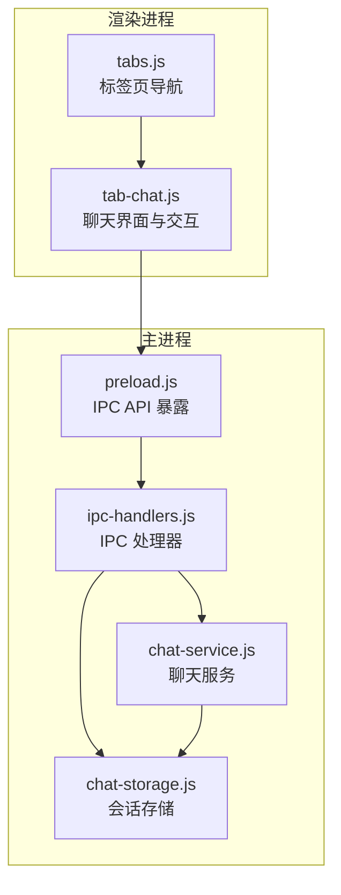
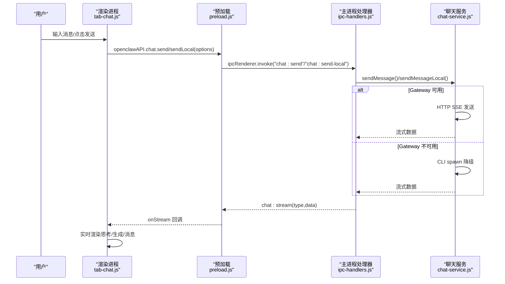
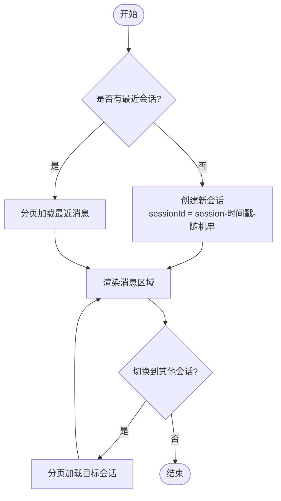
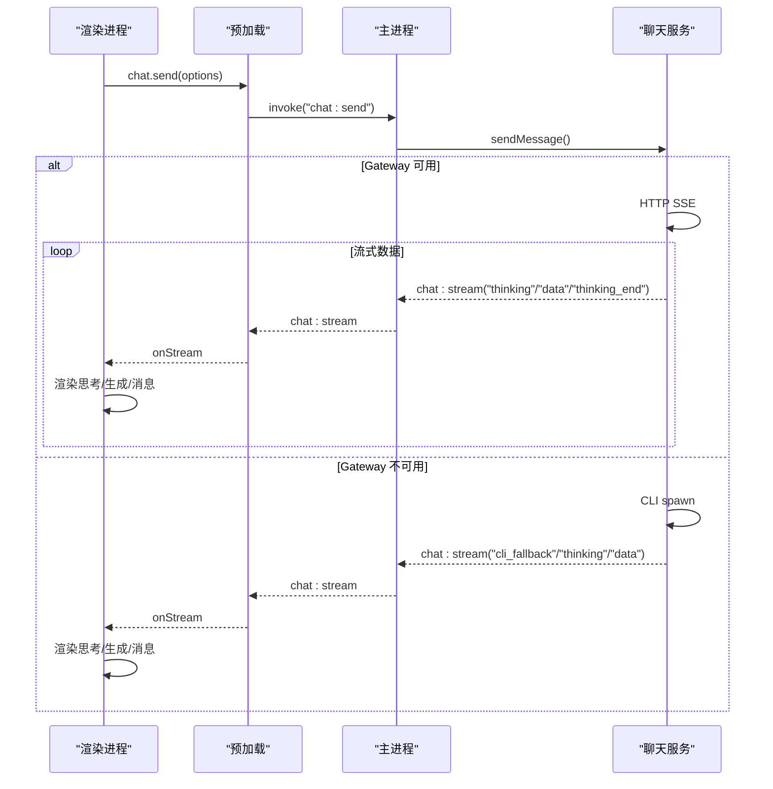
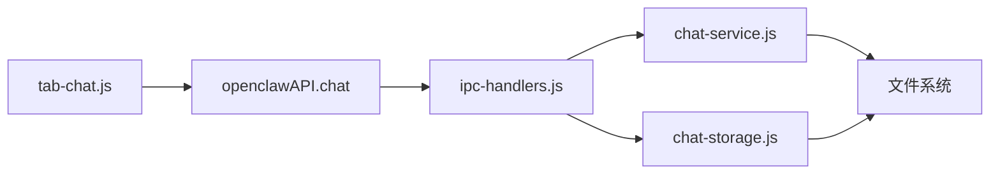

# 聊天界面

<cite>
**本文引用的文件**
- [src/renderer/index.html](file://src/renderer/index.html)
- [src/renderer/js/dashboard/tabs.js](file://src/renderer/js/dashboard/tabs.js)
- [src/renderer/js/dashboard/tab-chat.js](file://src/renderer/js/dashboard/tab-chat.js)
- [src/main/preload.js](file://src/main/preload.js)
- [src/main/ipc-handlers.js](file://src/main/ipc-handlers.js)
- [src/main/services/chat-service.js](file://src/main/services/chat-service.js)
- [src/main/services/chat-storage.js](file://src/main/services/chat-storage.js)
</cite>

## 目录
1. [简介](#简介)
2. [项目结构](#项目结构)
3. [核心组件](#核心组件)
4. [架构总览](#架构总览)
5. [详细组件分析](#详细组件分析)
6. [依赖关系分析](#依赖关系分析)
7. [性能考量](#性能考量)
8. [故障排查指南](#故障排查指南)
9. [结论](#结论)
10. [附录](#附录)

## 简介
本指南面向使用者与维护者，系统讲解聊天界面的完整使用方式与技术实现。内容涵盖消息输入、会话管理、历史记录查看与消息发送；界面布局与控件功能（发送按钮、附件上传、思考级别、本地模式等）；会话创建与切换机制；消息存储与检索；流式响应与实时交互体验；快捷键与键盘操作；聊天记录导出与备份；以及隐私与安全相关设置。

## 项目结构
聊天功能位于桌面应用的仪表盘“智能对话”标签页中，采用 Electron + 前后端分离的架构：
- 前端（渲染进程）：负责 UI 呈现、用户交互、流式渲染与会话管理
- 主进程（主进程）：负责与后端服务通信、文件系统读写、系统能力调用
- IPC：前后端通过 IPC 通道进行异步通信
- 后端服务：聊天服务与存储服务分别处理消息流式响应与会话持久化

图表来源
- [src/renderer/js/dashboard/tab-chat.js](file://src/renderer/js/dashboard/tab-chat.js)
- [src/renderer/js/dashboard/tabs.js](file://src/renderer/js/dashboard/tabs.js)
- [src/main/preload.js](file://src/main/preload.js)
- [src/main/ipc-handlers.js](file://src/main/ipc-handlers.js)
- [src/main/services/chat-service.js](file://src/main/services/chat-service.js)
- [src/main/services/chat-storage.js](file://src/main/services/chat-storage.js)

章节来源
- [src/renderer/index.html](file://src/renderer/index.html)
- [src/renderer/js/dashboard/tabs.js](file://src/renderer/js/dashboard/tabs.js)
- [src/renderer/js/dashboard/tab-chat.js](file://src/renderer/js/dashboard/tab-chat.js)
- [src/main/preload.js](file://src/main/preload.js)
- [src/main/ipc-handlers.js](file://src/main/ipc-handlers.js)
- [src/main/services/chat-service.js](file://src/main/services/chat-service.js)
- [src/main/services/chat-storage.js](file://src/main/services/chat-storage.js)

## 核心组件
- 聊天界面（tab-chat.js）：负责输入框、发送按钮、附件、思考级别、本地模式、会话列表、消息渲染、流式渲染、等待/思考/生成阶段提示、右键菜单、复制、滚动分页加载等
- 聊天服务（chat-service.js）：封装 Gateway HTTP SSE 与 CLI 降级两种消息发送路径，解析流式数据，处理思考阶段与生成阶段，提供代理与技能列表查询
- 会话存储（chat-storage.js）：提供会话保存/加载/分页加载、最近会话列表、删除、保存总结与知识库、统计与清理
- IPC 预加载（preload.js）：在渲染进程中暴露 openclawAPI.chat 等 API，桥接渲染进程与主进程
- IPC 处理器（ipc-handlers.js）：注册 chat:* 与 chat-storage:* 相关的 IPC 处理函数，转发到服务层

章节来源
- [src/renderer/js/dashboard/tab-chat.js](file://src/renderer/js/dashboard/tab-chat.js)
- [src/main/services/chat-service.js](file://src/main/services/chat-service.js)
- [src/main/services/chat-storage.js](file://src/main/services/chat-storage.js)
- [src/main/preload.js](file://src/main/preload.js)
- [src/main/ipc-handlers.js](file://src/main/ipc-handlers.js)

## 架构总览
聊天交互的关键流程如下：
- 用户在输入框输入消息，点击发送或按回车（Shift+Enter 换行）
- 前端根据“本地模式”开关选择调用 chat:send 或 chat:send-local
- 主进程处理器调用 chat-service 发送消息
- chat-service 优先尝试 Gateway HTTP SSE；若不可用则降级到 CLI spawn
- 流式数据通过 chat:stream 通道回传前端，前端实时渲染“思考/生成”阶段与消息气泡
- 会话与历史消息通过 chat-storage 进行持久化与分页加载

图表来源
- [src/renderer/js/dashboard/tab-chat.js](file://src/renderer/js/dashboard/tab-chat.js)
- [src/main/preload.js](file://src/main/preload.js)
- [src/main/ipc-handlers.js](file://src/main/ipc-handlers.js)
- [src/main/services/chat-service.js](file://src/main/services/chat-service.js)

## 详细组件分析

### 聊天界面布局与控件
- 布局结构
  - 顶部：智能对话标题与设置（本地模式、思考级别、历史会话、总结、清空）
  - 中部：消息区域，支持欢迎页与消息列表渲染
  - 底部：附件区、输入区（附件按钮、多行输入框）、发送按钮、状态栏
- 控件功能
  - 附件上传：选择文件（限制大小与类型），预览并可移除
  - 发送按钮：禁用条件为无内容或正在流式中
  - 本地模式：勾选后走 CLI 降级路径，适合无 Gateway 场景
  - 思考级别：可选“无思考/最少/低/中/高”
  - 历史会话：打开面板查看/切换/删除会话
  - 总结：基于当前对话生成阶段性总结
  - 清空：清空当前对话
  - 右键菜单：复制选中文本/全部内容、全选文字等
- 键盘操作
  - Shift+Enter：输入框换行
  - Enter：发送消息（若无 Shift）

章节来源
- [src/renderer/js/dashboard/tab-chat.js](file://src/renderer/js/dashboard/tab-chat.js)

### 会话创建与切换机制
- 创建新会话：无历史会话时自动创建；也可手动点击“+ 新对话”
- 切换会话：打开历史面板，点击会话项进入；使用分页加载最近消息
- 删除会话：面板中点击删除按钮确认删除
- 自动保存：消息变化后进行防抖保存，避免频繁写盘

图表来源
- [src/renderer/js/dashboard/tab-chat.js](file://src/renderer/js/dashboard/tab-chat.js)

章节来源
- [src/renderer/js/dashboard/tab-chat.js](file://src/renderer/js/dashboard/tab-chat.js)

### 消息发送与流式响应
- 发送路径
  - Gateway HTTP SSE：优先路径，支持真正的流式响应
  - CLI 降级：Gateway 不可用时自动降级，通过 Node.js spawn 执行 openclaw.mjs，模拟流式输出
- 流式阶段
  - thinking_start/thinking/thinking_end：展示“思考卡片”，支持展开/折叠
  - data：正式内容到达，实时渲染消息气泡
  - cli_fallback：Gateway 不可用时的过渡提示
- 错误兜底
  - 若流式未产生内容，尝试从 stdout/stderr 中提取有效文本
  - 若仍失败，给出明确错误提示与诊断信息

图表来源
- [src/renderer/js/dashboard/tab-chat.js](file://src/renderer/js/dashboard/tab-chat.js)
- [src/main/preload.js](file://src/main/preload.js)
- [src/main/ipc-handlers.js](file://src/main/ipc-handlers.js)
- [src/main/services/chat-service.js](file://src/main/services/chat-service.js)

章节来源
- [src/renderer/js/dashboard/tab-chat.js](file://src/renderer/js/dashboard/tab-chat.js)
- [src/main/services/chat-service.js](file://src/main/services/chat-service.js)

### 历史记录查看与分页加载
- 分页加载：每次加载固定数量消息，滚动至顶部附近自动触发加载更多
- 加载指示：顶部显示“加载更多历史消息”按钮，支持点击加载
- 统计信息：可获取会话消息总数、用户/助手消息数、字符统计等

章节来源
- [src/renderer/js/dashboard/tab-chat.js](file://src/renderer/js/dashboard/tab-chat.js)
- [src/main/services/chat-storage.js](file://src/main/services/chat-storage.js)

### 附件上传与消息拼接
- 选择附件：支持多种文本/代码/文档类文件，限制单文件大小
- 预览与移除：附件以标签形式展示，支持移除
- 发送时拼接：将附件内容按约定格式拼接到用户消息末尾，同时保留独立的附件标签展示

章节来源
- [src/renderer/js/dashboard/tab-chat.js](file://src/renderer/js/dashboard/tab-chat.js)

### 右键菜单与复制
- 右键菜单：支持复制选中文本、复制全部内容、全选文字等
- 复制提示：复制成功后显示轻提示

章节来源
- [src/renderer/js/dashboard/tab-chat.js](file://src/renderer/js/dashboard/tab-chat.js)

### 聊天快捷键与键盘操作
- Shift+Enter：在输入框内换行
- Enter：发送消息（若无 Shift）
- Esc：关闭右键菜单

章节来源
- [src/renderer/js/dashboard/tab-chat.js](file://src/renderer/js/dashboard/tab-chat.js)

### 聊天记录导出与备份
- 会话导出：通过会话存储服务保存为 JSON 文件，包含消息与元数据
- 知识库导出：会话总结与知识项持久化到独立文件，可用于知识沉淀与二次利用
- 备份建议：定期导出会话 JSON 与知识库文件，存放于安全位置

章节来源
- [src/main/services/chat-storage.js](file://src/main/services/chat-storage.js)

### 隐私保护与消息安全
- 本地模式：在无 Gateway 场景下使用 CLI 降级，减少网络暴露面
- 附件限制：限制单文件大小与类型，避免过大数据影响性能与安全
- 会话隔离：每个会话独立文件存储，便于清理与审计
- 诊断信息：错误与诊断信息仅在本地日志中记录，不上传云端

章节来源
- [src/renderer/js/dashboard/tab-chat.js](file://src/renderer/js/dashboard/tab-chat.js)
- [src/main/services/chat-service.js](file://src/main/services/chat-service.js)
- [src/main/services/chat-storage.js](file://src/main/services/chat-storage.js)

## 依赖关系分析
- 前端依赖
  - openclawAPI.chat：封装 chat:* 与 chat-storage:* IPC 调用
  - openclawAPI.utils：平台信息、诊断工具等
- 主进程依赖
  - chat-service：消息发送、流式解析、代理/技能查询
  - chat-storage：会话持久化、分页加载、知识库
- IPC 依赖
  - 预加载层统一暴露 API，主进程集中处理业务逻辑

图表来源
- [src/renderer/js/dashboard/tab-chat.js](file://src/renderer/js/dashboard/tab-chat.js)
- [src/main/preload.js](file://src/main/preload.js)
- [src/main/ipc-handlers.js](file://src/main/ipc-handlers.js)
- [src/main/services/chat-service.js](file://src/main/services/chat-service.js)
- [src/main/services/chat-storage.js](file://src/main/services/chat-storage.js)

章节来源
- [src/renderer/js/dashboard/tab-chat.js](file://src/renderer/js/dashboard/tab-chat.js)
- [src/main/preload.js](file://src/main/preload.js)
- [src/main/ipc-handlers.js](file://src/main/ipc-handlers.js)
- [src/main/services/chat-service.js](file://src/main/services/chat-service.js)
- [src/main/services/chat-storage.js](file://src/main/services/chat-storage.js)

## 性能考量
- 流式渲染：仅更新最后一条助手消息，避免全量重绘
- 分页加载：滚动至顶部附近触发加载更多，降低一次性渲染压力
- 防抖保存：会话变更后 2 秒内保存，兼顾实时性与性能
- CLI 降级：在 Gateway 不可用时提供近似流式的体验，避免长时间等待
- 会话清理：定期清理过期会话，控制文件数量与体积

## 故障排查指南
- Gateway 不可用
  - 现象：显示“正在连接...”长时间不变或提示“连接阶段结束，切换到思考阶段”
  - 处理：开启本地模式，或检查 Gateway 服务状态
- CLI 进程错误
  - 现象：提示“无法启动 CLI 进程，请检查 Node.js 安装”
  - 处理：确认系统已安装 Node.js 并加入 PATH
- 超时
  - 现象：提示“AI 助手响应超时（X 秒内未收到回复）”
  - 处理：检查网络与 API Key 配置，适当延长等待时间
- 无响应内容
  - 现象：显示“（无响应内容）”或“未知错误”
  - 处理：查看 stdout/stderr 诊断信息，核对模型名称与参数

章节来源
- [src/renderer/js/dashboard/tab-chat.js](file://src/renderer/js/dashboard/tab-chat.js)
- [src/main/services/chat-service.js](file://src/main/services/chat-service.js)

## 结论
本聊天界面提供了完善的对话体验：从输入、发送、流式渲染到会话管理与历史查看，均具备良好的交互与健壮性。通过 Gateway 优先与 CLI 降级双路径保障可用性，结合分页加载与自动保存提升性能与可靠性。配合附件上传、右键菜单、快捷键与总结建议等功能，满足日常办公与开发场景下的高效沟通需求。

## 附录
- 术语
  - Gateway：内置服务端，提供 HTTP SSE 能力
  - CLI 降级：在 Gateway 不可用时通过 Node.js 执行 openclaw.mjs
  - 流式：边生成边输出，实时渲染
- 常用操作
  - 新建会话：无历史会话时自动创建；或点击“+ 新对话”
  - 切换会话：打开历史面板，点击会话项
  - 发送消息：输入内容后按 Enter（Shift+Enter 换行）
  - 本地模式：勾选“本地模式”后发送走 CLI 降级路径
  - 附件：点击附件按钮选择文件，发送时自动拼接内容
  - 总结：对话达到一定长度后提示阶段性总结，或手动点击“总结”