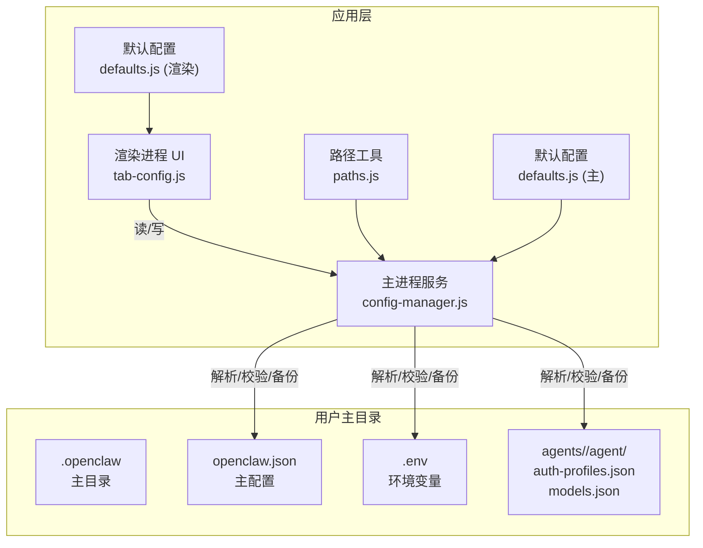
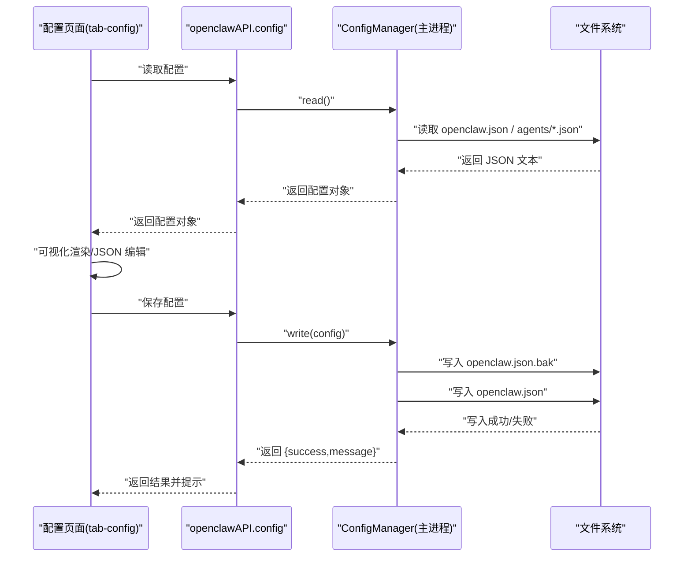
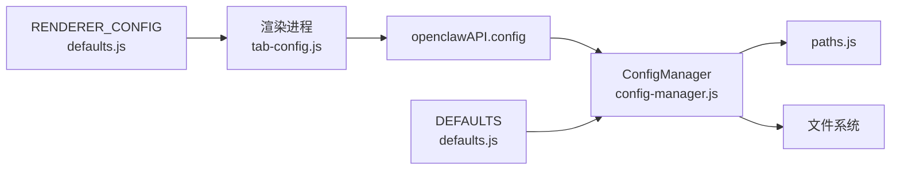

# 配置文件编辑

<cite>
**本文引用的文件**
- [defaults.js](file://src/main/config/defaults.js)
- [defaults.js](file://src/renderer/js/config/defaults.js)
- [config-manager.js](file://src/main/services/config-manager.js)
- [paths.js](file://src/main/utils/paths.js)
- [tab-config.js](file://src/renderer/js/dashboard/tab-config.js)
- [openai.yaml](file://resources/skills/playwright/agents/openai.yaml)
</cite>

## 目录
1. [简介](#简介)
2. [项目结构](#项目结构)
3. [核心组件](#核心组件)
4. [架构总览](#架构总览)
5. [详细组件分析](#详细组件分析)
6. [依赖关系分析](#依赖关系分析)
7. [性能与可靠性](#性能与可靠性)
8. [故障排查指南](#故障排查指南)
9. [结论](#结论)
10. [附录](#附录)

## 简介
本指南面向使用 OpenClaw 的用户与维护者，系统讲解如何编辑 OpenClaw 的各类配置文件，包括主配置文件、技能配置与用户偏好设置。内容涵盖：
- 配置文件的结构与字段含义
- 可视化与 JSON 编辑模式的使用
- 语法高亮、自动补全与错误检查
- 配置模板与示例文件的使用
- 配置备份与恢复流程
- 配置验证机制与错误提示解读
- 性能优化与最佳实践

## 项目结构
OpenClaw 的配置体系由“主配置”“技能配置”“用户偏好/认证配置”三类构成，分别存储在用户家目录下的 OpenClaw 主目录中，并通过 Electron 渲染进程的可视化界面进行编辑。

图表来源
- [config-manager.js:1-264](file://src/main/services/config-manager.js#L1-L264)
- [paths.js:1-124](file://src/main/utils/paths.js#L1-L124)
- [tab-config.js:1-478](file://src/renderer/js/dashboard/tab-config.js#L1-L478)
- [defaults.js:1-180](file://src/main/config/defaults.js#L1-L180)
- [defaults.js:1-51](file://src/renderer/js/config/defaults.js#L1-L51)

章节来源
- [paths.js:1-124](file://src/main/utils/paths.js#L1-L124)
- [config-manager.js:1-264](file://src/main/services/config-manager.js#L1-L264)
- [tab-config.js:1-478](file://src/renderer/js/dashboard/tab-config.js#L1-L478)

## 核心组件
- 主配置文件 openclaw.json：存放全局网络、超时、功能开关、路径等配置，位于用户主目录的 OpenClaw 主目录中。
- 技能配置：以 YAML/JSON 形式存在，如 playwright 技能的 openai.yaml，用于声明技能接口元数据。
- 用户偏好/认证配置：按 Agent 分组，包含认证凭据与模型配置，位于 agents/<agent-id>/agent/ 下。
- 渲染进程配置编辑器：提供可视化表单与 JSON 编辑两种模式，支持密码字段显隐切换、自动补全与错误提示。
- 主进程配置管理器：负责读取、写入、备份、校验配置文件，确保数据一致性与安全性。

章节来源
- [config-manager.js:1-264](file://src/main/services/config-manager.js#L1-L264)
- [tab-config.js:1-478](file://src/renderer/js/dashboard/tab-config.js#L1-L478)
- [openai.yaml:1-7](file://resources/skills/playwright/agents/openai.yaml#L1-L7)

## 架构总览
配置编辑流程分为“读取—渲染—保存—备份—校验”五个环节，贯穿渲染进程与主进程。

图表来源
- [tab-config.js:33-54](file://src/renderer/js/dashboard/tab-config.js#L33-L54)
- [tab-config.js:412-461](file://src/renderer/js/dashboard/tab-config.js#L412-L461)
- [config-manager.js:212-260](file://src/main/services/config-manager.js#L212-L260)

## 详细组件分析

### 主配置 openclaw.json 结构与字段参考
- 位置与命名
  - 主配置文件名：openclaw.json
  - 默认主目录：~/.openclaw
  - 环境变量覆盖：可通过 OPENCLAW_HOME 与 OPENCLAW_CONFIG_PATH 调整
- 关键字段类别
  - 网络与服务
    - gateway.bind/gateway.port/gateway.mode：网关绑定地址、端口与运行模式
    - gateway.auth.token：认证令牌
    - gateway.controlUi.allowedOrigins：控制台允许的跨域来源（自动注入）
  - 超时与轮询
    - timeouts.*：默认超时、探测超时、缓存 TTL、状态轮询间隔、启动/安装/CLI 超时等
  - 样式与交互
    - styles.toastDuration/styles.toastErrorDuration/styles.toastZIndex/styles.modalZIndex：提示与弹窗样式参数
  - 路径与功能
    - paths.*：主目录、配置文件名、环境变量文件名、agents/skills/workspace 等子目录名
    - features.allowedOrigins/features.gatewayMode/features.authMode：跨域白名单、网关模式、认证模式
- 读取与写入
  - 读取：不存在时返回空对象；若当前文件损坏，尝试读取 .bak 备份
  - 写入：先备份为 .bak，再写入新内容；写入前进行 JSON 语法校验
- 自动补全与错误提示
  - 可视化模式下，字段类型会根据路径与值类型自动推断（布尔/数值/文本），并提供密码显隐切换
  - JSON 模式下，保存前进行语法校验，失败时提示无效 JSON

章节来源
- [defaults.js:14-179](file://src/main/config/defaults.js#L14-L179)
- [paths.js:8-11](file://src/main/utils/paths.js#L8-L11)
- [config-manager.js:212-260](file://src/main/services/config-manager.js#L212-L260)
- [tab-config.js:412-461](file://src/renderer/js/dashboard/tab-config.js#L412-L461)

### 技能配置（以 playwright/openai.yaml 为例）
- 用途：声明技能的显示名称、描述、图标与默认提示词等元信息
- 示例文件位置：resources/skills/playwright/agents/openai.yaml
- 常见字段
  - interface.display_name：技能显示名
  - interface.short_description：简短描述
  - interface.icon_small/interface.icon_large：小/大图标路径
  - interface.default_prompt：默认提示词
- 使用方式
  - 在技能目录内放置对应 YAML 文件，应用启动时加载
  - 可配合主配置中的 skills 相关路径与工作区设置使用

章节来源
- [openai.yaml:1-7](file://resources/skills/playwright/agents/openai.yaml#L1-L7)

### 用户偏好与认证配置（按 Agent 分组）
- 存放位置
  - agents/<agent-id>/agent/auth-profiles.json：认证配置（含版本号与 profiles）
  - agents/<agent-id>/agent/models.json：模型配置（providers 映射）
- 功能特性
  - 支持按 Agent 维度管理多套凭据与模型
  - 写入时自动备份为 .bak
  - 支持按提供商标识更新或删除 API Key
- 字段要点
  - auth-profiles.json：version（版本）、profiles[providerId]（apiKey 等）
  - models.json：providers[providerId]（baseUrl、apiKey、models）

章节来源
- [config-manager.js:25-185](file://src/main/services/config-manager.js#L25-L185)

### 渲染进程配置编辑器（可视化与 JSON 模式）
- 模式切换
  - 可视化模式：按配置层级自动生成表单控件，支持布尔/数值/文本/密码输入
  - JSON 模式：提供 textarea 编辑器，支持复制/粘贴与语法高亮（依赖编辑器能力）
- 交互细节
  - 密码显隐：点击按钮切换明文/密文
  - 折叠面板：支持展开/折叠配置分组
  - 自动补全：基于路径推断字段类型（如含 .port 的字段为数值）
  - 错误提示：保存失败/无效 JSON/写入异常均会提示
- 自动注入
  - 若未设置 gateway.controlUi.allowedOrigins，则在加载时自动注入并保存

章节来源
- [tab-config.js:6-31](file://src/renderer/js/dashboard/tab-config.js#L6-L31)
- [tab-config.js:63-151](file://src/renderer/js/dashboard/tab-config.js#L63-L151)
- [tab-config.js:326-383](file://src/renderer/js/dashboard/tab-config.js#L326-L383)
- [tab-config.js:412-461](file://src/renderer/js/dashboard/tab-config.js#L412-L461)

### 主进程配置管理器（读写/备份/校验）
- 能力清单
  - 读取主配置、认证配置、模型配置
  - 写入主配置、认证配置、模型配置
  - 写入前自动备份为 .bak
  - 写入前进行 JSON 语法校验
  - 读取失败时尝试读取 .bak
- 关键行为
  - 目录不存在时自动创建
  - 写入失败时返回错误信息
  - 读取失败时返回空对象或回退 .bak

章节来源
- [config-manager.js:212-260](file://src/main/services/config-manager.js#L212-L260)
- [config-manager.js:25-75](file://src/main/services/config-manager.js#L25-L75)
- [config-manager.js:136-185](file://src/main/services/config-manager.js#L136-L185)

## 依赖关系分析
- 渲染进程依赖
  - 通过 window.openclawAPI.config.read/write 与主进程通信
  - 使用 RENDERER_CONFIG（渲染默认配置）作为前端网络/超时/样式参数来源
- 主进程依赖
  - 依赖路径工具解析 OPENCLAW_HOME/CONFIG_PATH 等路径
  - 依赖文件系统进行读写与备份
- 配置文件间关系
  - 主配置 openclaw.json 为全局入口
  - Agent 级 auth-profiles.json 与 models.json 由主配置中的路径与工作区决定
  - 技能配置（YAML/JSON）由技能目录扫描加载

图表来源
- [tab-config.js:38-50](file://src/renderer/js/dashboard/tab-config.js#L38-L50)
- [config-manager.js:1-9](file://src/main/services/config-manager.js#L1-L9)
- [paths.js:1-124](file://src/main/utils/paths.js#L1-L124)
- [defaults.js:1-51](file://src/renderer/js/config/defaults.js#L1-L51)
- [defaults.js:143-180](file://src/main/config/defaults.js#L143-L180)

## 性能与可靠性
- 超时与轮询
  - 默认超时与探测超时、缓存 TTL、状态轮询间隔等参数可在主配置中调整，以适配不同硬件与网络环境
- 写入与备份
  - 写入前自动备份，避免数据丢失；若当前文件损坏，尝试读取 .bak 回退
- 并发与健壮性
  - 主进程对 JSON 语法进行即时校验，防止无效配置写入
  - 渲染进程提供 JSON 模式与可视化模式互补，降低手误风险

章节来源
- [defaults.js:34-70](file://src/main/config/defaults.js#L34-L70)
- [config-manager.js:249-251](file://src/main/services/config-manager.js#L249-L251)
- [config-manager.js:221-232](file://src/main/services/config-manager.js#L221-L232)

## 故障排查指南
- 无法保存配置
  - 检查 JSON 模式语法是否正确（保存前会进行校验）
  - 查看主进程日志，确认写入权限与磁盘空间
- 配置丢失或损坏
  - 检查 .bak 备份是否存在，必要时手动恢复
  - 确认主配置路径与环境变量是否被覆盖
- 认证或模型配置异常
  - 检查 agents/<agent-id>/agent/auth-profiles.json 与 models.json 的结构是否符合预期
  - 确认 providerId 是否一致，API Key 是否正确

章节来源
- [config-manager.js:249-251](file://src/main/services/config-manager.js#L249-L251)
- [config-manager.js:221-232](file://src/main/services/config-manager.js#L221-L232)
- [paths.js:8-11](file://src/main/utils/paths.js#L8-L11)

## 结论
OpenClaw 的配置体系以“主配置 + Agent 级认证/模型 + 技能元数据”为核心，结合渲染进程的可视化编辑与主进程的安全写入/备份机制，提供了易用且可靠的配置管理体验。遵循本文的结构说明、编辑流程与故障排查建议，可高效完成配置的定制、验证与维护。

## 附录

### 配置文件与字段参考速查
- 主配置 openclaw.json
  - 网络与服务：gateway.bind、gateway.port、gateway.mode、gateway.auth.token、gateway.controlUi.allowedOrigins
  - 超时与轮询：timeouts.defaultTimeout、timeouts.gatewayProbeTimeout、timeouts.gatewayCacheTtl、timeouts.statusPollInterval、timeouts.startTimeout、timeouts.installTimeout、timeouts.npmTimeout、timeouts.cliTimeout、timeouts.cliLongTimeout、timeouts.cliChatTimeout
  - 样式与交互：styles.toastDuration、styles.toastErrorDuration、styles.toastZIndex、styles.modalZIndex
  - 路径与功能：paths.openclawDirName、paths.configFileName、paths.envFileName、paths.agentsDirName、paths.skillsDirName、paths.skillsDisabledDirName、paths.workspaceDirName、paths.authProfilesFileName、paths.modelsFileName、paths.agentFileName、features.allowedOrigins、features.gatewayMode、features.authMode
- Agent 认证配置 auth-profiles.json
  - version、profiles[providerId].apiKey
- Agent 模型配置 models.json
  - providers[providerId].baseUrl、providers[providerId].apiKey、providers[providerId].models[]
- 技能配置（示例：playwright/openai.yaml）
  - interface.display_name、interface.short_description、interface.icon_small、interface.icon_large、interface.default_prompt

章节来源
- [defaults.js:14-179](file://src/main/config/defaults.js#L14-L179)
- [config-manager.js:25-185](file://src/main/services/config-manager.js#L25-L185)
- [openai.yaml:1-7](file://resources/skills/playwright/agents/openai.yaml#L1-L7)

### 编辑流程与最佳实践
- 优先使用可视化模式进行日常编辑，复杂场景再切换至 JSON 模式
- 修改敏感字段（如 API Key）时使用密码显隐功能，避免误泄露
- 保存前先刷新，确保读取到最新配置
- 对关键配置变更保留 .bak 备份，必要时回滚
- 如需批量迁移或复用，建议导出 JSON 模式内容并归档

章节来源
- [tab-config.js:6-31](file://src/renderer/js/dashboard/tab-config.js#L6-L31)
- [tab-config.js:63-151](file://src/renderer/js/dashboard/tab-config.js#L63-L151)
- [config-manager.js:243-247](file://src/main/services/config-manager.js#L243-L247)