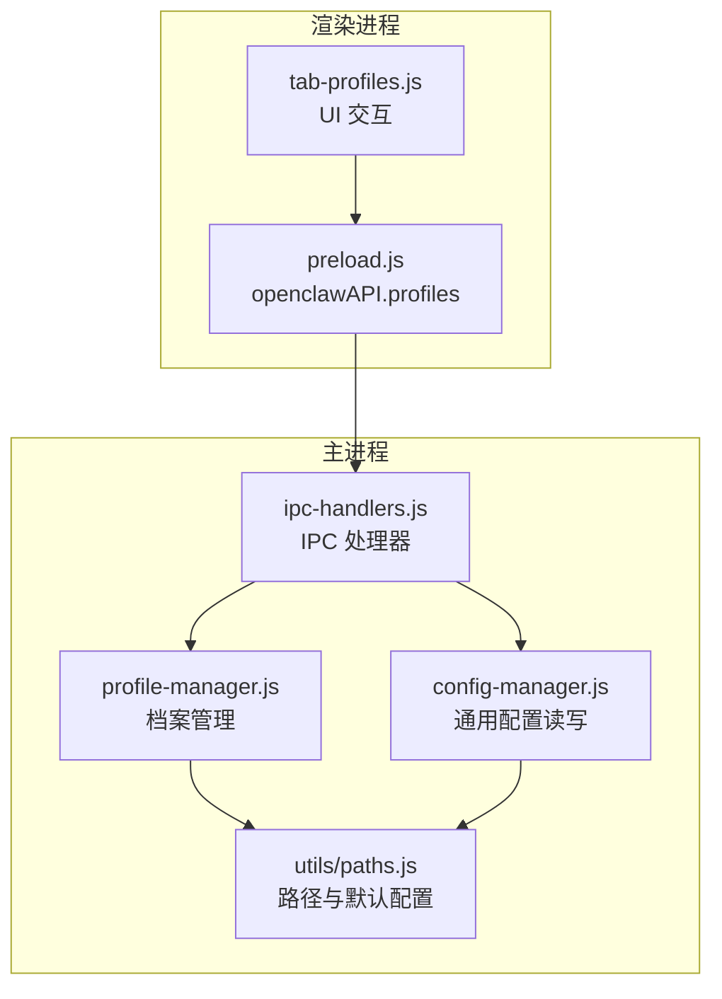
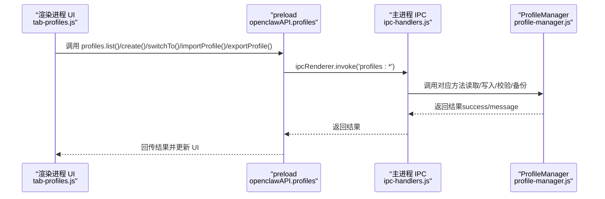
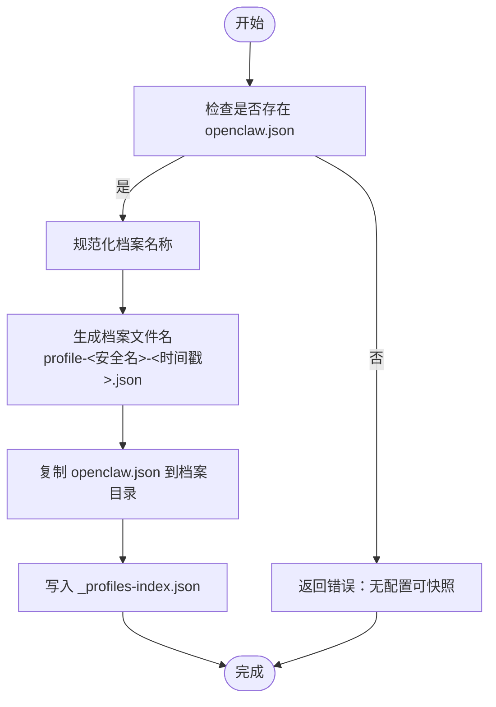
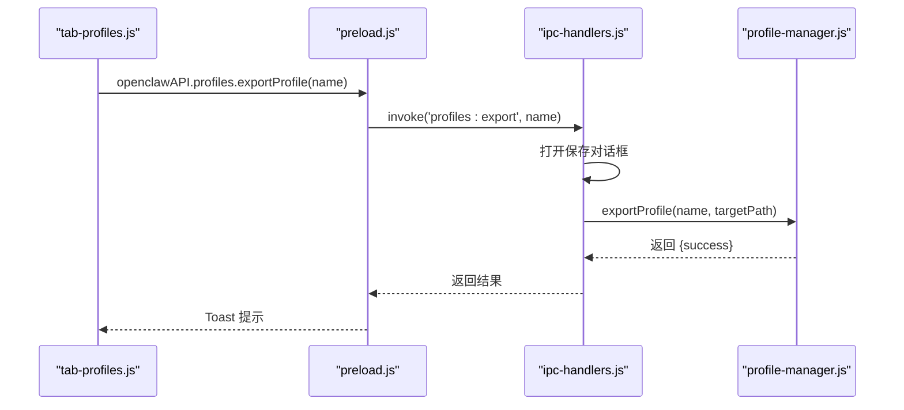
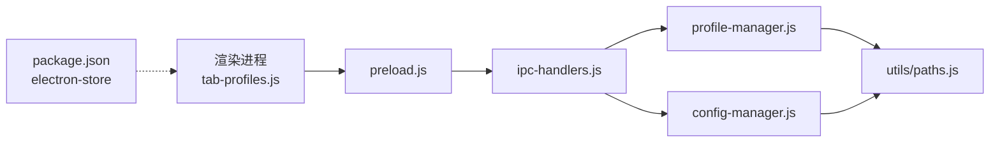

# 配置档案管理

<cite>
**本文档引用的文件**
- [src/main/services/profile-manager.js](file://src/main/services/profile-manager.js)
- [src/renderer/js/dashboard/tab-profiles.js](file://src/renderer/js/dashboard/tab-profiles.js)
- [src/main/ipc-handlers.js](file://src/main/ipc-handlers.js)
- [src/main/utils/paths.js](file://src/main/utils/paths.js)
- [src/main/services/config-manager.js](file://src/main/services/config-manager.js)
- [src/main/preload.js](file://src/main/preload.js)
- [src/main/config/defaults.js](file://src/main/config/defaults.js)
- [src/renderer/js/config/defaults.js](file://src/renderer/js/config/defaults.js)
- [package.json](file://package.json)
</cite>

## 目录
1. [简介](#简介)
2. [项目结构](#项目结构)
3. [核心组件](#核心组件)
4. [架构总览](#架构总览)
5. [详细组件分析](#详细组件分析)
6. [依赖关系分析](#依赖关系分析)
7. [性能考虑](#性能考虑)
8. [故障排除指南](#故障排除指南)
9. [结论](#结论)
10. [附录](#附录)

## 简介
本指南面向“配置档案管理”功能，帮助用户在多环境下高效地创建、编辑、切换、删除与迁移配置档案，并支持团队协作与备份恢复。系统基于 Electron + Node.js 构建，采用主进程负责文件系统与配置持久化、渲染进程负责可视化交互的设计。

## 项目结构
配置档案管理涉及以下关键模块：
- 主进程服务层：ProfileManager（档案索引与文件管理）、ConfigManager（通用配置读写）
- IPC 层：主进程注册 profiles 相关 IPC 处理器，渲染进程通过 preload 暴露 openclawAPI.profiles 接口
- 渲染进程界面层：仪表盘“配置档案”标签页负责展示、创建、导入、导出、切换与删除
- 路径与默认配置：统一管理 OPENCLAW_HOME、配置文件路径、档案存储目录等

图表来源
- [src/renderer/js/dashboard/tab-profiles.js:1-159](file://src/renderer/js/dashboard/tab-profiles.js#L1-L159)
- [src/main/preload.js:125-135](file://src/main/preload.js#L125-L135)
- [src/main/ipc-handlers.js:418-457](file://src/main/ipc-handlers.js#L418-L457)
- [src/main/services/profile-manager.js:1-179](file://src/main/services/profile-manager.js#L1-L179)
- [src/main/services/config-manager.js:1-264](file://src/main/services/config-manager.js#L1-L264)
- [src/main/utils/paths.js:1-124](file://src/main/utils/paths.js#L1-L124)

章节来源
- [src/main/services/profile-manager.js:1-179](file://src/main/services/profile-manager.js#L1-L179)
- [src/renderer/js/dashboard/tab-profiles.js:1-159](file://src/renderer/js/dashboard/tab-profiles.js#L1-L159)
- [src/main/ipc-handlers.js:418-457](file://src/main/ipc-handlers.js#L418-L457)
- [src/main/utils/paths.js:1-124](file://src/main/utils/paths.js#L1-L124)

## 核心组件
- ProfileManager：负责档案索引文件维护、档案文件的创建/切换/删除/导入/导出、备份与校验
- ConfigManager：负责通用配置 openclaw.json 的读写、备份与回滚
- IPC 处理器：在主进程注册 profiles:list/switch/create/delete/export/import 等接口
- preload 暴露 openclawAPI.profiles：渲染进程通过 IPC 调用主进程能力
- 路径与默认配置：统一管理 OPENCLAW_HOME、配置文件路径、档案目录等

章节来源
- [src/main/services/profile-manager.js:1-179](file://src/main/services/profile-manager.js#L1-L179)
- [src/main/services/config-manager.js:1-264](file://src/main/services/config-manager.js#L1-L264)
- [src/main/ipc-handlers.js:418-457](file://src/main/ipc-handlers.js#L418-L457)
- [src/main/preload.js:125-135](file://src/main/preload.js#L125-L135)
- [src/main/utils/paths.js:1-124](file://src/main/utils/paths.js#L1-L124)

## 架构总览
配置档案管理遵循“渲染进程 UI -> preload -> IPC -> 主进程服务”的调用链路；主进程服务通过文件系统完成档案索引与数据文件的持久化。

图表来源
- [src/renderer/js/dashboard/tab-profiles.js:1-159](file://src/renderer/js/dashboard/tab-profiles.js#L1-L159)
- [src/main/preload.js:125-135](file://src/main/preload.js#L125-L135)
- [src/main/ipc-handlers.js:418-457](file://src/main/ipc-handlers.js#L418-L457)
- [src/main/services/profile-manager.js:1-179](file://src/main/services/profile-manager.js#L1-L179)

## 详细组件分析

### 组件一：ProfileManager（档案管理）
职责与能力
- 列表：读取档案索引文件，返回档案元数据（名称、描述、创建时间、文件名）
- 创建：将当前 openclaw.json 快照保存为新档案文件，并写入索引
- 切换：备份当前 openclaw.json，再将目标档案复制回 openclaw.json
- 删除：删除档案文件并从索引中移除
- 导入：校验 JSON 合法性，拷贝到档案目录并写入索引
- 导出：弹出保存对话框，将档案文件导出到用户选择位置
- 备份：所有写操作均自动备份原文件（.bak）

命名规则与组织结构
- 档案索引文件：_profiles-index.json（位于配置备份目录）
- 档案文件：profile-<安全名称>-<时间戳>.json
- 安全名称：仅保留字母、数字、中文、连字符与下划线，其余替换为下划线
- 存储目录：PROFILES_DIR（配置备份目录）

优先级与覆盖机制
- 切换时先备份当前 openclaw.json，再覆盖，确保可回滚
- 导入时校验 JSON 合法性，避免损坏配置
- 写入前进行 JSON 校验，失败则回滚并返回错误

版本与历史
- 档案文件包含创建时间字段，可用于排序与历史追踪
- 系统未提供内置版本对比功能，建议结合外部工具或 Git 管理

图表来源
- [src/main/services/profile-manager.js:41-69](file://src/main/services/profile-manager.js#L41-L69)

章节来源
- [src/main/services/profile-manager.js:1-179](file://src/main/services/profile-manager.js#L1-L179)
- [src/main/utils/paths.js:1-124](file://src/main/utils/paths.js#L1-L124)

### 组件二：ConfigManager（通用配置读写）
职责与能力
- 读取 openclaw.json，若主文件损坏则尝试读取 .bak 备份
- 写入 openclaw.json 前进行目录准备、备份与 JSON 校验
- 提供认证档案与模型配置的读写（auth-profiles.json、models.json），用于多 Agent 场景

章节来源
- [src/main/services/config-manager.js:212-260](file://src/main/services/config-manager.js#L212-L260)
- [src/main/services/config-manager.js:12-75](file://src/main/services/config-manager.js#L12-L75)
- [src/main/services/config-manager.js:122-185](file://src/main/services/config-manager.js#L122-L185)

### 组件三：IPC 与 UI（profiles）
- IPC 注册：profiles:list/switch/create/delete/export/import
- 渲染进程：tab-profiles.js 提供创建、导入、刷新、切换、导出、删除等交互
- 对话框：导出/导入使用 Electron 对话框选择目标路径

图表来源
- [src/renderer/js/dashboard/tab-profiles.js:128-135](file://src/renderer/js/dashboard/tab-profiles.js#L128-L135)
- [src/main/preload.js:125-135](file://src/main/preload.js#L125-L135)
- [src/main/ipc-handlers.js:435-445](file://src/main/ipc-handlers.js#L435-L445)
- [src/main/services/profile-manager.js:125-145](file://src/main/services/profile-manager.js#L125-L145)

章节来源
- [src/main/ipc-handlers.js:418-457](file://src/main/ipc-handlers.js#L418-L457)
- [src/renderer/js/dashboard/tab-profiles.js:1-159](file://src/renderer/js/dashboard/tab-profiles.js#L1-L159)
- [src/main/preload.js:125-135](file://src/main/preload.js#L125-L135)

### 组件四：路径与默认配置
- OPENCLAW_HOME：主目录，默认 ~/.openclaw
- CONFIG_PATH：openclaw.json 路径
- PROFILES_DIR：配置备份目录（存放档案文件与索引）
- 渲染进程默认配置：网络、超时、样式等参数（纯前端）

章节来源
- [src/main/utils/paths.js:1-124](file://src/main/utils/paths.js#L1-L124)
- [src/main/config/defaults.js:1-180](file://src/main/config/defaults.js#L1-L180)
- [src/renderer/js/config/defaults.js:1-51](file://src/renderer/js/config/defaults.js#L1-L51)

## 依赖关系分析
- 渲染进程依赖 preload 暴露的 openclawAPI.profiles
- preload 通过 ipcRenderer.invoke 与主进程通信
- 主进程通过 ipcMain.handle 注册处理器，委托 ProfileManager/ConfigManager 执行
- ProfileManager/ConfigManager 依赖 utils/paths.js 提供的路径常量
- package.json 中 Electron Store 用于应用级配置存储（与档案管理互补）

图表来源
- [src/renderer/js/dashboard/tab-profiles.js:1-159](file://src/renderer/js/dashboard/tab-profiles.js#L1-L159)
- [src/main/preload.js:125-135](file://src/main/preload.js#L125-L135)
- [src/main/ipc-handlers.js:418-457](file://src/main/ipc-handlers.js#L418-L457)
- [src/main/services/profile-manager.js:1-179](file://src/main/services/profile-manager.js#L1-L179)
- [src/main/services/config-manager.js:1-264](file://src/main/services/config-manager.js#L1-L264)
- [src/main/utils/paths.js:1-124](file://src/main/utils/paths.js#L1-L124)
- [package.json:61-71](file://package.json#L61-L71)

章节来源
- [src/main/ipc-handlers.js:418-457](file://src/main/ipc-handlers.js#L418-L457)
- [src/main/preload.js:125-135](file://src/main/preload.js#L125-L135)
- [src/main/services/profile-manager.js:1-179](file://src/main/services/profile-manager.js#L1-L179)
- [src/main/services/config-manager.js:1-264](file://src/main/services/config-manager.js#L1-L264)
- [src/main/utils/paths.js:1-124](file://src/main/utils/paths.js#L1-L124)
- [package.json:61-71](file://package.json#L61-L71)

## 性能考虑
- 档案文件为 JSON，体积通常较小，I/O 成本低
- 切换档案时仅复制单个文件，响应迅速
- 导入/导出使用系统对话框，避免额外内存占用
- 建议定期清理不再使用的档案，保持目录整洁

## 故障排除指南
常见问题与处理
- 无法创建档案：当前无 openclaw.json 可快照
  - 处理：先保存一次配置或完成初始化
- 档案不存在/文件丢失：切换/导出时报错
  - 处理：检查档案索引与文件是否存在，必要时重新导入
- 导入 JSON 不合法：校验失败
  - 处理：修正 JSON 格式或使用正确的档案文件
- 切换失败：备份/覆盖过程中异常
  - 处理：查看日志，确认 openclaw.json 权限与磁盘空间

章节来源
- [src/main/services/profile-manager.js:44-46](file://src/main/services/profile-manager.js#L44-L46)
- [src/main/services/profile-manager.js:75-82](file://src/main/services/profile-manager.js#L75-L82)
- [src/main/services/profile-manager.js:149-151](file://src/main/services/profile-manager.js#L149-L151)
- [src/main/services/profile-manager.js:95-97](file://src/main/services/profile-manager.js#L95-L97)

## 结论
配置档案管理提供了完整的“快照-切换-迁移-备份”能力，满足多环境与团队协作需求。通过清晰的命名规则、索引文件与自动备份机制，用户可以安全地在不同配置间切换，并通过导入导出实现迁移与共享。

## 附录

### 使用指南：创建、编辑、切换、删除与导入导出
- 创建档案
  - 在“配置档案”页面点击“新建”，输入名称与可选描述，系统将当前 openclaw.json 快照为新档案
- 切换档案
  - 点击“切换”，系统会备份当前 openclaw.json 并覆盖为目标档案
- 删除档案
  - 点击“删除”，确认后移除档案文件与索引条目
- 导入档案
  - 点击“导入”，选择 JSON 档案文件，系统校验后写入索引
- 导出档案
  - 点击“导出”，选择保存位置，生成独立 JSON 文件

章节来源
- [src/renderer/js/dashboard/tab-profiles.js:1-159](file://src/renderer/js/dashboard/tab-profiles.js#L1-L159)
- [src/main/ipc-handlers.js:435-457](file://src/main/ipc-handlers.js#L435-L457)
- [src/main/services/profile-manager.js:41-69](file://src/main/services/profile-manager.js#L41-L69)
- [src/main/services/profile-manager.js:71-98](file://src/main/services/profile-manager.js#L71-L98)
- [src/main/services/profile-manager.js:100-123](file://src/main/services/profile-manager.js#L100-L123)
- [src/main/services/profile-manager.js:147-176](file://src/main/services/profile-manager.js#L147-L176)

### 命名规则与组织结构
- 档案索引：_profiles-index.json（数组，包含 name/description/fileName/createdAt）
- 档案文件：profile-<安全名称>-<时间戳>.json
- 安全名称：仅保留字母、数字、中文、连字符与下划线，其余替换为下划线
- 存储目录：PROFILES_DIR（配置备份目录）

章节来源
- [src/main/services/profile-manager.js:19-35](file://src/main/services/profile-manager.js#L19-L35)
- [src/main/services/profile-manager.js:48-49](file://src/main/services/profile-manager.js#L48-L49)
- [src/main/utils/paths.js:11-11](file://src/main/utils/paths.js#L11-L11)

### 继承与覆盖机制、优先级规则
- 切换优先级：当前 openclaw.json <- 档案文件（切换时覆盖）
- 备份策略：写入前自动备份为 .bak，便于回滚
- 导入策略：校验 JSON 合法性后再写入索引

章节来源
- [src/main/services/profile-manager.js:84-90](file://src/main/services/profile-manager.js#L84-L90)
- [src/main/services/profile-manager.js:149-151](file://src/main/services/profile-manager.js#L149-L151)

### 版本管理与历史记录
- 历史记录：每个档案包含 createdAt 时间戳，可用于排序与追踪
- 版本对比：系统未内置对比功能，建议配合外部工具或 Git 管理

章节来源
- [src/main/services/profile-manager.js:55-60](file://src/main/services/profile-manager.js#L55-L60)

### 模板与快速创建向导
- 快速创建向导：通过安装向导完成初始配置，随后可在“配置”标签页进行可视化编辑
- 模板：系统未提供专用模板文件，可通过“新建”创建标准档案后手动调整

章节来源
- [src/renderer/js/dashboard/tab-config.js:1-213](file://src/renderer/js/dashboard/tab-config.js#L1-L213)

### 安全保护与访问控制
- 认证档案：支持按 Provider 与 Agent 维度管理 API Key（auth-profiles.json）
- 访问控制：系统未提供用户权限与访问控制机制，建议结合文件系统权限与密钥管理工具

章节来源
- [src/main/services/config-manager.js:11-75](file://src/main/services/config-manager.js#L11-L75)