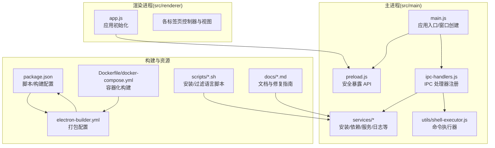
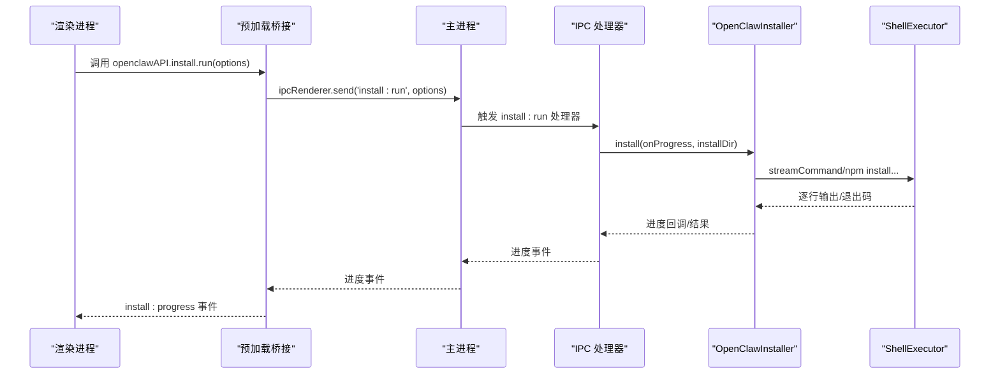
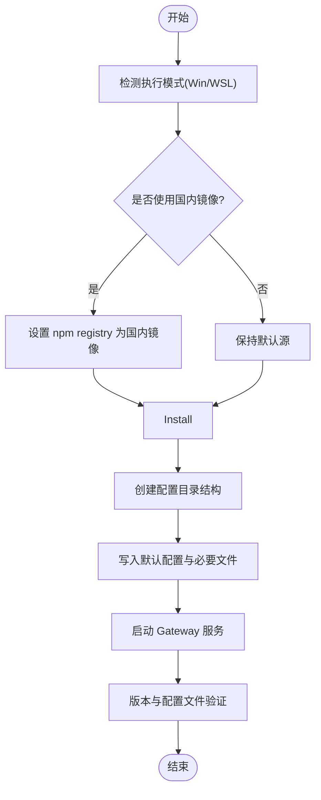
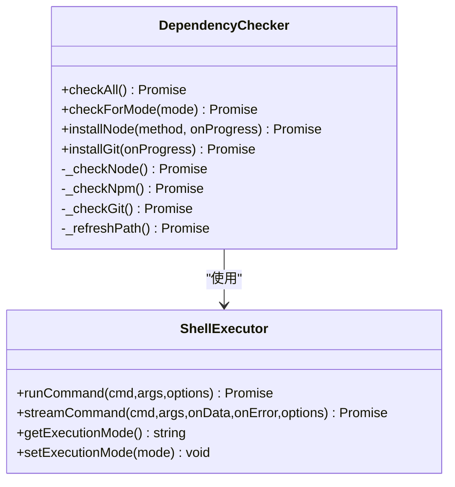
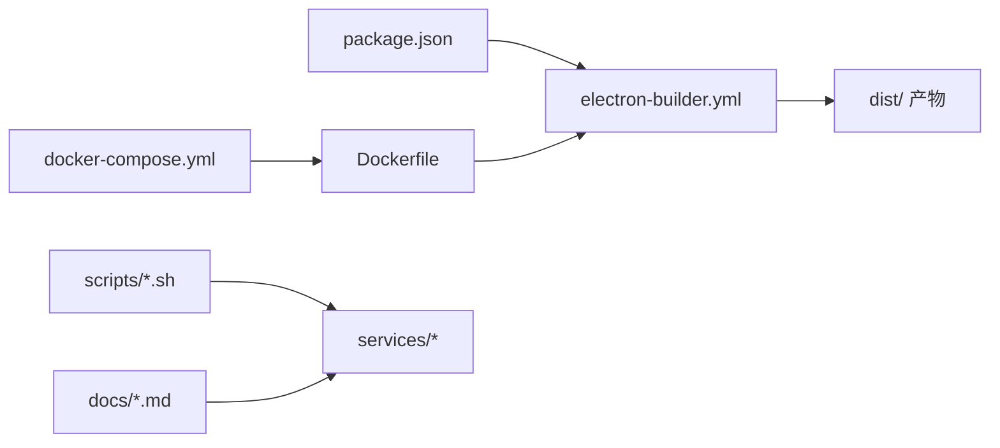

# 贡献指南

<cite>
**本文引用的文件**
- [README.md](file://README.md)
- [package.json](file://package.json)
- [electron-builder.yml](file://electron-builder.yml)
- [Dockerfile](file://Dockerfile)
- [docker-compose.yml](file://docker-compose.yml)
- [src/main/main.js](file://src/main/main.js)
- [src/main/preload.js](file://src/main/preload.js)
- [src/main/ipc-handlers.js](file://src/main/ipc-handlers.js)
- [src/main/utils/shell-executor.js](file://src/main/utils/shell-executor.js)
- [src/main/services/openclaw-installer.js](file://src/main/services/openclaw-installer.js)
- [src/main/services/dependency-checker.js](file://src/main/services/dependency-checker.js)
- [src/renderer/js/app.js](file://src/renderer/js/app.js)
- [scripts/install-openclaw.sh](file://scripts/install-openclaw.sh)
- [docs/INSTALLATION_FIX_GUIDE.md](file://docs/INSTALLATION_FIX_GUIDE.md)
- [docs/FIX_SUMMARY.md](file://docs/FIX_SUMMARY.md)
</cite>

## 目录
1. [简介](#简介)
2. [项目结构](#项目结构)
3. [核心组件](#核心组件)
4. [架构总览](#架构总览)
5. [详细组件分析](#详细组件分析)
6. [依赖关系分析](#依赖关系分析)
7. [性能考虑](#性能考虑)
8. [故障排查指南](#故障排查指南)
9. [结论](#结论)
10. [附录](#附录)

## 简介
本指南面向希望参与 OpenClaw 安装管理器项目的开发者与文档贡献者，涵盖从 Fork 项目、创建分支、提交代码到发起 Pull Request 的完整流程；提供代码规范与最佳实践（编码风格、命名约定、注释标准、测试要求）；说明开发环境搭建、调试技巧与测试策略；介绍项目架构原则与设计模式；并给出文档贡献的方法与标准，帮助新贡献者快速上手并高效参与项目开发。

## 项目结构
项目采用 Electron 主进程 + 渲染进程的桌面应用架构，核心目录与职责如下：
- src/main：主进程代码，负责窗口、IPC、系统集成与服务编排
- src/renderer：渲染进程代码，负责 UI 与用户交互
- scripts：安装与构建辅助脚本
- docs：项目文档与故障排除指南
- resources：打包时随应用分发的资源（如技能包）

图表来源
- [src/main/main.js:1-121](file://src/main/main.js#L1-L121)
- [src/main/preload.js:1-239](file://src/main/preload.js#L1-L239)
- [src/main/ipc-handlers.js:1-816](file://src/main/ipc-handlers.js#L1-L816)
- [src/main/utils/shell-executor.js:1-471](file://src/main/utils/shell-executor.js#L1-L471)
- [src/main/services/openclaw-installer.js:1-780](file://src/main/services/openclaw-installer.js#L1-L780)
- [package.json:1-75](file://package.json#L1-L75)
- [electron-builder.yml:1-53](file://electron-builder.yml#L1-L53)
- [Dockerfile:1-109](file://Dockerfile#L1-L109)
- [docker-compose.yml:1-105](file://docker-compose.yml#L1-L105)
- [scripts/install-openclaw.sh:1-328](file://scripts/install-openclaw.sh#L1-L328)
- [docs/INSTALLATION_FIX_GUIDE.md:1-418](file://docs/INSTALLATION_FIX_GUIDE.md#L1-L418)

章节来源
- [README.md:36-90](file://README.md#L36-L90)
- [package.json:1-75](file://package.json#L1-L75)
- [electron-builder.yml:1-53](file://electron-builder.yml#L1-L53)
- [Dockerfile:1-109](file://Dockerfile#L1-L109)
- [docker-compose.yml:1-105](file://docker-compose.yml#L1-L105)

## 核心组件
- 主进程入口与窗口：负责创建 BrowserWindow、菜单、单实例锁与资源检查
- 预加载桥接：通过 contextBridge 暴露受控 API 至渲染进程
- IPC 处理器：集中注册各类 IPC 事件与异步调用，协调服务层
- ShellExecutor：统一命令执行、编码解码、超时控制与 WSL/Windows 模式适配
- OpenClawInstaller：封装安装/更新/版本检测/配置生成/守护进程启动
- DependencyChecker：增强的依赖检测与安装（Node.js、npm、Git、WSL）
- 渲染应用入口：根据安装状态切换向导或仪表盘视图

章节来源
- [src/main/main.js:1-121](file://src/main/main.js#L1-L121)
- [src/main/preload.js:1-239](file://src/main/preload.js#L1-L239)
- [src/main/ipc-handlers.js:1-816](file://src/main/ipc-handlers.js#L1-L816)
- [src/main/utils/shell-executor.js:1-471](file://src/main/utils/shell-executor.js#L1-L471)
- [src/main/services/openclaw-installer.js:1-780](file://src/main/services/openclaw-installer.js#L1-L780)
- [src/main/services/dependency-checker.js:1-800](file://src/main/services/dependency-checker.js#L1-L800)
- [src/renderer/js/app.js:1-72](file://src/renderer/js/app.js#L1-L72)

## 架构总览
应用采用“主进程负责系统集成与安全隔离，渲染进程负责 UI”的经典 Electron 架构。IPC 通道将渲染层请求转发至主进程服务层，服务层通过 ShellExecutor 执行系统命令，实现安装、检测、日志、守护进程等核心能力。

图表来源
- [src/renderer/js/app.js:1-72](file://src/renderer/js/app.js#L1-L72)
- [src/main/preload.js:1-239](file://src/main/preload.js#L1-L239)
- [src/main/ipc-handlers.js:177-195](file://src/main/ipc-handlers.js#L177-L195)
- [src/main/services/openclaw-installer.js:117-438](file://src/main/services/openclaw-installer.js#L117-L438)
- [src/main/utils/shell-executor.js:208-281](file://src/main/utils/shell-executor.js#L208-L281)

## 详细组件分析

### 组件 A：安装与更新流程（OpenClawInstaller）
- 职责：安装/更新 OpenClaw、生成默认配置、启动守护进程、版本检测与校验
- 关键流程：镜像源切换 → 安装 → 创建配置目录与必要文件 → 启动 Gateway → 验证
- 并发与容错：使用超时控制、临时脚本清理、失败回退与日志记录

图表来源
- [src/main/services/openclaw-installer.js:117-438](file://src/main/services/openclaw-installer.js#L117-L438)
- [src/main/services/openclaw-installer.js:440-532](file://src/main/services/openclaw-installer.js#L440-L532)

章节来源
- [src/main/services/openclaw-installer.js:1-780](file://src/main/services/openclaw-installer.js#L1-L780)

### 组件 B：依赖检测与安装（DependencyChecker）
- 职责：检测并安装 Node.js、npm、Git、WSL；增强 PATH 与多路径探测
- 设计要点：统一返回格式、并行检测、缓存命中、系统工具路径修正

图表来源
- [src/main/services/dependency-checker.js:133-800](file://src/main/services/dependency-checker.js#L133-L800)
- [src/main/utils/shell-executor.js:62-471](file://src/main/utils/shell-executor.js#L62-L471)

章节来源
- [src/main/services/dependency-checker.js:1-800](file://src/main/services/dependency-checker.js#L1-L800)

### 组件 C：命令执行器（ShellExecutor）
- 职责：跨平台命令执行、编码解码、超时控制、WSL/Windows 模式适配
- 关键点：cmd.exe 路径解析、GBK 乱码处理、UTF-8 环境变量注入、PATH 清理

章节来源
- [src/main/utils/shell-executor.js:1-471](file://src/main/utils/shell-executor.js#L1-L471)

### 组件 D：IPC 与 API 暴露（ipc-handlers.js 与 preload.js）
- 职责：集中注册 IPC 事件、暴露受限 API、进度事件广播
- 设计要点：主进程服务实例化、渲染进程通过 contextBridge 安全访问

章节来源
- [src/main/ipc-handlers.js:1-816](file://src/main/ipc-handlers.js#L1-L816)
- [src/main/preload.js:1-239](file://src/main/preload.js#L1-L239)

### 组件 E：应用初始化与视图切换（src/renderer/js/app.js）
- 职责：根据安装状态决定显示安装向导或管理面板；初始化控制器

章节来源
- [src/renderer/js/app.js:1-72](file://src/renderer/js/app.js#L1-L72)

## 依赖关系分析
- 构建与打包：package.json 定义脚本，electron-builder.yml 控制打包；Dockerfile 与 docker-compose.yml 提供容器化构建
- 运行时依赖：electron-store、chokidar 等第三方库
- 脚本依赖：安装脚本与资源目录映射

图表来源
- [package.json:1-75](file://package.json#L1-L75)
- [electron-builder.yml:1-53](file://electron-builder.yml#L1-L53)
- [Dockerfile:1-109](file://Dockerfile#L1-L109)
- [docker-compose.yml:1-105](file://docker-compose.yml#L1-L105)

章节来源
- [package.json:1-75](file://package.json#L1-L75)
- [electron-builder.yml:1-53](file://electron-builder.yml#L1-L53)
- [Dockerfile:1-109](file://Dockerfile#L1-L109)
- [docker-compose.yml:1-105](file://docker-compose.yml#L1-L105)

## 性能考虑
- 并行检测：依赖检测阶段使用 Promise.all 并行执行，缩短等待时间
- 超时控制：命令执行与安装流程设置合理超时，避免卡顿
- 缓存策略：依赖检测结果缓存，减少重复扫描
- 资源打包：electron-builder 配置按需包含文件，避免冗余

## 故障排查指南
- 安装后命令不可用：检查 PATH，使用应用的“检查 PATH”与“添加到 PATH”
- 首次打包缓慢：下载 Electron 与 NSIS 工具缓存，后续复用
- 镜像源下载失败：设置国内镜像源或使用 Docker 构建
- 依赖检测异常：参考依赖检测修复指南，增强 PATH 与多路径探测

章节来源
- [README.md:258-288](file://README.md#L258-L288)
- [docs/INSTALLATION_FIX_GUIDE.md:1-418](file://docs/INSTALLATION_FIX_GUIDE.md#L1-L418)
- [docs/FIX_SUMMARY.md:1-43](file://docs/FIX_SUMMARY.md#L1-L43)

## 结论
本指南提供了从开发环境搭建、代码贡献流程、架构理解到文档贡献的标准与实践建议。建议贡献者在提交前阅读相关组件文档，遵循编码规范与测试要求，确保改动稳定、可维护且易于审查。

## 附录

### 代码贡献流程（Fork → 分支 → 提交 → PR）
- Fork 仓库至个人账号
- 创建功能分支（建议使用 feat/、fix/、docs/ 前缀）
- 提交代码并编写清晰的提交信息（说明背景、变更与影响）
- 发起 Pull Request，填写模板说明变更内容与动机，等待审查与讨论

### 代码规范与最佳实践
- 编码风格
  - 使用一致的缩进与换行
  - 变量与函数命名采用小驼峰，类名首字母大写
  - 常量使用全大写加下划线
- 注释标准
  - 公共 API 与复杂逻辑需提供中文注释说明用途与行为
  - 错误处理与边界条件需标注潜在风险
- 测试要求
  - 新增功能需配套单元/集成测试
  - 影响安装/检测流程的改动需在多环境验证（Win/WSL）
- 文档要求
  - 新功能需同步更新 README 或新增 docs/* 指南
  - 重大变更需更新变更日志与迁移说明

### 开发环境搭建
- 环境要求：Node.js >= 18，npm
- 安装依赖：npm install
- 开发运行：npm run dev
- 生产运行：npm start
- 打包构建：npm run build（本地）或 docker compose 运行构建任务（推荐）

章节来源
- [README.md:92-141](file://README.md#L92-L141)
- [package.json:7-17](file://package.json#L7-L17)
- [docker-compose.yml:1-105](file://docker-compose.yml#L1-L105)

### 调试技巧
- 主进程调试：启用开发者工具（菜单“视图/开发者工具”）
- 进度与日志：关注 install:progress、deps:progress 等事件
- 命令执行：ShellExecutor 提供详细日志与编码解码处理
- 容器化调试：docker compose run --rm shell 进入容器交互式调试

章节来源
- [src/main/main.js:68-100](file://src/main/main.js#L68-L100)
- [src/main/ipc-handlers.js:177-195](file://src/main/ipc-handlers.js#L177-L195)
- [src/main/utils/shell-executor.js:136-197](file://src/main/utils/shell-executor.js#L136-L197)

### 测试策略
- 单元测试：针对 ShellExecutor、DependencyChecker 的关键方法
- 集成测试：端到端安装/更新流程，覆盖 Win/WSL 两种模式
- 回归测试：依赖检测修复回归验证脚本

章节来源
- [docs/INSTALLATION_FIX_GUIDE.md:406-418](file://docs/INSTALLATION_FIX_GUIDE.md#L406-L418)
- [docs/FIX_SUMMARY.md:40-43](file://docs/FIX_SUMMARY.md#L40-L43)

### 架构原则与设计模式
- 分层架构：主进程服务层、渲染进程 UI 层、工具层（ShellExecutor）
- 事件驱动：IPC 事件驱动服务编排
- 安全隔离：contextIsolation + preload 暴露受限 API
- 可靠性：超时控制、错误回退、日志记录与诊断工具

章节来源
- [src/main/main.js:1-121](file://src/main/main.js#L1-L121)
- [src/main/preload.js:1-239](file://src/main/preload.js#L1-L239)
- [src/main/ipc-handlers.js:1-816](file://src/main/ipc-handlers.js#L1-L816)

### 文档贡献方法与标准
- 文档格式：Markdown，标题层级规范，使用中文
- 内容要求：结构清晰、步骤可复现、包含截图/示例链接
- 发布流程：提交 PR，审查通过后合并，随版本发布

章节来源
- [docs/INSTALLATION_FIX_GUIDE.md:1-418](file://docs/INSTALLATION_FIX_GUIDE.md#L1-L418)
- [docs/FIX_SUMMARY.md:1-43](file://docs/FIX_SUMMARY.md#L1-L43)

### 社区交流与帮助
- 问题反馈：通过 Issues 描述现象、环境信息与复现步骤
- 讨论与协作：在 PR 与 Issues 中积极沟通
- 参考脚本：安装脚本与资源目录可用于理解安装流程与资源分发

章节来源
- [scripts/install-openclaw.sh:1-328](file://scripts/install-openclaw.sh#L1-L328)
- [README.md:36-90](file://README.md#L36-L90)