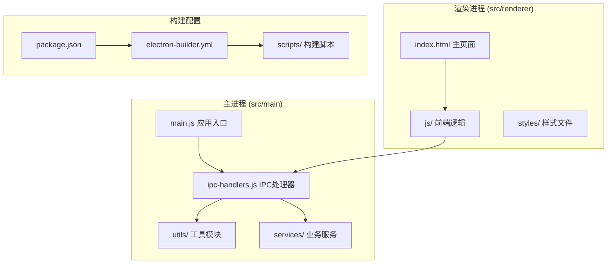
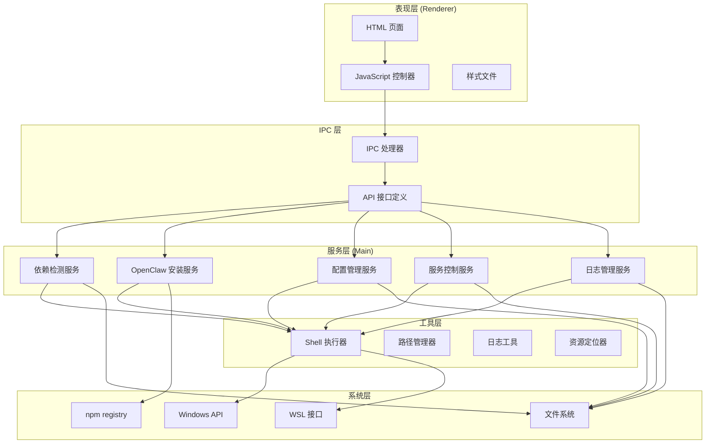
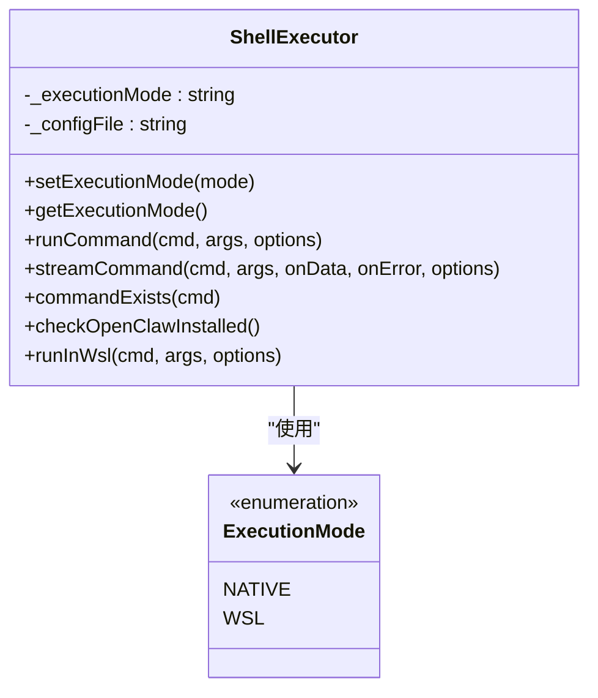
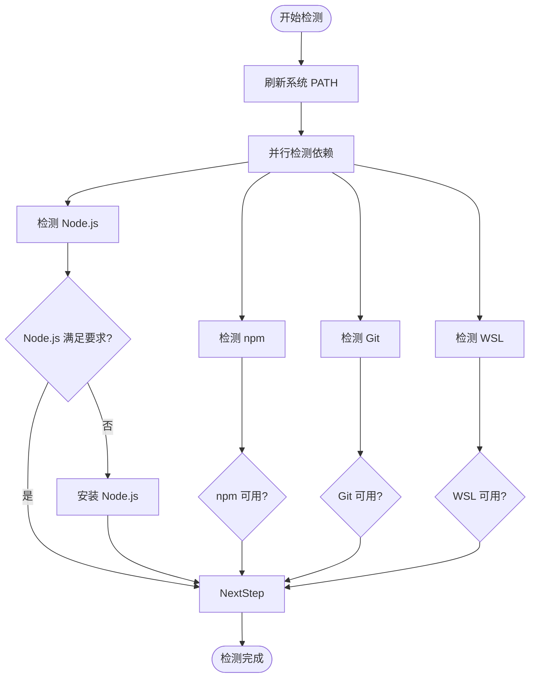
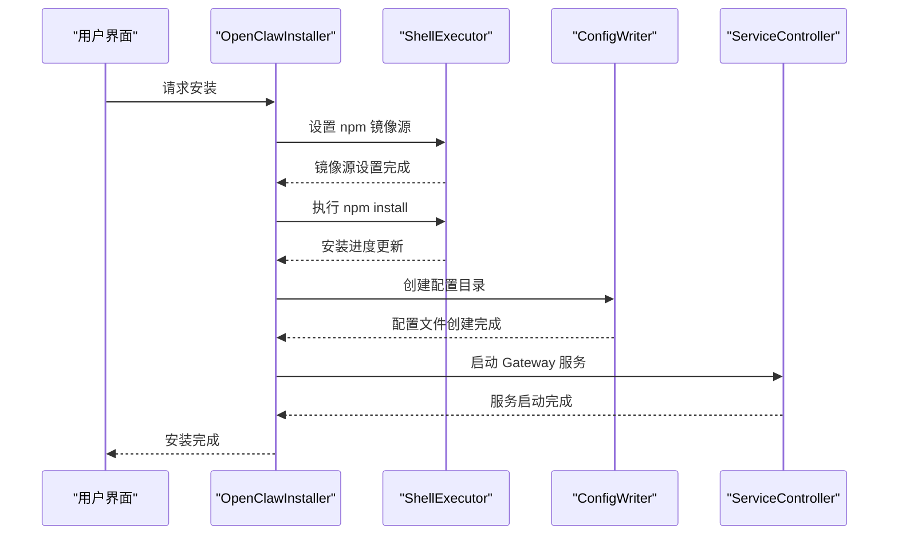
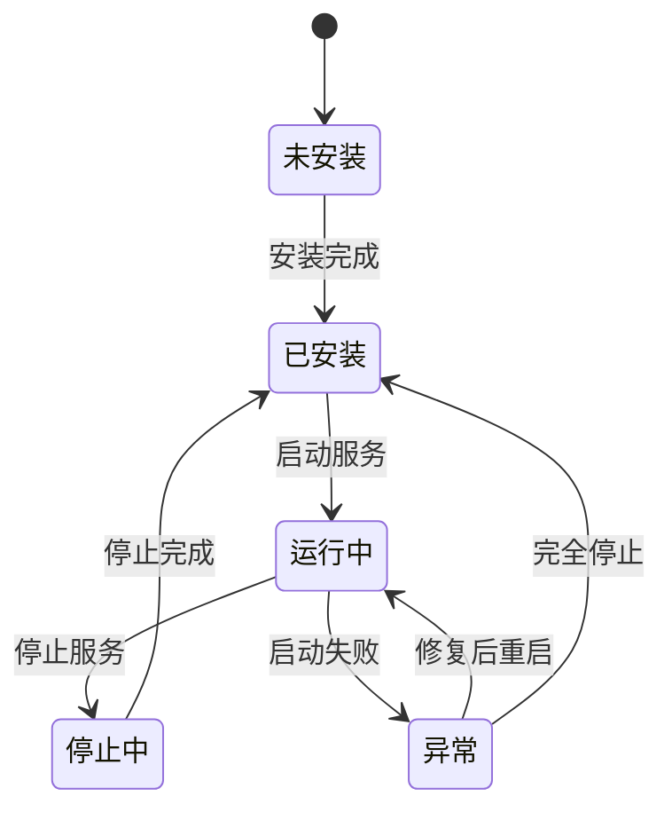
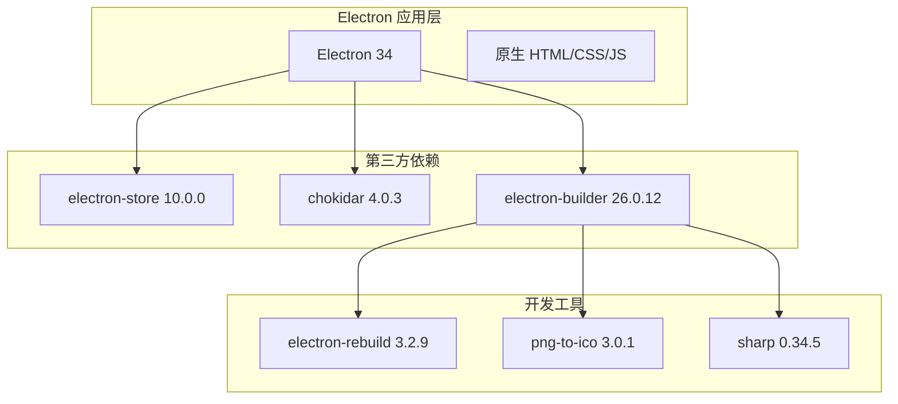
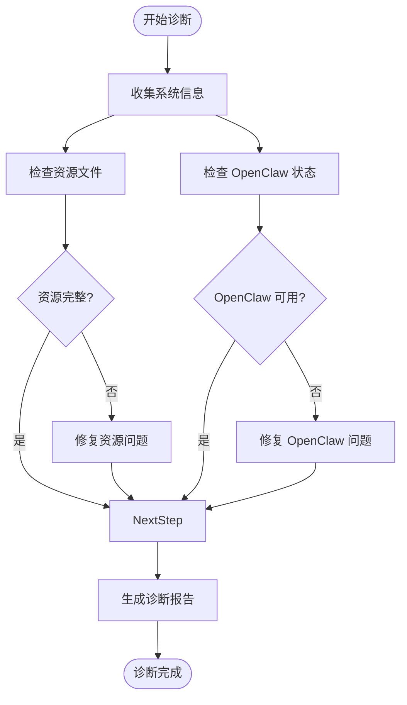

# 项目概述

<cite>
**本文档引用的文件**
- [README.md](file://README.md)
- [package.json](file://package.json)
- [electron-builder.yml](file://electron-builder.yml)
- [src/main/main.js](file://src/main/main.js)
- [src/main/ipc-handlers.js](file://src/main/ipc-handlers.js)
- [src/main/utils/shell-executor.js](file://src/main/utils/shell-executor.js)
- [src/main/services/dependency-checker.js](file://src/main/services/dependency-checker.js)
- [src/main/services/wsl-checker.js](file://src/main/services/wsl-checker.js)
- [src/main/services/openclaw-installer.js](file://src/main/services/openclaw-installer.js)
- [src/main/services/service-controller.js](file://src/main/services/service-controller.js)
- [src/renderer/index.html](file://src/renderer/index.html)
- [src/renderer/js/app.js](file://src/renderer/js/app.js)
- [scripts/install-openclaw.sh](file://scripts/install-openclaw.sh)
- [docs/TROUBLESHOOTING.md](file://docs/TROUBLESHOOTING.md)
- [docs/INSTALLATION_FIX_GUIDE.md](file://docs/INSTALLATION_FIX_GUIDE.md)
</cite>

## 目录
1. [简介](#简介)
2. [项目结构](#项目结构)
3. [核心组件](#核心组件)
4. [架构总览](#架构总览)
5. [详细组件分析](#详细组件分析)
6. [依赖关系分析](#依赖关系分析)
7. [性能考虑](#性能考虑)
8. [故障排查指南](#故障排查指南)
9. [结论](#结论)
10. [附录](#附录)

## 简介

OpenClaw 安装管理器是一个基于 Electron 的桌面应用程序，专为 OpenClaw AI 工具链提供一键安装、配置与管理功能。项目采用全中文图形化界面，支持 Windows 10/11 系统，提供从环境检测、OpenClaw 安装、配置写入到服务管理的完整工作流。

### 核心目标
- 降低 OpenClaw 工具链的安装与使用门槛，提供可视化操作体验
- 支持多种执行模式（Windows 原生与 WSL），满足不同用户需求
- 提供完善的诊断与故障排查机制，提升安装成功率
- 通过单实例锁与安全架构保障应用稳定性与安全性

### 主要功能特性
- **安装向导（5 步完成）**：欢迎页 → 环境检测 → 安装 OpenClaw → 图形化配置 → 完成
- **管理面板（11 个功能标签页）**：状态监控、智能对话、服务管理、技能管理、定时任务、IM 插件、模型配置、环境变量、配置管理、MCP 服务器、配置档案、日志查看
- **WSL 支持**：自动检测 WSL 安装状态，支持一键安装 WSL（UAC 提权），可选择 WSL 或 Windows 原生运行模式
- **双执行模式**：原生模式直接在 Windows 运行，WSL 模式自动将命令包装为 `wsl -- bash -lc ...`
- **国内镜像**：安装步骤支持一键切换 npmmirror.com 镜像源
- **安全架构**：使用 Electron contextIsolation + preload 的 IPC 通信模式，禁用 nodeIntegration
- **单实例锁**：防止重复启动

### 设计理念
- **易用性优先**：通过图形化界面简化复杂的命令行操作
- **兼容性保障**：支持多种安装路径与版本管理器，适配不同开发环境
- **安全性设计**：严格的 IPC 通信与权限控制，避免系统风险
- **可维护性**：模块化架构，清晰的职责分离与错误处理

### 目标用户群体
- AI 开发者与研究者
- 需要快速部署 OpenClaw 工具链的团队
- 对命令行操作不熟悉的用户
- 需要在 Windows 环境下使用 OpenClaw 的用户

### 与其他相关工具的关系
- 作为 OpenClaw 的图形化前端，替代传统的命令行安装与配置流程
- 与 OpenClaw CLI 工具配合使用，提供可视化的管理界面
- 与各种 AI 服务商集成，支持多种模型提供商的 API 密钥管理

## 项目结构

项目采用典型的 Electron 应用结构，分为主进程（src/main）和渲染进程（src/renderer）两大部分：



**图表来源**
- [src/main/main.js:1-121](file://src/main/main.js#L1-L121)
- [src/renderer/index.html:1-127](file://src/renderer/index.html#L1-L127)

### 核心目录说明
- **src/main/**：Electron 主进程代码，包含应用入口、IPC 处理器、工具模块和服务层
- **src/renderer/**：渲染进程代码，包含 HTML 页面、JavaScript 逻辑和样式文件
- **scripts/**：构建和安装相关的脚本文件
- **resources/**：应用运行所需的资源文件（包括技能模板等）
- **docs/**：项目文档和故障排查指南

**章节来源**
- [README.md:36-90](file://README.md#L36-L90)
- [src/main/main.js:1-121](file://src/main/main.js#L1-L121)
- [src/renderer/index.html:1-127](file://src/renderer/index.html#L1-L127)

## 核心组件

### 应用入口与窗口管理
应用入口位于 `src/main/main.js`，负责创建主窗口、配置菜单、注册 IPC 处理器以及实现单实例锁机制。

### IPC 通信层
`src/main/ipc-handlers.js` 实现了完整的 IPC 通信接口，涵盖依赖检测、OpenClaw 安装、配置管理、服务控制、日志管理等所有功能模块。

### Shell 执行器
`src/main/utils/shell-executor.js` 提供跨平台的命令执行能力，支持 Windows 原生模式和 WSL 模式，处理编码转换和超时控制。

### 依赖检测器
`src/main/services/dependency-checker.js` 实现了智能的依赖检测与安装功能，支持 Node.js、npm、Git 和 WSL 的检测与自动安装。

### OpenClaw 安装器
`src/main/services/openclaw-installer.js` 负责 OpenClaw 的安装、更新与版本检测，支持多种安装模式和镜像源配置。

### 服务控制器
`src/main/services/service-controller.js` 管理 OpenClaw Gateway 服务的启动、停止、重启和状态监控。

**章节来源**
- [src/main/main.js:1-121](file://src/main/main.js#L1-L121)
- [src/main/ipc-handlers.js:1-816](file://src/main/ipc-handlers.js#L1-L816)
- [src/main/utils/shell-executor.js:1-471](file://src/main/utils/shell-executor.js#L1-L471)
- [src/main/services/dependency-checker.js:1-1526](file://src/main/services/dependency-checker.js#L1-L1526)
- [src/main/services/openclaw-installer.js:1-780](file://src/main/services/openclaw-installer.js#L1-L780)
- [src/main/services/service-controller.js:1-1101](file://src/main/services/service-controller.js#L1-L1101)

## 架构总览

项目采用分层架构设计，实现了清晰的关注点分离：



**图表来源**
- [src/main/ipc-handlers.js:26-51](file://src/main/ipc-handlers.js#L26-L51)
- [src/main/utils/shell-executor.js:62-108](file://src/main/utils/shell-executor.js#L62-L108)

### 核心设计原则
- **分层解耦**：每层都有明确的职责边界，降低模块间的耦合度
- **异步处理**：大量使用 Promise 和 async/await，提升用户体验
- **错误隔离**：每个服务都有独立的错误处理机制
- **资源管理**：统一的资源定位和文件管理策略

**章节来源**
- [src/main/ipc-handlers.js:1-816](file://src/main/ipc-handlers.js#L1-L816)
- [src/main/utils/shell-executor.js:1-471](file://src/main/utils/shell-executor.js#L1-L471)

## 详细组件分析

### Shell 执行器组件分析

Shell 执行器是整个系统的核心基础设施，提供了跨平台的命令执行能力：



**图表来源**
- [src/main/utils/shell-executor.js:62-108](file://src/main/utils/shell-executor.js#L62-L108)

#### 核心功能特性
- **执行模式管理**：支持 Windows 原生模式和 WSL 模式自动切换
- **命令执行**：提供同步和异步两种命令执行方式
- **输出处理**：自动处理 Windows GBK 编码问题
- **超时控制**：为长时间运行的命令提供超时保护

#### 错误处理机制
- **编码转换**：自动检测和转换输出编码，避免乱码问题
- **超时处理**：统一的超时控制机制
- **错误传播**：详细的错误信息传递和日志记录

**章节来源**
- [src/main/utils/shell-executor.js:1-471](file://src/main/utils/shell-executor.js#L1-L471)

### 依赖检测器组件分析

依赖检测器实现了智能的系统环境检测功能：



**图表来源**
- [src/main/services/dependency-checker.js:149-191](file://src/main/services/dependency-checker.js#L149-L191)

#### 检测策略
- **多路径检测**：Node.js 支持多种安装路径检测
- **版本验证**：自动验证 Node.js 版本是否满足要求（>= 18）
- **并行优化**：使用 Promise.all 并行检测多个依赖
- **缓存机制**：避免重复检测，提升性能

#### 安装流程
- **Node.js 安装**：支持多种安装方式（winget、choco、scoop）
- **Git 安装**：自动下载并安装 Git for Windows
- **WSL 安装**：通过 UAC 提权安装 WSL 组件

**章节来源**
- [src/main/services/dependency-checker.js:1-1526](file://src/main/services/dependency-checker.js#L1-L1526)
- [src/main/services/wsl-checker.js:1-311](file://src/main/services/wsl-checker.js#L1-L311)

### OpenClaw 安装器组件分析

OpenClaw 安装器提供了完整的安装与管理功能：



**图表来源**
- [src/main/services/openclaw-installer.js:117-438](file://src/main/services/openclaw-installer.js#L117-L438)

#### 安装流程
1. **环境准备**：设置 npm 镜像源和安装目录
2. **依赖安装**：执行 `npm install -g openclaw@latest`
3. **配置初始化**：创建必要的配置文件和目录结构
4. **服务启动**：启动 OpenClaw Gateway 服务
5. **验证检查**：验证安装结果和配置完整性

#### 配置管理
- **默认配置**：自动创建包含网关配置的默认配置文件
- **Agent 管理**：支持多 Agent 的配置管理
- **环境变量**：统一的环境变量管理机制

**章节来源**
- [src/main/services/openclaw-installer.js:1-780](file://src/main/services/openclaw-installer.js#L1-L780)

### 服务控制器组件分析

服务控制器负责 OpenClaw Gateway 服务的生命周期管理：



**图表来源**
- [src/main/services/service-controller.js:123-132](file://src/main/services/service-controller.js#L123-L132)

#### 服务管理功能
- **启动控制**：支持原生模式和 WSL 模式的不同启动策略
- **状态监控**：实时监控服务运行状态
- **进程管理**：精确控制子进程的生命周期
- **错误恢复**：自动检测和恢复服务异常

#### 环境变量处理
- **PATH 注入**：自动注入必要的 PATH 环境变量
- **.env 文件**：支持环境变量文件的读写操作
- **编码处理**：正确处理不同编码的环境变量

**章节来源**
- [src/main/services/service-controller.js:1-1101](file://src/main/services/service-controller.js#L1-L1101)

## 依赖关系分析

项目的技术栈采用轻量级设计，核心依赖简洁高效：



**图表来源**
- [package.json:61-71](file://package.json#L61-L71)

### 核心依赖说明
- **electron-store**：提供持久化存储功能，用于保存用户配置和应用状态
- **chokidar**：文件监控工具，用于实时日志查看功能
- **electron-builder**：应用打包工具，支持多平台构建

### 开发环境要求
- **Node.js >= 18**：满足现代 JavaScript 特性需求
- **npm**：包管理工具
- **Electron 34**：桌面应用框架

**章节来源**
- [package.json:1-75](file://package.json#L1-L75)
- [README.md:94-98](file://README.md#L94-L98)

## 性能考虑

### 启动性能优化
- **延迟加载**：非关键模块采用延迟加载策略
- **资源预加载**：关键资源在应用启动时预加载
- **内存管理**：及时释放不再使用的对象和事件监听器

### 网络性能优化
- **镜像源切换**：支持国内镜像源，提升 npm 安装速度
- **并发控制**：合理控制并发操作数量，避免系统资源争用
- **缓存策略**：对频繁访问的数据建立缓存机制

### 用户体验优化
- **进度反馈**：提供详细的安装和配置进度反馈
- **错误恢复**：自动处理常见错误并提供恢复建议
- **离线支持**：部分功能支持离线运行

## 故障排查指南

### 常见问题与解决方案

#### 1. 打包后无法检测已安装的 OpenClaw
**症状**：开发环境可以正确检测，但打包后无法检测
**解决方法**：
1. 打开开发者工具（F12）
2. 运行诊断命令查看详细信息
3. 检查诊断输出中的配置路径和版本信息

#### 2. 资源文件缺失
**症状**：安装 Node.js 时提示找不到安装包
**解决方法**：
1. 检查诊断报告中的资源部分
2. 确认资源文件存在于 `resources/nodejs/` 目录
3. 重新打包应用或手动添加缺失的安装包

#### 3. Git 安装失败
**症状**：提示"未找到内置 Git 安装包"
**解决方法**：
1. 手动下载 Git for Windows 安装包
2. 将安装包放入 `resources/gitbash/` 目录
3. 重新打包应用

#### 4. OpenClaw 安装失败
**症状**：`npm install -g openclaw@latest` 执行失败
**解决方法**：
1. 检查网络连接和代理设置
2. 尝试切换到国内镜像源
3. 手动执行安装命令进行调试

### 诊断工具使用

项目提供了完整的诊断工具集，帮助用户快速定位和解决问题：



**图表来源**
- [docs/TROUBLESHOOTING.md:82-107](file://docs/TROUBLESHOOTING.md#L82-L107)

**章节来源**
- [docs/TROUBLESHOOTING.md:1-219](file://docs/TROUBLESHOOTING.md#L1-L219)
- [docs/INSTALLATION_FIX_GUIDE.md:1-418](file://docs/INSTALLATION_FIX_GUIDE.md#L1-L418)

## 结论

OpenClaw 安装管理器是一个设计精良、功能完备的桌面应用程序，成功地将复杂的 OpenClaw 工具链安装与管理流程简化为直观的图形化操作。项目采用了现代化的 Electron 技术栈，结合严谨的架构设计和完善的错误处理机制，为用户提供了稳定可靠的使用体验。

### 主要优势
- **用户友好**：全中文界面，操作流程清晰直观
- **功能完整**：覆盖从安装到管理的全流程功能
- **技术先进**：采用 Electron 34 和现代 JavaScript 特性
- **安全可靠**：严格的 IPC 通信和权限控制机制
- **易于维护**：模块化设计，便于后续功能扩展

### 技术亮点
- 智能的依赖检测与自动安装机制
- 支持多种执行模式的灵活架构
- 完善的诊断与故障排查工具
- 跨平台的构建与分发能力

该项目为 OpenClaw 工具链的普及和使用做出了重要贡献，是 AI 工具链管理领域的优秀实践案例。

## 附录

### 快速开始指南

#### 系统要求
- **操作系统**：Windows 10/11（64 位）
- **硬件要求**：至少 4GB RAM，推荐 8GB 或更高
- **存储空间**：至少 2GB 可用磁盘空间
- **软件要求**：Node.js >= 18，npm

#### 安装步骤
1. **下载安装包**
   - 从官方渠道下载适用于 Windows 的安装包
   - 双击安装程序，按照提示完成安装

2. **首次运行**
   - 启动应用后会自动检测系统环境
   - 根据检测结果进行必要的依赖安装

3. **完成配置**
   - 按照安装向导的步骤完成 OpenClaw 的安装
   - 配置 API 密钥和模型参数
   - 启动 Gateway 服务

#### 基本使用
1. **管理面板导航**
   - 使用顶部标签页访问不同功能模块
   - 状态监控标签页查看系统健康状况
   - 服务管理标签页控制 OpenClaw 服务

2. **日常操作**
   - 定期检查服务状态
   - 及时更新 OpenClaw 版本
   - 备份重要的配置文件

#### 卸载方法
1. 通过控制面板卸载 OpenClaw 安装管理器
2. 手动删除用户目录下的 `.openclaw` 配置文件夹
3. 清理环境变量中的相关路径

### 开发者指南

#### 环境搭建
```bash
# 克隆项目
git clone <repository-url>
cd openclaw-installer-manager

# 安装依赖
npm install

# 开发模式运行
npm run dev

# 生产模式运行
npm start
```

#### 构建应用
```bash
# Windows 安装包
npm run build

# macOS 安装包
npm run build:mac

# 全平台构建
npm run build:all

# 便携版构建
npm run build:portable
```

#### 项目结构说明
- **src/main/**：Electron 主进程代码
- **src/renderer/**：渲染进程代码
- **scripts/**：构建和安装脚本
- **resources/**：应用资源文件
- **docs/**：项目文档